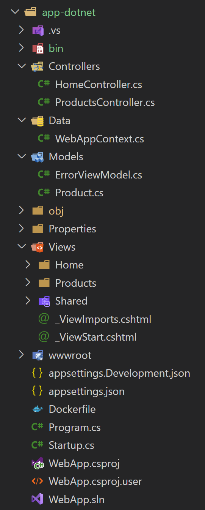
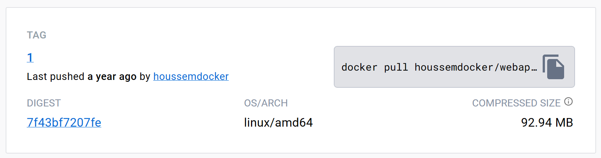

# Getting started with container images

To start learning `Kubernetes`, you need first to understand how to work with containers.
In this tutorial, we have a .NET application and we want to dockerize it. This module will walk through that process.

You'll learn how to:

1. Create a Dockerfile
2. Build docker image
3. Run a docker image
3. Run a command inside a docker container
5. Stop a container
6. Remove a container
7. Remove an image 
8. Working with Docker Compose
9. Working with Container Registry (Docker Hub)
10. Working with Container Registry (Azure Container Registry)

## Prerequisites

To complete this tutorial, you will need:

- [Docker](https://docs.docker.com/get-docker/) installed on your machine
- [.NET Core SDK](https://dotnet.microsoft.com/download) installed on your machine
- A text editor of your choice. We recommend [Visual Studio Code](https://code.visualstudio.com/download)
- Azure subscription (free is enough)
- Azure command line: [Azure CLI](https://docs.microsoft.com/en-us/cli/azure/install-azure-cli)

## Introduction to containers

Docker containers are a popular technology used in software development and deployment. They provide a lightweight and efficient way to package an application along with its dependencies, libraries, and configuration files into a single, portable unit. Docker containers are based on a containerization technology that isolates the application from the underlying system, ensuring that it runs consistently across different environments. This makes it easy to deploy and scale applications across different platforms, including cloud, on-premises, and hybrid environments. Docker containers also offer benefits such as improved security, faster deployment times, and simplified management of complex applications.

Depending on the programming language and platform for your application, we will find the corresponding Docker image. That image will have all the required dependencies and libraries already installed. 

For example, for .NET Core apps, there are multiple images available that contains the SDK and/or runtime for multiple versions.

These images are typically available on a Container Registry like hub.docker.com, for [.NET Core](https://hub.docker.com/_/microsoft-dotnet), for [Java](https://hub.docker.com/_/openjdk), for [NodeJs](https://hub.docker.com/_/node).

There are also images available for database engines like [MySQL](https://hub.docker.com/_/mysql), [SQL Server](https://hub.docker.com/_/microsoft-mssql-server), [Oracle](https://hub.docker.com/_/oracle-database-enterprise-edition), Cassandra, etc.


## 1. Create a Dockerfile

We have a sample .NET Core 5.0 web MVC application. The source code is available at this link: [https://github.com/HoussemDellai/docker-kubernetes-course/tree/main/01_docker_dotnet](https://github.com/HoussemDellai/docker-kubernetes-course/tree/main/01_docker_dotnet).
The source code is on the /app-dotnet folder.

Here is the structure of the project.



We can run this application through the .NET cli tool. We build it first, then we run it.

```sh
cd app-dotnet
dotnet build
dotnet run
```

Now we want to run this same application in a Docker container. The process is similar to running the application inside a virtual machine:

1. Choose a base VM running Linux or Windows.
2. Install the application dependencies and libraries (typically app SDK and Runtime). 
3. Build the application. 
4. Deploy the application into the VM.

With containers, the process will be:

1. Choose a base docker image with application dependencies and libraries (steps 1 and 2 for VMs).
2. Build the application.
3. Deploy the application into the image.

This process will be described into a file called `Dockerfile`. Let's see the following example:

```dockerfile
# Dockerfile
FROM mcr.microsoft.com/dotnet/aspnet:5.0-buster-slim AS base
WORKDIR /app
EXPOSE 80
EXPOSE 443

FROM mcr.microsoft.com/dotnet/sdk:5.0-buster-slim AS build
WORKDIR /src
COPY "WebApp.csproj" .
RUN dotnet restore "WebApp.csproj"
COPY . .
RUN dotnet build "WebApp.csproj" -c Release -o /app/build

FROM build AS publish
RUN dotnet publish "WebApp.csproj" -c Release -o /app/publish

FROM base AS final
WORKDIR /app
COPY --from=publish /app/publish .
ENTRYPOINT ["dotnet", "WebApp.dll"]
```

Note that in this Dockerfile, we are using two different docker images.

1. SDK image is used to build the application (sdk). The commands `dotnet restore`, `dotnet build` and `dotnet publish` will run inside this container. This will generate the application package.
2. Dotnet image is used to run the application when it is deployed. It contains the dotnet runtime (but not the SDK) in addition to the application package. The application package generated in the SDK image, will be copied to the dotnet image. That is why you see the `COPY` operation.

> SDK image is heavy because it contains the dotnet SDK tools required to build dotnet apps. SDK is required only during build-time, not during the run of the container.

> It is highly recommended to keep only the minimum tools required to run the container. You should remove any unnecessary features. That is better for security as it reduces the attack surface. And it keeps the image very lightweight which enhances the pull or download time of the image from the registry.

## 2. Build docker image

Let's first make sure that we have Docker up and running:

```sh
docker run hello-world
```

Then we go to the application folder (app-dotnet) and run the following command to build the image (don't forget the dot "." at the end which references to the current folder):

```sh
docker build .
```

Run the same command and assign a name to the image:

```sh
docker build --rm -t webapp:1.0 .
```

Check the images exists:

```sh
docker images
```

## 3. Run a docker image

Let's run a container based on the image created earlier:

```sh
docker run --rm -d -p 5000:80/tcp webapp:1.0
```

Open web browser on `localhost:5000` to see the application running.

List the running docker containers:

```sh
docker ps
```

## 3. Run a command inside a docker container

Explore the command docker exec.

```sh
docker exec <CONTAINER_ID> -- ls
```

## 5. Stop a container

Explore the command docker stop.

```sh
docker stop <CONTAINER_ID>
```

## 6. Remove a container

Explore the command docker rm.

```sh
docker rm <CONTAINER_ID>
```

## 7. Remove an image

Explore the command docker rmi.

```sh
docker rmi <IMAGE_ID_OR_NAME>
```

## 8. Working with Docker Compose

When we want to run multiple applications together (for micro/multi services for example), working with the commands to build and run each image independently is time consuming. To solve this issue, Docker enterprise invented the Compose file. It can compose and configure multiple services in one single YAML file. Using docker compose, we can build and run multiple images, configure applications to connect to each other, configure docker networking, configure environment variables, etc.

Let's see the following `docker-compose.yml` file:

```yml
# docker-compose.yml
version: "3"
services:
  web:
    container_name: webapp
    build: 
      dockerfile: Dockerfile
      context: app-dotnet
    ports:
      - "8008:80"
    environment:
      ConnectionStrings__WebAppContext: "Server=db;Database=ProductsDB;User=sa;Password=@Aa123456;"
    depends_on:
      - db

  db:
    container_name: mssql-db
    image: "microsoft/mssql-server-linux"
    expose:
      - "1433"
    environment:
      SA_PASSWORD: "@Aa123456"
      ACCEPT_EULA: "Y"
    ports:
      - "1433:1433"
```

Let's build and run the compose file:

```sh
docker-compose build
docker-compose up
```

Verify the application is running in your browser: `localhost:8080`.

## 9. Working with Container Registry (Docker Hub)

A container registry is a central repository that is used to store and manage container images. Container images are snapshots of a containerized application, along with all its dependencies and configurations. These images can be used to create containers that run the application in a consistent and repeatable way.

A container registry provides a secure and scalable way to store and distribute container images. It allows developers to share their images with others, or to deploy them to different environments such as testing, staging, and production. Container registries can be public or private, depending on the needs of the organization.

In addition to storing and managing container images, some container registries also offer additional features such as access control, image scanning, and versioning. These features help to ensure the security and reliability of the container images that are used to run critical applications.

In this lab, we will work with Docker Hub container registry.

Create a Docker Hub account at: [https://hub.docker.com/](https://hub.docker.com/).
Login to Docker Hub registry:

```sh
docker login
```

Tag the image with your Docker Hub ID (for me it is `houssemdocker`):

```sh
docker tag webapp:1.0 <houssemdocker>/webapp:1.0
```

Push the image to the registry:

```sh
docker push <houssemdocker>/webapp:1.0
```

Now, verify the image is stored in the registry.



## 10. Working with Container Registry (Azure Container Registry)

Create a new Azure Container Registry (ACR) in Azure portal.

Enable *Admin* credentials from ACR.

Login to ACR:

```sh
$acrName="myacr" # change with your own value
az acr login -n $acrName --expose-token
```

Build the image on ACR (Optional):

```sh
az acr build -t "$acrName.azurecr.io/webapp:1.0" -r $acrName .
```

Note that image is already pushed to ACR by viewing the ACR resource in Azure portal.

## Conclusion

In this lab, you learned how to create a container image from an existing application source code.
Then you deployed the image in your machine. And you pushed the image into a container registry.
You are ready now to deploy this image into Kubernetes cluster. 
That is our next lab.