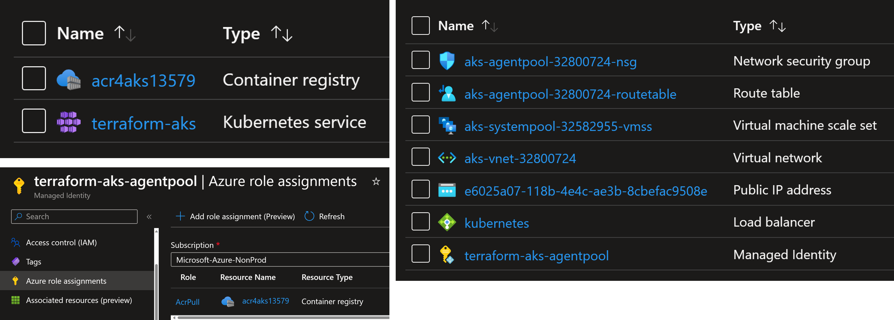

# Creating AKS cluster using Terraform

## Introduction

Using the Azure portal or command line is the easiest option to create an AKS cluster.
That is fine for testing and learning purposes.
However, for production environments, it is important to use `Infrastructure as Code` tool like Terraform.

Infra as Code is the principle of using configuration files like YAML, HCL to describe the infrastructure using the declarative model.
It has the following advantages.

1. Acts as the infra documentation as the config files are human readable
2. The configuration files could be pushed to a Git repository which enables versioning of the infra
3. Enable team collaboration by submitting `Pull Request` whenever an update should be made
4. Idempotence. The same infra config could be redeployed multiple times and always have the same result

In this lab, you will learn how to use Terraform to create an AKS cluster connected to ACR.
You will work with the very basic configuration to keep the demo sample.

## Requirements

You will the following tools:

1. Azure CLI and Azure subscription
2. Terraform CLI

## 1. Understanding Terraform template

A terraform template consists, typically, of the following files:

1. `main.tf` : contains the resources to be created. In our sample it is AKS cluster, ACR and role assignment.
2. `outputs.tf` : contains output values from the created resources. In our sample, it is cluster and ACR resources ID, resource group name and control plane FQDN.
3. `providers.tf` : describes the terraform providers. Each cloud provider have its own terraform implementation.
4. `terraform.tfvars` : sets a value for the variables described in `variables.tf` file.
5. `variables.tf` : describes the variables to be used to set the configuration for the template.

Take a look at the `main.tf` file.

The following creates an Azure resource group by using Terraform's `azurerm_resource_group` resource.

```yaml
resource "azurerm_resource_group" "rg" {
  name     = var.resource_group_name
  location = var.location
}
```

The following configuration creates an AKS cluster using `azurerm_kubernetes_cluster` resource. 
Note how variables are provided as input for the cluster name, location, resource group name, node count, node size, network plugin, etc.

```yaml
resource "azurerm_kubernetes_cluster" "aks" {
  name                = var.cluster_name
  kubernetes_version  = null # var.kubernetes_version
  location            = var.location
  resource_group_name = azurerm_resource_group.rg.name
  dns_prefix          = var.cluster_name

  default_node_pool {
    name                = "systempool"
    node_count          = var.system_node_count
    vm_size             = "Standard_DS2_v2"
    type                = "VirtualMachineScaleSets"
    enable_auto_scaling = false
  }

  identity {
    type = "SystemAssigned"
  }

  network_profile {
    load_balancer_sku = "standard"
    network_plugin    = "kubenet" # CNI
  }
}
```

The official documentation for `azurerm_kubernetes_cluster` is available here with all the supported features: [registry.terraform.io/providers/hashicorp/azurerm/latest/docs/resources/kubernetes_cluster](https://registry.terraform.io/providers/hashicorp/azurerm/latest/docs/resources/kubernetes_cluster).

The following creates an Azure Container Registry (ACR).

```yaml
resource "azurerm_container_registry" "acr" {
  name                = var.acr_name
  resource_group_name = azurerm_resource_group.rg.name
  location            = var.location
  sku                 = "Standard"
  admin_enabled       = false
}
```

The following is a role assignment providing AKS's Identity the role `AcrPull` over the ACR registry's images.
This role assignment authorize AKS to authenticate, authorize and pull images from ACR.

```yaml
resource "azurerm_role_assignment" "role_acrpull" {
  scope                            = azurerm_container_registry.acr.id
  role_definition_name             = "AcrPull"
  principal_id                     = azurerm_kubernetes_cluster.aks.kubelet_identity.0.object_id
  skip_service_principal_aad_check = true
}
```

## 2. Planning for the changes with terraform plan

Before creating the resources, Terraform has a useful feature to preview the changes before they happen. It is like `dry run` or `simulation`.
From within the folder containing terraform files, run the following commands.

```sh
terraform init
terraform plan -out tfplan
# azurerm_container_registry.acr will be created
# azurerm_kubernetes_cluster.aks will be created
# azurerm_resource_group.rg will be created
# azurerm_role_assignment.role_acrpull will be created
# Plan: 4 to add, 0 to change, 0 to destroy.
```

Terraform shows the detailed changes that will be made.

## 3. Deploying the cluster with terraform plan

Now we are ready to deploy the changes. Run the following command.

```sh
terraform apply tfplan
# azurerm_resource_group.rg: Creating...
# azurerm_resource_group.rg: Creation complete after 2s
# azurerm_container_registry.acr: Creating...
# azurerm_kubernetes_cluster.aks: Creating...
# azurerm_container_registry.acr: Creation complete after 28s
# azurerm_kubernetes_cluster.aks: Creation complete after 3m49s
# azurerm_role_assignment.role_acrpull: Creating...
# azurerm_role_assignment.role_acrpull: Creation complete after 25s
```

Note how terraform starts creating the resource and then updates the status until it is created successfully.

View the created resources in Azure portal.



## Conclusion

You learned how to use terraform to create resources in Azure.
To go deeper in this topic, check out the AKS Landing Zone implementation: [github.com/Azure/AKS-Landing-Zone-Accelerator/tree/main/Scenarios/AKS-Secure-Baseline-PrivateCluster/Terraform](https://github.com/Azure/AKS-Landing-Zone-Accelerator/tree/main/Scenarios/AKS-Secure-Baseline-PrivateCluster/Terraform).
