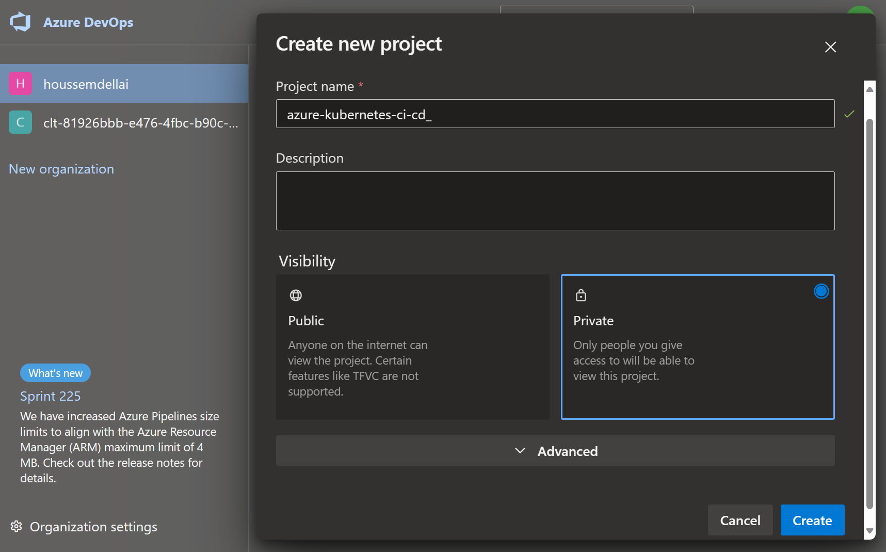
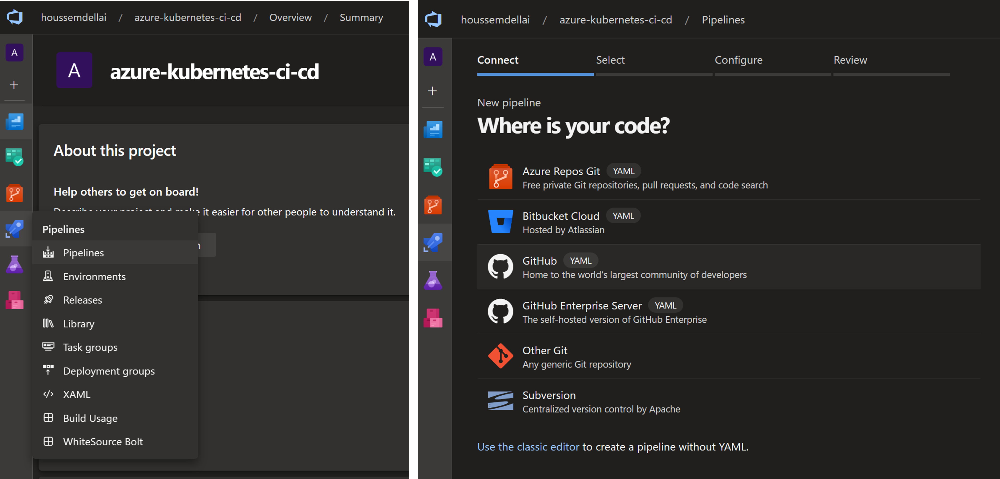
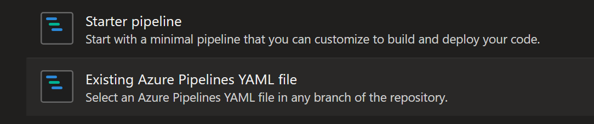
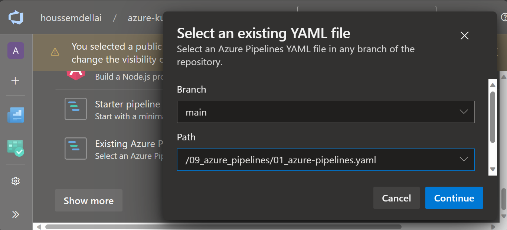
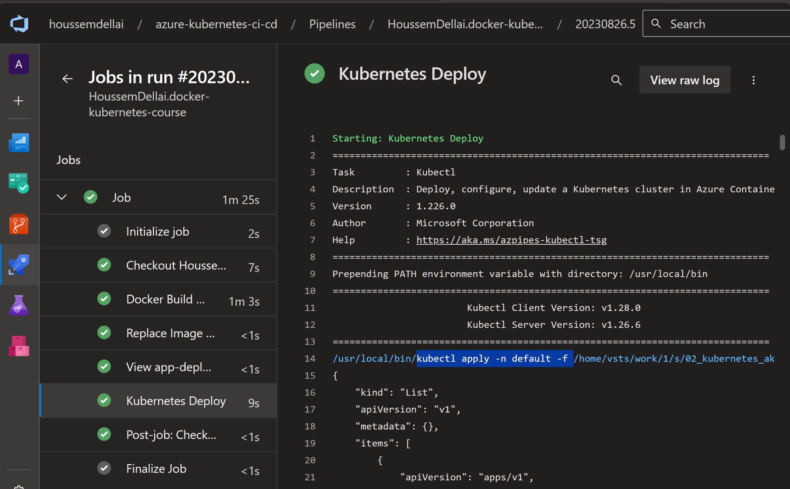

# Creating DevOps CI/CD pipelines for Kubernetes

## Introduction

When learning and testing, deployment to Kubernetes is done through the `kubectl` command line from the personal machine. However, for production systems, the recommended way is to use DevOps CI/CD pipelines with tools like Azure DevOps, Github Actions, Gitlab, Jenkins, etc.

In this lab, you will create a new AKS cluster with attached ACR.
Then create a CI/CD pipeline for deploying sample application (YAML files) using Azure DevOps.

## Prerequisites

You will need:

1. Azure subscription
2. Azure CLI
3. Azure DevOps account [dev.azure.com](https://dev.azure.com/)

## 1. Preparing an AKS cluster and ACR

To create an AKS cluster and attached ACR, you can use the sample terraform template from folder `08_aks_terraform`.
You will need to run the following command to create the resources from within the folder /08_aks_terraform.

```sh
terraform init
terraform plan -out tfplan
terraform apply tfplan
```

## 2. Creating new project in Azure DevOps

In Azure DevOps portal, go to create new project.
Choose a name then click create.



After that, because you will need the source code of the application to be in a Github repository, you can fork the repository into your own Github account.
You can do that from here: [github.com/HoussemDellai/docker-kubernetes-course/fork](https://github.com/HoussemDellai/docker-kubernetes-course/fork).

## 3. Creating and configuring the CI/CD pipeline

Now you will use the `pipelines` feature in Azure DevOps to create a new pipeline.
Click on pipelines from the left menu and create new one.



Choose the Github (new) option, as the source code is in your Github repository.
Authenticate to your Github account, then search the cloned repository and click on it.



After that, select the `main` branch and the YAML pipeline.



You should have the following pipeline.

```yaml
trigger: none
pool:
  vmImage: ubuntu-latest
variables:
  acr_name: acr4aks13579
  tag: 1.0.0-$(Build.BuildId)
steps:
- task: AzureCLI@2
  displayName: Docker Build & Push
  inputs:
    azureSubscription: 'Microsoft-Azure-NonProd'
    scriptType: 'bash'
    scriptLocation: 'inlineScript'
    inlineScript: |
      docker build -t $(acr_name).azurecr.io/webapp:$(tag) app-dotnet
      az acr login -n $(acr_name)
      docker push $(acr_name).azurecr.io/webapp:$(tag)
- task: qetza.replacetokens.replacetokens-task.replacetokens@3
  displayName: 'Replace Image TAG'
  inputs:
    rootDirectory: '02_kubernetes_aks'
    targetFiles: 'app-deploy.yaml'
    encoding: 'auto'
    writeBOM: true
    actionOnMissing: 'warn'
    keepToken: false
    tokenPrefix: '__'
    tokenSuffix: '__'
    useLegacyPattern: false
    enableTransforms: false
    enableTelemetry: true
- script: cat 02_kubernetes_aks/app-deploy.yaml
  displayName: View app-deploy.yaml
- task: Kubernetes@1
  displayName: Kubernetes Deploy
  inputs:
    connectionType: 'Azure Resource Manager'
    azureSubscriptionEndpoint: 'Microsoft-Azure-NonProd'
    azureResourceGroup: 'rg-aks'
    kubernetesCluster: 'aks-cluster-dev'
    namespace: 'default'
    command: 'apply'
    useConfigurationFile: true
    configuration: '02_kubernetes_aks'
    secretType: 'dockerRegistry'
    containerRegistryType: 'Azure Container Registry'
```

This pipeline will use the task `AzureCLI@2` to build, tag and push a container image into ACR.
The task `replacetokens@3` will replace the new image tag generated in each new pipeline run, into the YAML deployment file.
The task `Kubernetes@1` is used to connect to AKS and deploy the YAML files.
Behind the scenes, this task is running the command `kubectl apply -f`.
For this simple, you will be using a sample application YAML manifest from folder `02_kubernetes_aks`.

Note how `AzureCLI` and `Kubernetes` are using a sample `service connection`.
A service connection is what Azure DevOps uses to authenticate to external services like Azure.
You will need to create and use your own service connection.
Make sure you use the same email for your Azure and Azure DevOps (ADO) accounts so that ADO can retrieve all Azure accounts attached to your email.

If you don't use the same email, you can create and use `service principal (SPN)`.

You will also need to change the `acr_name`, `azureResourceGroup` and `kubernetesCluster` values with your own values.
Save the changes to git.

## 4. Running the pipeline

Now that the pipeline is ready and configured, we can run it. Just click on the run button on top right.
Then you can view the pipeline logs as following.



## Conclusion

You learned in this lab how create a sample CI/CD pipeline for building and deploying an application into an AKS cluster.
This was a sample pipeline.
For a more complete pipeline, check the pipeline `03_azure-pipelines.yaml`.
It will show you how to add testing and deploy to multiple environments like dev, test and prod.