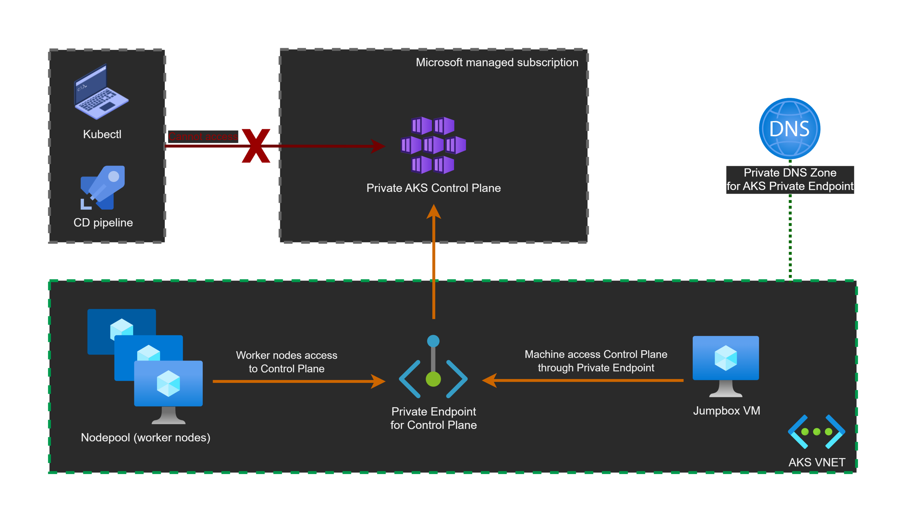
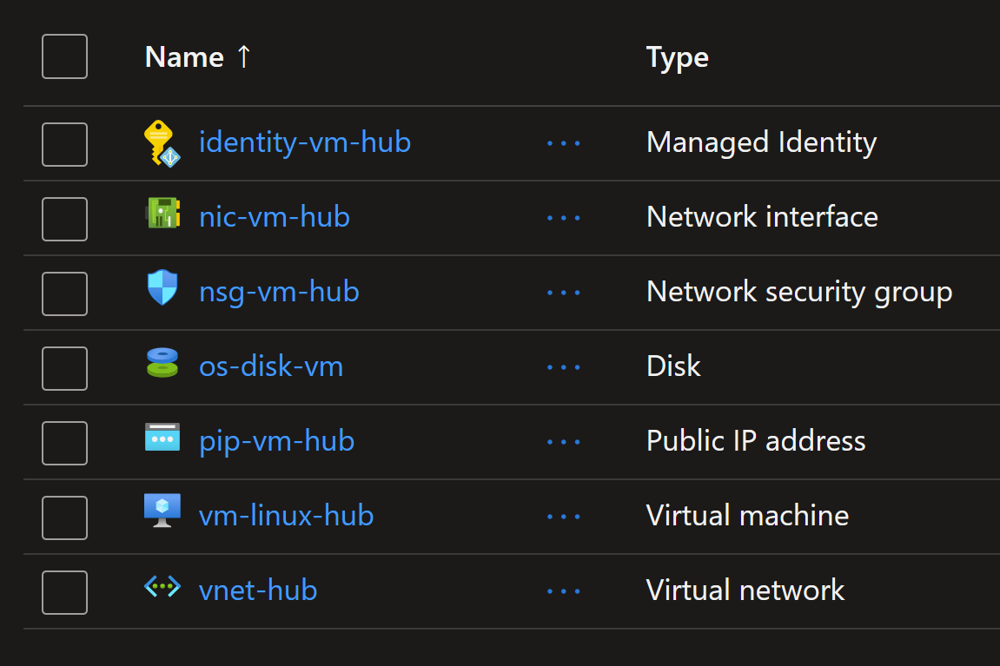
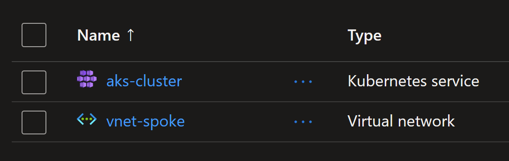

# Private AKS cluster DNS resolution at scale

## Introduction

With the `Hub and Spoke` network topology, you have the following options for DNS resolution.
1) Centralized DNS resolution: all `Private DNS Zones` are attached and resolved from the Hub VNET (or from on-prem).
2) Decentralized DNS resolution: each `Private DNS Zone` is attached and resolved from its Spoke VNET.
3) Sort of Hybrid DNS resolution: some `Private DNS Zones` are attached and resolved from the Hub VNET and some others from the Spokes.

With `AKS`, you can choose one of these solutions.
1) Solution 1: Enabling AKS public FQDN to resolve to private IP address
2) Solution 2: Using centralized DNS name resolution
3) Solution 3: Using decentralized DNS name resolution


## Limitations
A `VNET` could be linked/attached to maximum 1000 `Private DNS Zones`.
`Private DNS Zone` could be linked/attached to maximum 1000 `VNETs`.
`VNET` could be peered to maximum 500 `VNETs`.
 


#########################################################################

## Introduction

When creating a public AKS cluster, the control plane will be exposed through an FQDN and a public IP address. 
To secure the cluster exposure, you can create a private cluster.
With a private AKS cluster, the control plane won't have a public IP address. 
Instead, it will be exposed through a `Private Endpoint` that uses a private IP address. 
An `FQDN` will be used to resolve the private IP address. 

This FQDN could be resolved by:
1) Public `Azure DNS`: public FQDN that resolves to private IP.
This could be configured with the following configuration.
`private_cluster_public_fqdn_enabled = true`.
2) `Private DNS Zone`: FQDN is resolvable only from within the cluster's VNET perimeter `private_cluster_public_fqdn_enabled = false`. For that, you will need either to let AKS create and manage it's own `Private DNS Zone` by configuring `private_dns_zone_id = "None"`

This `FQDN` will then be resolved by the following actors who needs access to the control plane.
1) Kubernetes agent pools (Nodes) (kubelet component).
2) Cluster operators and/or developers connecting from on-premise or from a Jumpbox.
3) DevOps CI/CD pipelines that deploys to the cluster.

## Resolving AKS control plane private IP address using public Azure DNS

AKS `FQDN` is by default exposed publicly through `Azure DNS`.
For a private cluster, this FQDN will resolve to the private IP address of the control plane's `Private Endpoint`.

```sh
nslookup aks-prbob7iw.hcp.swedencentral.azmk8s.io # from internet
# Address:  10.1.0.4
```

```hcl
resource "azurerm_kubernetes_cluster" "aks" {
  name                = "aks-cluster"
  kubernetes_version  = "1.29.2"

  private_cluster_enabled             = true
  private_cluster_public_fqdn_enabled = true
  private_dns_zone_id                 = "None"
  ...
}
```



