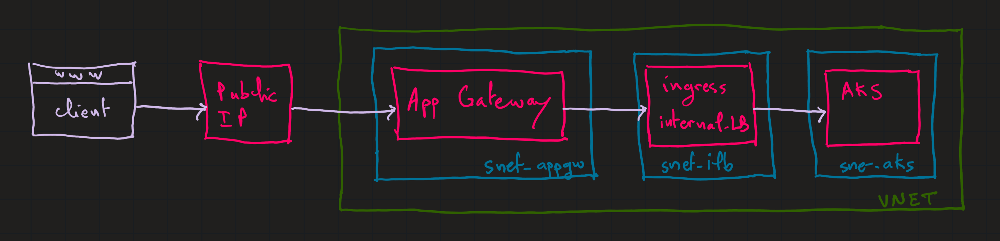
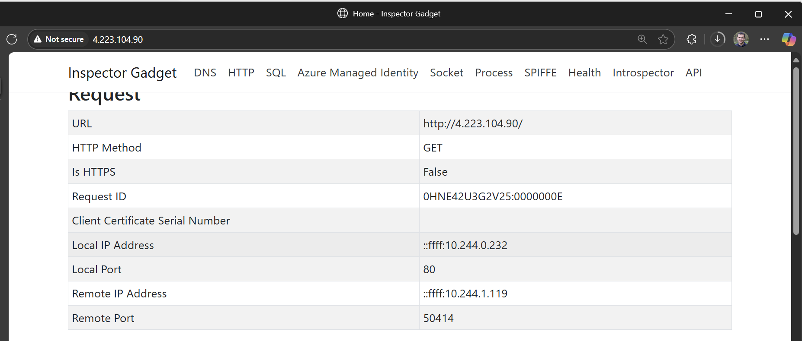

# Azure AKS Ingress Controller with Application Gateway

## Introduction

In this lab, you will learn how to expose an AKS application using the Azure Application Gateway and Nginx Ingress Controller.

It is possible to achieve this by using the [App Routing](https://learn.microsoft.com/en-us/azure/aks/app-routing) addon in AKS, which creates a managed Nginx Ingress Controller. The Application Gateway will be used to route traffic to the Nginx Ingress Controller.



>Note: AKS documentation used to highlight `Application Gateway Ingress Controller (AGIC)` as the preferred way to expose AKS applications. However, this approach, despite being so simple to implement, might cause applications to be out of service while App Gateway is being updated each time there is new ingress configuration.

## Implement the lab

This lab uses `terraform` to deploy the resources. It will create the VNET, Subnets, AKS cluster, Application Gateway and will enable the `App Routing` addon on AKS which will create a managed Nginx Ingress Controller.

To deploy the resources, run the following commands from the `terraform` directory:

```sh
$env:ARM_SUBSCRIPTION_ID=(az account show --query id -o tsv)

terraform init
terraform apply -auto-approve
```

This will take about 5 minutes to complete. The following resources will be deployed: 


And the following resources will be created in the nodes resource group.


>Note that Terraform will also deploy a Linux VM as a jumpbox to verify connectivity to the private ingress controller. This is not required, but it is useful for testing purposes.

After that, you will need to deploy an application to the AKS cluster. To do this, run the following commands :

```sh
kubectl apply -f app-k8s.yaml
```

This will deploy a sample application exposed through the App Routing's internal Nginx Ingress Controller.

```sh
kubectl get ingress
# NAME     CLASS            HOSTS   ADDRESS      PORTS   AGE
# webapp   nginx-internal   *       10.10.1.10   80      23m
```

>Note that the ingress controller is using the internal Load Balancer IP `10.10.1.10`. This IP was statically assigned in the `app-k8s.yaml` file and it is from the `snet-aks-lb` subnet. It will also be used by the Application Gateway to route traffic to the Nginx Ingress Controller.

## Access the application

To access the application, you will need to use the public IP address of the Application Gateway. You can find this IP address in the Azure Portal or from Terraform output.

