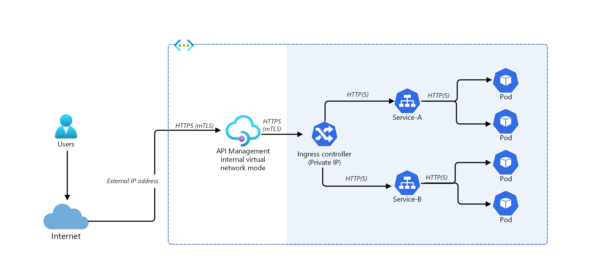
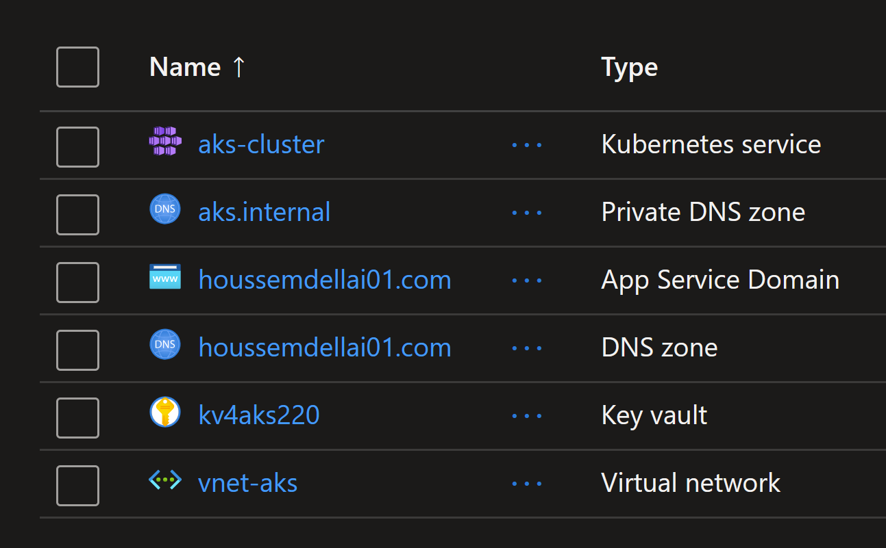

# Exposing AKS applications using API Management

## Introduction

Mutual TLS authentication is natively supported by API Management and can be enabled in Kubernetes by installing an Ingress Controller. As a result, authentication will be performed in the Ingress Controller, which simplifies the microservices. Additionally, you can add the IP addresses of API Management to the allowed list by Ingress to make sure only API Management has access to the cluster.



Pros:

- Easy configuration on the API Management side because it doesn't need to be injected into the cluster VNet and mTLS is natively supported
- Centralizes protection for inbound cluster traffic at the Ingress Controller layer
- Reduces security risk by minimizing publicly visible cluster endpoints

Cons:

- Increases complexity of cluster configuration due to extra work to install, configure and maintain the Ingress Controller and manage certificates used for mTLS
- Security risk due to public visibility of Ingress Controller endpoint(s)

When you publish APIs through API Management, it's easy and common to secure access to those APIs by using subscription keys. Developers who need to consume the published APIs must include a valid subscription key in HTTP requests when they make calls to those APIs. Otherwise, the calls are rejected immediately by the API Management gateway. They aren't forwarded to the back-end services.

To get a subscription key for accessing APIs, a subscription is required. A subscription is essentially a named container for a pair of subscription keys. Developers who need to consume the published APIs can get subscriptions. And they don't need approval from API publishers. API publishers can also create subscriptions directly for API consumers.

Official documentation here: https://learn.microsoft.com/en-us/azure/api-management/api-management-kubernetes

## Lab: Exposing AKS applications using API Management

In this lab, you will learn how to expose an AKS application using API Management. You will go through the following steps:

1. Deploy an AKS cluster
2. Enable AKS App Routing addon to create a managed Nginx Ingress Controller
3. Deploy an application to the cluster
4. Expose the application using the Ingress Controller and internal Load Balancer
5. Deploy an API Management instance
6. Expose the application using API Management

### Deploying the resources

You will use `terraform` to deploy the resources.

To deploy the resources, run the following commands from the `terraform` directory:

```sh
terraform init
terraform apply -auto-approve
```

This will take about 22 minutes to complete.
The following resources will be deployed: 

- AKS cluster with App Routing addon enabled
- API Management developer instance (the cheapest SKU)
- Virtual Network with a subnet for the AKS cluster and another subnet for the API Management instance
- NSG rules to allow required inbound and outbound traffic for API Management instance
- API definition for the application in API Management

> Note how we are using the static IP address `10.10.0.10` for the Ingress Controller. This IP will be used to configure the API Management API backend.

After that, you will need to deploy an application to the AKS cluster. To do this, run the following commands from the `kubernetes` directory:

```sh
kubectl apply -f 1-app.yaml,2-nginx-internal-controller.yaml,3-ingress-internal.yaml
```

This will deploy:
- Kubernetes namespace, deployment, and service for the application

```yaml
apiVersion: v1
kind: Namespace
metadata:
  name: webapi
---
apiVersion: apps/v1
kind: Deployment
metadata:
  name: webapi
  namespace: webapi
spec:
  replicas: 3
  selector:
    matchLabels:
      app: webapi
  template:
    metadata:
      labels:
        app: webapi
    spec:
      containers:
      - name: webapi
        image: ghcr.io/houssemdellai/containerapps-album-backend:v1
        ports:
        - containerPort: 3500
---
apiVersion: v1
kind: Service
metadata:
  name: webapi
  namespace: webapi
spec:
  type: ClusterIP
  ports:
  - port: 80
    targetPort: 3500
  selector:
    app: webapi
```

- Nginx Ingress Controller with an internal Load Balancer that uses static IP

```yaml
apiVersion: approuting.kubernetes.azure.com/v1alpha1
kind: NginxIngressController
metadata:
  name: nginx-internal-static
spec:
  ingressClassName: nginx-internal-static
  controllerNamePrefix: nginx-internal-static
  loadBalancerAnnotations: 
    service.beta.kubernetes.io/azure-load-balancer-internal: "true"
    service.beta.kubernetes.io/azure-load-balancer-ipv4: "10.10.0.10"
```

- Ingress resource to expose the application using the Ingress Controller

```yaml
apiVersion: networking.k8s.io/v1
kind: Ingress
metadata:
  name: webapi
  namespace: webapi
spec:
  ingressClassName: nginx-internal-static
  rules:
  - http:
      paths:
      - backend:
          service:
            name: webapi
            port:
              number: 80
        path: /
        pathType: Prefix
```

The application should now be exposed using the Ingress Controller.

```sh
kubectl run nginx --image=nginx
# pod/nginx created
root@nginx:/# curl 10.10.0.10/albums
[{"id":1,"title":"You, Me and an App Id","artist":"Daprize","price":10.99,"image_url":"https://aka.ms/albums-daprlogo"},{"id":2,"title":"Seven Revision Army","artist":"The Blue-Green Stripes","price":13.99,"image_url":"https://aka.ms/albums-containerappslogo"},{"id":3,"title":"Scale It Up","artist":"KEDA Club","price":13.99,"image_url":"https://aka.ms/albums-kedalogo"},{"id":4,"title":"Lost in Translation","artist":"MegaDNS","price":12.99,"image_url":"https://aka.ms/albums-envoylogo"},{"id":5,"title":"Lock Down Your Love","artist":"V is for VNET","price":12.99,"image_url":"https://aka.ms/albums-vnetlogo"},{"id":6,"title":"Sweet Container O' Mine","artist":"Guns N Probeses","price":14.99,"image_url":"https://aka.ms/albums-containerappslogo"}]
```

Now you can verify the application is exposed using the API Management instance.
Get the Gateway URL, which should be something like `https://apim-external-aks-230-swc.azure-api.net`.
Then paste the URL in the browser and add `/albums` to the end of the URL. You should see the same response as before.

