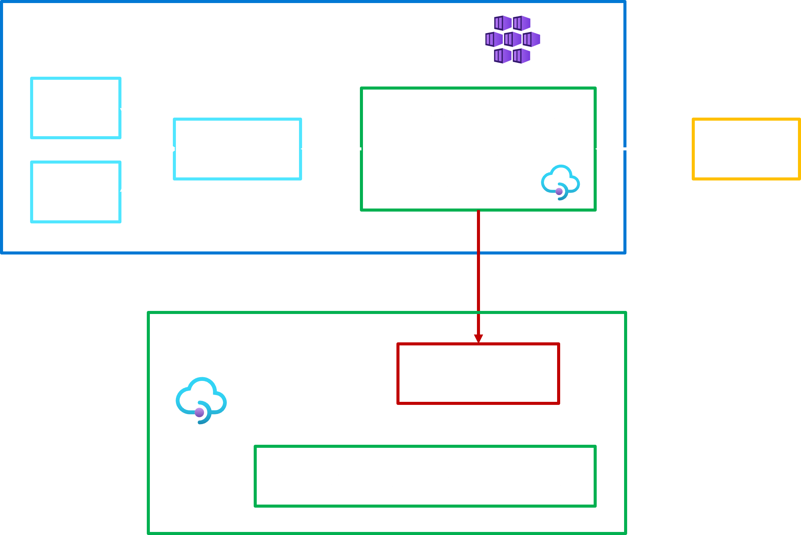
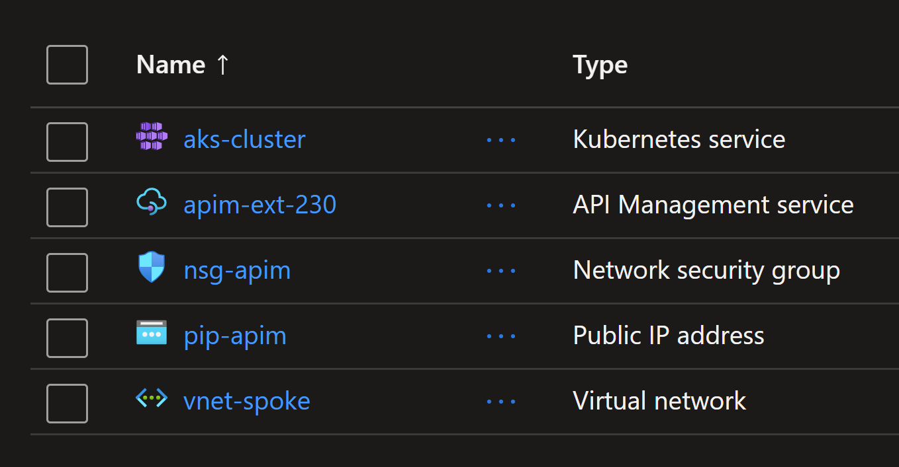
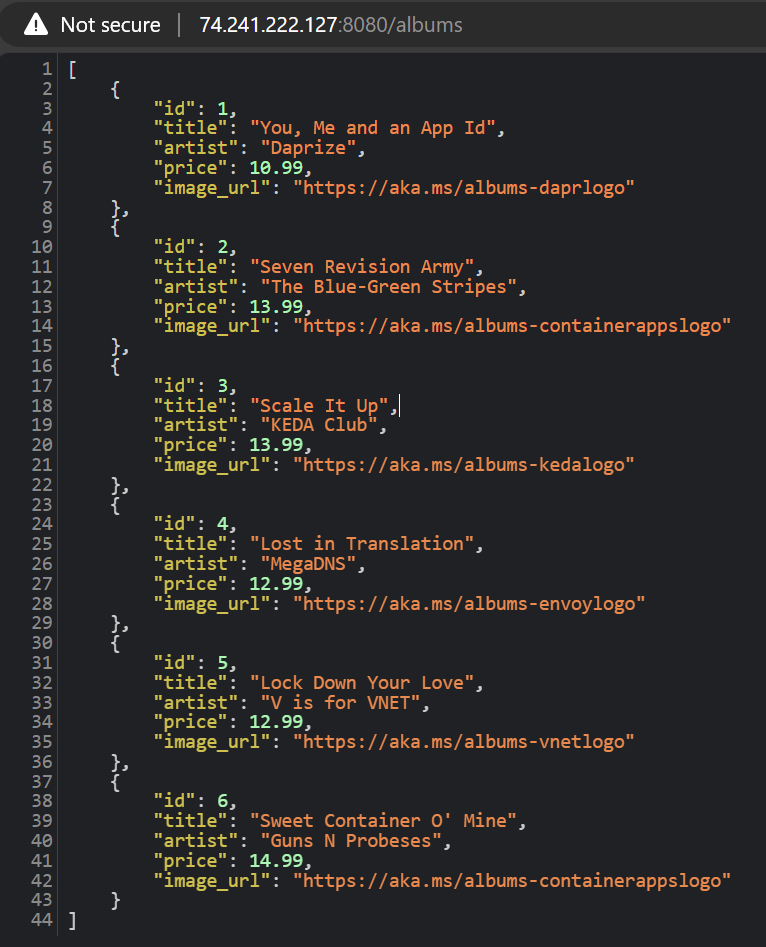

# Exposing AKS applications using API Management Self Hosted Gateway

## Introduction

Self-hosted gateway is a feature of Azure API Management. The self-hosted gateway, a containerized version of the API Management gateway component, expands API Management support for hybrid and multi-cloud environments. It allows customers to manage all of their APIs using a single API management solution without compromising security, compliance, or performance. Customers can deploy the self-hosted gateways to the same environments where they host their APIs while continuing to manage them from an associated API Management service in Azure.



## Lab: Exposing AKS applications using API Management Self Hosted Gateway

In this lab, you will learn how to expose an AKS application using API Management. You will go through the following steps:

1. Deploy an AKS cluster
2. Deploy an application to the cluster
3. Deploy an API Management instance (developer SKU)
4. Deploy the self-hosted gateway into AKS
5. Create API resource in API Management
6. Confirm the API is accessible through the self-hosted gateway

> Note that API Management self hosted gateway is a container that could be deployed in any k8s cluster, not just AKS.

### Deploying the resources using Terraform

You will use `terraform` to deploy the resources.

To deploy the resources, run the following commands from the `terraform` directory:

```sh
terraform init
terraform apply -auto-approve
```

This will take about 22 minutes to complete.
The following resources will be deployed: 

