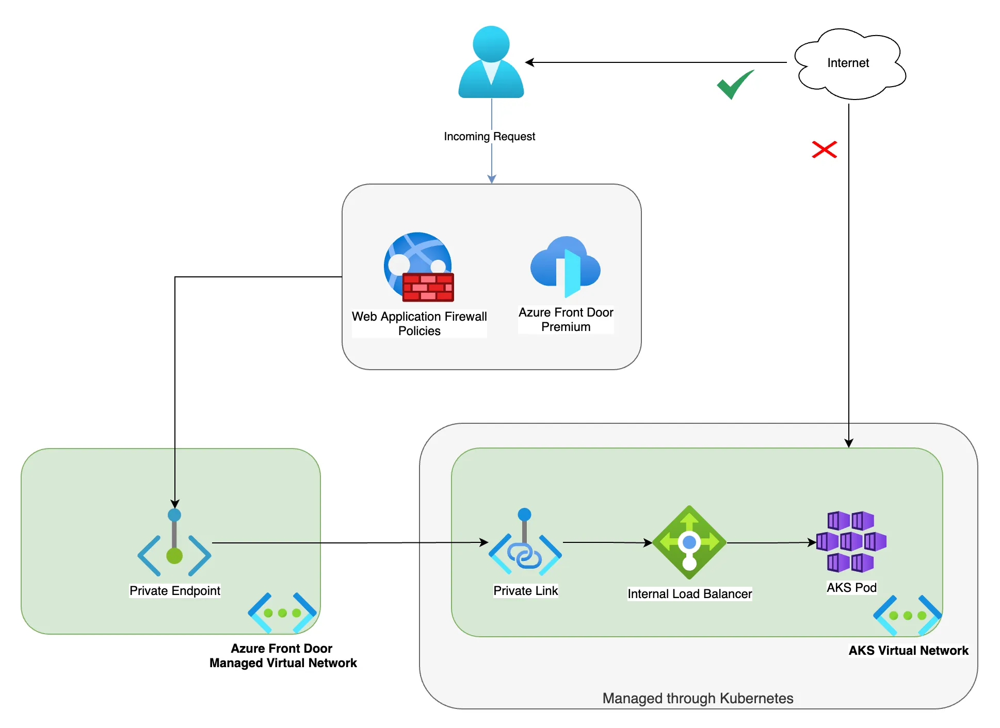

# Exposing AKS applications using Azure Front Door

## Introduction

AKS applications could be exposed `Load Balancer`, `Ingress Controller`, `API Management`, `Application Gateway` or `Front Door`. 
In this lab, you will learn how to expose an AKS application using Azure Front Door. 
Azure Front Door uses `Private Link Service` to expose the AKS applications.

To use Azure Front Door with AKS, you will go through the following steps.

1. Create an internal Load Balancer using the `Ingress Controller` or the `Kubernetes service` annotations.
2. Enable creation of a `Private Link Service` using annotations. That is to provide connectivity to the internal Load Balancer with `Private Endpoint`.
3. Enable `Front Door` to create a `Private Endpoint` to connect to the `Private Link Service`.
4. Approve the connection between the `Private Link Service` and the `Private Endpoint`.



## Lab: Exposing AKS applications using Front Door

### Deploying the resources

You will use `terraform` to deploy the resources. Run the following commands from the `terraform` directory:

```sh
terraform init
terraform apply -auto-approve
```

The following resources will be deployed: 


The terraform template will create the following resources:

### 1. Creating an AKS cluster with App Routing enabled (this will create a managed Nginx Ingress Controller)
Terraform will then connect to the cluster using `az aks get-credentials`.

```hcl
resource "terraform_data" "aks-get-credentials" {
  triggers_replace = [
    azurerm_kubernetes_cluster.aks.id
  ]

  provisioner "local-exec" {
    command = "az aks get-credentials -n ${azurerm_kubernetes_cluster.aks.name} -g ${azurerm_kubernetes_cluster.aks.resource_group_name} --overwrite-existing"
  }
}
```

### 2. Creating an Azure Front Door

```hcl
resource "azurerm_cdn_frontdoor_profile" "frontdoor" {
  name                = "frontdoor-aks-apps"
  resource_group_name = azurerm_resource_group.rg.name
  sku_name            = "Premium_AzureFrontDoor"
}
```

> **Note**: The `sku_name` must be `Premium_AzureFrontDoor` for Private Link support.

### 3. Deploying a service and ingress controller that enables creation of internal Load Balancer with Private Link Service

The simplest way to expose an AKS application is to use the `Kubernetes service` annotations like following.

```yaml
apiVersion: v1
kind: Service
metadata:
  name: webapi-internal-service-pls
  namespace: webapi
  annotations:
    service.beta.kubernetes.io/azure-load-balancer-internal: "true" # Right now PLS must be used with internal LB
    service.beta.kubernetes.io/azure-load-balancer-ipv4: 10.10.0.25
    service.beta.kubernetes.io/azure-pls-create: "true"
    service.beta.kubernetes.io/azure-pls-name: "pls-aks-service"
    service.beta.kubernetes.io/azure-pls-ip-configuration-subnet: "snet-aks" # Private Link subnet name
    service.beta.kubernetes.io/azure-pls-ip-configuration-ip-address-count: "1"
    service.beta.kubernetes.io/azure-pls-proxy-protocol: "false"
    service.beta.kubernetes.io/azure-pls-visibility: "*"
    service.beta.kubernetes.io/azure-pls-auto-approval: "38977b70-47bf-4da5-a492-88712fce8725"
spec:
  type: LoadBalancer
  selector:
    app: webapi
  ports:
  - port: 80
    targetPort: 80
```

But, if you want to use the `Ingress Controller` like `Nginx`, you should tell Nginx to apply the above annotations.
As we are using `App Routing` addon, we can configure it like this.

```yaml
apiVersion: approuting.kubernetes.azure.com/v1alpha1
kind: NginxIngressController
metadata:
  name: nginx-internal-static-pls
spec:
  ingressClassName: nginx-internal-static-pls
  controllerNamePrefix: nginx-internal-static-pls
  loadBalancerAnnotations: 
    service.beta.kubernetes.io/azure-load-balancer-internal: "true" # Right now PLS must be used with internal LB
    service.beta.kubernetes.io/azure-load-balancer-ipv4: 10.10.0.30
    service.beta.kubernetes.io/azure-pls-create: "true"
    service.beta.kubernetes.io/azure-pls-name: "pls-aks-ingress"
    service.beta.kubernetes.io/azure-pls-ip-configuration-subnet: "snet-aks" # Private Link subnet name
    service.beta.kubernetes.io/azure-pls-ip-configuration-ip-address-count: "1"
    service.beta.kubernetes.io/azure-pls-proxy-protocol: "false"
    service.beta.kubernetes.io/azure-pls-visibility: "*"
    service.beta.kubernetes.io/azure-pls-auto-approval: "<Replace with your subscription ID>"
```

`Terraform` deploys all YAML files in the `kubernetes` directory.
That includes a sample application.

```sh
kubectl get pods,deployments,services,ingress --namespace webapi
NAME                          READY   STATUS    RESTARTS   AGE
pod/webapi-56fd7bbb95-68kgm   1/1     Running   0          16m
pod/webapi-56fd7bbb95-jp8gw   1/1     Running   0          16m
pod/webapi-56fd7bbb95-mxkwx   1/1     Running   0          16m

NAME                     READY   UP-TO-DATE   AVAILABLE   AGE
deployment.apps/webapi   3/3     3            3           16m

NAME                                  TYPE           CLUSTER-IP     EXTERNAL-IP   PORT(S)        AGE
service/webapi                        ClusterIP      10.0.168.77    <none>        80/TCP         16m
service/webapi-internal-service-pls   LoadBalancer   10.0.133.161   10.10.0.25    80:30091/TCP   16m

NAME                                   CLASS                       HOSTS   ADDRESS      PORTS   AGE
ingress.networking.k8s.io/webapi-pls   nginx-internal-static-pls   *       10.10.0.30   80      16m
```

### 4. Configure Azure `Front Door` to create a `Private Endpoint` to connect to the `Private Link Service`.

```hcl
# Get the PLS that is created for the ingress and the service
data "azurerm_private_link_service" "pls-ingress" {
  name                = var.pls_ingress_name
  resource_group_name = azurerm_kubernetes_cluster.aks.node_resource_group

  depends_on = [time_sleep.wait_120_seconds]
}

resource "azurerm_cdn_frontdoor_origin" "origin-aks-ingress" {
  name                          = "origin-aks-ingress"
  cdn_frontdoor_origin_group_id = azurerm_cdn_frontdoor_origin_group.origin-group-aks-ingress.id

  enabled                        = true
  host_name                      = "10.10.0.30"
  http_port                      = 80
  https_port                     = 443
  origin_host_header             = "10.10.0.30"
  priority                       = 1
  weight                         = 1000
  certificate_name_check_enabled = true

  private_link {
    private_link_target_id = data.azurerm_private_link_service.pls-ingress.id
    request_message        = "Request access for Azure Front Door Private Link origin"
    location               = var.location
  }
}
```

### 5. Approve the connection between the `Private Link Service` and the `Private Endpoint`.

This step is not yet natively integrated with `Terraform`. So you will need to do it manually in this lab.
Just go to the `Private Link Center`in the Azure portal, then pending connections, and approve the connection.


## Test the application

