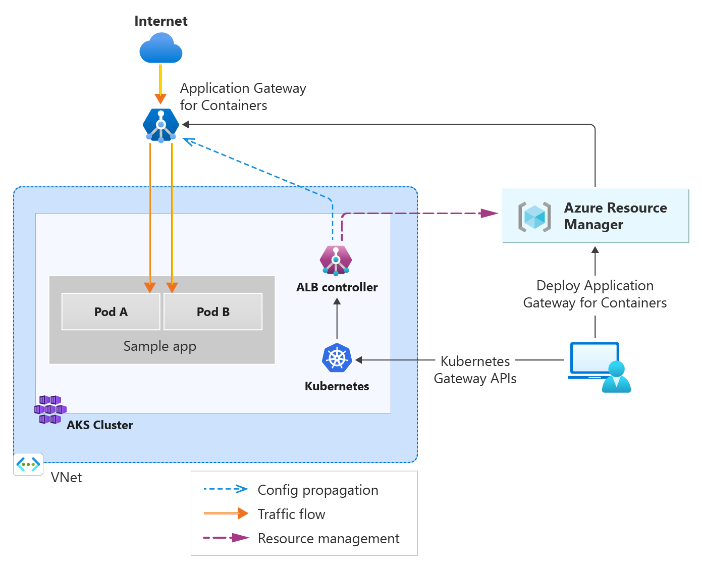

# Application Gateway for Containers with AKS

This demo showcases how to create an **Application Gateway for Containers (AGC)** integrated with **Azure Kubernetes Service (AKS)** to expose a sample application. The configuration uses **Terraform** to provision the required Azure resources and deploy the application.

## Architecture

The architecture includes:
- An AKS cluster hosting the sample application.
- An Application Gateway for Containers (AGC) to manage ingress traffic.
- A custom DNS zone for routing traffic to the application.
- A virtual network (VNet) for networking resources.



## Steps to Deploy

```sh
terraform init
terraform plan -out=tfplan
terraform apply tfplan
```

## Application Deployment

After the infrastructure is provisioned, you need to deploy the sample application to the AKS cluster. The AGC will be configured to route traffic to the application based on the defined rules.

```sh
kubectl apply -f kubernetes/
```

## Accessing the Application

Once the application is deployed, you can access it through the custom DNS name configured in the App Service Domain name.

```sh
curl http://<your-custom-dns-name>
```