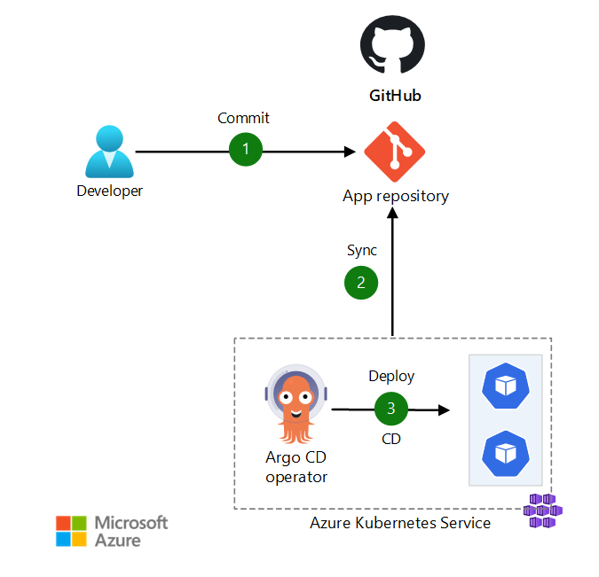

# Deploying apps into AKS using ArgoCD

## Introduction to ArgoCD

Application definitions, configurations, and environments should be declarative and version controlled. Application deployment and lifecycle management should be automated, auditable, and easy to understand.

The Kubernetes administrator can change Kubernetes configuration objects, such as secrets and ConfigMaps, and commit the changes directly to the GitHub repository.



The data flow for this scenario is:

1. The Kubernetes administrator makes configuration changes in YAML files and commits the changes to the GitHub repository.
2. Argo CD pulls the changes from the Git repository.
3. Argo CD reconciles the configuration changes to the AKS cluster.

Argo CD doesn't have to automatically sync the desired target state to the AKS cluster. It's implemented as a Kubernetes controller that continuously monitors running applications. It compares the current, live state of the AKS cluster against the desired target state that's specified in the Git repository. Argo CD reports and visualizes the differences, while providing facilities to automatically or manually sync the live state back to the desired target state.

Argo CD provides a browser-based user interface. You can use it to add application configurations, observe the synchronization state with respect to the cluster, and initiate synchronization against the cluster. You can also use the Argo CD command line to do these things. Both the user interface and command line interface provide features to view the history of configuration changes and to roll back to a previous version.

By default, the Argo CD user interface and the API server aren't exposed. To access them, we recommend that you create an ingress controller that has an internal IP address. Or, you can use an internal load balancer to expose them.

## Installing ArgoCD into the cluster

```sh
kubectl create namespace argocd

kubectl apply -n argocd -f https://raw.githubusercontent.com/argoproj/argo-cd/stable/manifests/install.yaml

# Expose ArgoCD on public IP
kubectl patch svc argocd-server -n argocd -p '{"spec": {"type": "LoadBalancer"}}'

# get password then decode base64
kubectl get secret argocd-initial-admin-secret -n argocd -o yaml
```

## Deploying an ArgoCD project

Each team should have its own project to deploy its own apps.
A project config looks like this:

```yaml
apiVersion: argoproj.io/v1alpha1
kind: AppProject
metadata:
  name: project-apps
  namespace: argocd
spec:
  sourceRepos:
    - '*'
  destinations:
  - namespace: '!kube-system' # Do not allow any app to be installed in `kube-system`
    server: 'https://kubernetes.default.svc'
```

```sh
kubectl apply -f project-argocd.yaml
```

## Deploying a Helm application

We'll deploy the sample application prvided in `helm` folder.

First create the namespace for the application.

```sh
kubectl create namespace app001
```

Then deploy the app through ArgoCD.

The ArgoCD's `Application` object will be used to create the app. 
It describes where to deploy the app, in which namespace and from which repo to get manifest files.

Here is its configuration.

```yaml
apiVersion: argoproj.io/v1alpha1
kind: Application
metadata:
  name: app001
  namespace: argocd
spec:
  project: project-apps
  source:
    path: 292_gitops_argocd_helm_multi_apps/helm/
    repoURL: https://github.com/HoussemDellai/aks-course/
    targetRevision: HEAD
    helm:
      valuesObject:
        env:
          DATABASE_FQDN: "sqlserver-poc-001.database.windows.net"
          DATABASE_NAME: "inspectorgadget"
          DATABASE_USERNAME: "sqladmin"
          DATABASE_PASSWORD: "P@ssw0rd"
          DATABASE_PORT: "1433"
  destination:
    namespace: app001
    server: https://kubernetes.default.svc
```

Let's deploy it to AKS through ArgoCD server.

```sh
kubectl apply -f app-argocd-001.yaml
```

Check the app is installed correctly.

```sh
kubectl get application -n argocd
```

## Exploring ArgoCD CLI

Installing ArgoCD CLI on Windows

```sh
winget install -e --id argoproj.argocd
```

## Login to ArgoCD server

Replace the IP with your ArgoCD server IP.

```sh
argocd login 4.178.217.48:80
# WARNING: server certificate had error: tls: failed to verify certificate: x509: certificate signed by unknown authority. Proceed insecurely (y/n)? y
# Username: admin
# Password:
# 'admin:login' logged in successfully
# Context '4.178.217.48:80' updated
```

```sh
# argocd app get app001
# Name:               argocd/app001
# Project:            project-apps
# Server:             https://kubernetes.default.svc
# Namespace:          app001
# URL:                https://4.178.217.48:80/applications/app001
# Source:
# - Repo:             https://github.com/HoussemDellai/aks-course/
#   Target:           HEAD
#   Path:             292_gitops_argocd_helm_multi_apps/helm/
# SyncWindow:         Sync Allowed
# Sync Policy:        Manual
# Sync Status:        Synced to HEAD (e77dd42)
# Health Status:      Healthy

# GROUP  KIND        NAMESPACE  NAME             STATUS  HEALTH   HOOK  MESSAGE
#        Service     app001     inspectorgadget  Synced  Healthy        service/inspectorgadget created
# apps   Deployment  app001     inspectorgadget  Synced  Healthy        deployment.apps/inspectorgadget created
```