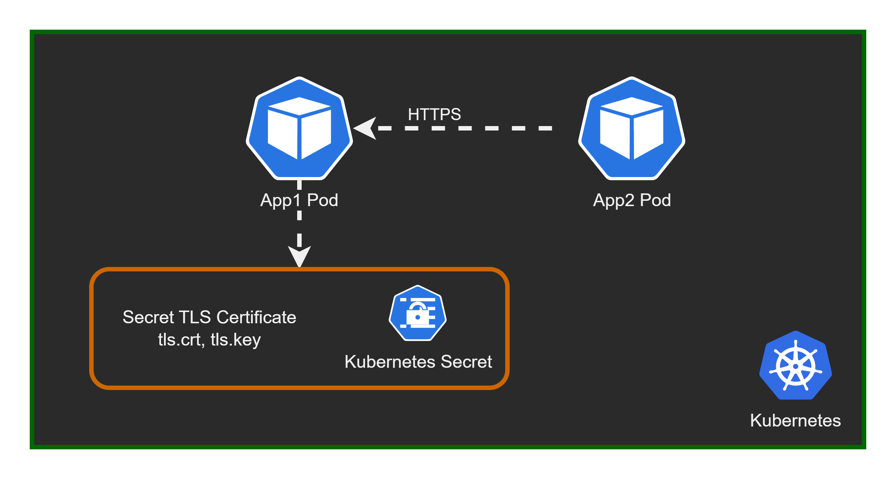

# Setting TLS certificate in Kubernetes deployment

This lab will show how to configure a kubernetes deployment to use TLS certificate to enable HTTPS. We'll take as an example a .NET application.

Lab steps:
1. Create an AKS cluster
2. Create TLS certificate for the Deployment
3. Save certificate into a kubernetes secret object
4. Deploy sample application that uses the TLS secret to configure HTTPS
5. Verify TLS certificate is working



## 1. Create an AKS cluster

```powershell
$AKS_RG="rg-aks-demo-tls"
$AKS_NAME="aks-cluster"

az group create -n $AKS_RG -l westeurope

az aks create -g $AKS_RG -n $AKS_NAME `
              --kubernetes-version "1.25.2" `
              --enable-managed-identity `
              --node-count 2 `
              --network-plugin azure
```

## Connect to the cluster

```powershell
az aks get-credentials -n $AKS_NAME -g $AKS_RG --overwrite-existing

kubectl get nodes
# NAME                                STATUS   ROLES   AGE     VERSION
# aks-nodepool1-17393022-vmss000000   Ready    agent   3m13s   v1.25.2
# aks-nodepool1-17393022-vmss000001   Ready    agent   3m24s   v1.25.2
```

## 2. Create TLS certificate for the Deployment

```powershell
$APP_CERT_NAME="app-tls-cert"

$SERVICE_NAME="app-svc"

openssl req -x509 -nodes -days 365 -newkey rsa:2048 `
    -out "${APP_CERT_NAME}.crt" `
    -keyout "${APP_CERT_NAME}.key" `
    -subj "/CN=$SERVICE_NAME.$NAMESPACE_APP.svc.cluster.local/O=aks-ingress-tls" `
    -addext "subjectAltName=DNS:$SERVICE_NAME.$NAMESPACE_APP.svc.cluster.local"
# Generating a RSA private key
# ........+++++
# ....................................+++++
# writing new private key to 'app-tls-cert.key'

openssl pkcs12 -export -in "$APP_CERT_NAME.crt" -inkey "$APP_CERT_NAME.key" -out "$APP_CERT_NAME.pfx"
# Enter Export Password:
# Verifying - Enter Export Password:
```

## 3. Save certificate into a kubernetes secret object

```powershell
$NAMESPACE_APP="dotnet-app"

kubectl create namespace $NAMESPACE_APP
# namespace/dotnet-app created

$APP_SECRET_TLS="app-tls-cert-secret"

kubectl create secret generic $APP_SECRET_TLS --from-file="$APP_CERT_NAME.pfx" --namespace $NAMESPACE_APP
# secret/app-tls-cert-secret created

kubectl describe secret $APP_SECRET_TLS --namespace $NAMESPACE_APP
# Name:         app-tls-cert-secret
# Namespace:    dotnet-app
# Labels:       <none>
# Annotations:  <none>

# Type:  Opaque

# Data
# ====
# app-tls-cert.pfx:  2509 bytes
```

## 4. Deploy sample application that uses the TLS secret to configure HTTPS

```powershell
@"
apiVersion: v1
kind: Service
metadata:
  labels:
    app: demo-app
  name: $SERVICE_NAME
spec:
  ports:
  - port: 443
    protocol: TCP
    targetPort: 443
  selector:
    app: demo-app
  type: ClusterIP
---
apiVersion: apps/v1
kind: Deployment
metadata:
  labels:
    app: demo-app
  name: demo-app
spec:
  replicas: 3
  selector:
    matchLabels:
      app: demo-app
  template:
    metadata:
      labels:
        app: demo-app
    spec:
      restartPolicy: Always
      volumes:
      - name: demo-app-tls
        secret:
          secretName: $APP_SECRET_TLS
      containers:
      - name: demo-app
        image: mcr.microsoft.com/dotnet/samples:aspnetapp
        ports:
        - containerPort: 443
        volumeMounts:
        - name: demo-app-tls
          mountPath: /secrets/tls-cert
          readOnly: true
        env:
        - name: ASPNETCORE_Kestrel__Certificates__Default__Password
          value: ""
        - name: ASPNETCORE_Kestrel__Certificates__Default__Path
          value: /secrets/tls-cert/$APP_CERT_NAME.pfx
        - name: ASPNETCORE_URLS
          value: "https://+;http://+"
        - name: ASPNETCORE_HTTPS_PORT
          value: "443"
"@  > app-deploy-svc.yaml

kubectl apply -f app-deploy-svc.yaml -n $NAMESPACE_APP
```

Check app deployed

```powershell
kubectl get pods,svc -n $NAMESPACE_APP
# NAME                            READY   STATUS    RESTARTS   AGE
# pod/demo-app-5bcc468b9f-ldrhk   1/1     Running   0          17m
# pod/demo-app-5bcc468b9f-mgr6x   1/1     Running   0          17m
# pod/demo-app-5bcc468b9f-qv85h   1/1     Running   0          17m

# NAME              TYPE        CLUSTER-IP   EXTERNAL-IP   PORT(S)   AGE
# service/app-svc   ClusterIP   10.0.96.70   <none>        443/TCP   17m
```

## 5. Verify TLS certificate is working

```powershell
kubectl run nginx --image=nginx

kubectl exec -it nginx -- curl -v -k https://app-svc.dotnet-app.svc.cluster.local
# *   Trying 10.0.96.70:443...
# * Connected to app-svc.dotnet-app.svc.cluster.local (10.0.96.70) port 443 (#0)
# * ALPN, offering h2
# * ALPN, offering http/1.1
# * successfully set certificate verify locations:
# *  CAfile: /etc/ssl/certs/ca-certificates.crt
# *  CApath: /etc/ssl/certs
# * TLSv1.3 (OUT), TLS handshake, Client hello (1):
# * SSL connection using TLSv1.3 / TLS_AES_256_GCM_SHA384
# * Server certificate:
# *  subject: CN=app-svc..svc.cluster.local; O=aks-ingress-tls
# *  start date: Dec 10 07:42:41 2022 GMT
# *  expire date: Dec 10 07:42:41 2023 GMT
# *  issuer: CN=app-svc..svc.cluster.local; O=aks-ingress-tls
# *  SSL certificate verify result: self signed certificate (18), continuing anyway.
```