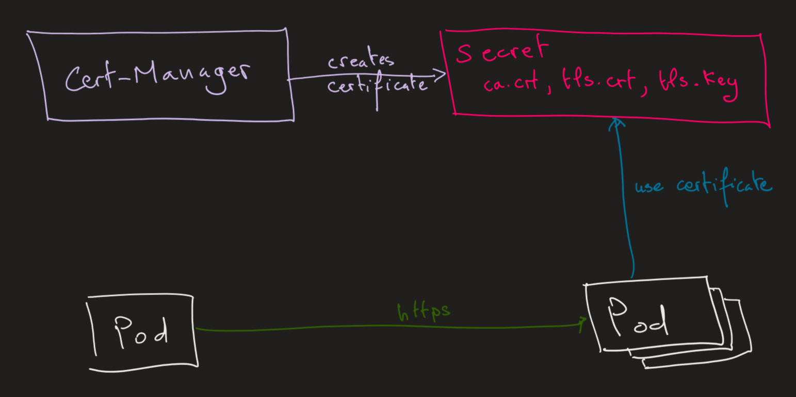

# Encrypting Pod to Pod traffic using TLS certificates with Cert Manager

In this lab we will secure pod to pod communication using `TLS certificates`.
The TLS certificate will be generated using `Cert-Manager`. 
Then Cert-Manager will save it into Kubernetes secret.
The pod will consume this TLS certificate through environment variables.

In this demo, we just use self-signed certificate for simplicity. 
But Cert-Manager can request a TLS certificate from `Let's Encrypt`.



For production workloads, follow the official guide: https://cert-manager.io/docs/tutorials/getting-started-aks-letsencrypt/

The steps for the lab:
1. Create an AKS cluster
2. Install Cert Manager into AKS
3. Create a ClusterIssuer and a self-signed Certificate
4. Create a deployment consuming the TLS certificate
5. Verify the TLS configuration

## 1. Create an AKS cluster

```shell
$AKS_RG="rg-aks-cluster"
$AKS_NAME="aks-cluster"

az group create -n $AKS_RG -l westeurope

az aks create -g $AKS_RG -n $AKS_NAME `
              --kubernetes-version "1.25.5" `
              --node-count 2 `
              --network-plugin azure

# Connect to the cluster

az aks get-credentials -n $AKS_NAME -g $AKS_RG --overwrite-existing

kubectl get nodes
# NAME                                STATUS   ROLES   AGE     VERSION
# aks-nodepool1-10569199-vmss000000   Ready    agent   3h24m   v1.25.5
# aks-nodepool1-10569199-vmss000001   Ready    agent   3h24m   v1.25.5
```

## 2. Install Cert Manager into AKS

```shell
# Add the Jetstack Helm repository
helm repo add jetstack https://charts.jetstack.io

# Update your local Helm chart repository cache
helm repo update

# Install the cert-manager Helm chart
helm upgrade cert-manager jetstack/cert-manager `
             --install `
             --create-namespace `
             --namespace cert-manager `
             --set installCRDs=true `
             --set nodeSelector."kubernetes\.io/os"=linux
# Release "cert-manager" does not exist. Installing it now.
#  NAME: cert-manager
#  LAST DEPLOYED: Sat Feb 18 08:10:56 2023
#  NAMESPACE: cert-manager
#  STATUS: deployed
#  REVISION: 1
#  TEST SUITE: None
#  NOTES:
#  cert-manager v1.11.0 has been deployed successfully!
 
#  In order to begin issuing certificates, you will need to set up a ClusterIssuer
#  or Issuer resource (for example, by creating a 'letsencrypt-staging' issuer).
# ...
```

You can view some of the resources that have been installed as follows:

```shell
kubectl get all -n cert-manager 
# NAME                                           READY   STATUS    RESTARTS   AGE
# pod/cert-manager-59bf757d77-78tjl              1/1     Running   0          36s
# pod/cert-manager-cainjector-547c9b8f95-dr5mf   1/1     Running   0          36s
# pod/cert-manager-webhook-6787f645b9-qn4tl      1/1     Running   0          36s

# NAME                           TYPE        CLUSTER-IP     EXTERNAL-IP   PORT(S)    AGE
# service/cert-manager           ClusterIP   10.0.78.114    <none>        9402/TCP   36s
# service/cert-manager-webhook   ClusterIP   10.0.181.174   <none>        443/TCP    36s

# NAME                                      READY   UP-TO-DATE   AVAILABLE   AGE
# deployment.apps/cert-manager              1/1     1            1           36s
# deployment.apps/cert-manager-cainjector   1/1     1            1           36s
# deployment.apps/cert-manager-webhook      1/1     1            1           36s

# NAME                                                 DESIRED   CURRENT   READY   AGE
# replicaset.apps/cert-manager-59bf757d77              1         1         1       36s
# replicaset.apps/cert-manager-cainjector-547c9b8f95   1         1         1       36s
# replicaset.apps/cert-manager-webhook-6787f645b9      1         1         1       36s
```

## 3. Create a ClusterIssuer and a self-signed Certificate

```shell
kubectl apply -f clusterissuer-selfsigned.yaml
# clusterissuer.cert-manager.io/selfsigned created

kubectl apply -f .\certificate.yaml
# certificate.cert-manager.io/app01 created

kubectl get certificate,secret,ClusterIssuer
# NAME                                READY   SECRET      AGE
# certificate.cert-manager.io/app01   True    app01-tls   16s

# NAME                           TYPE                DATA   AGE
# secret/app01-tls-cert-secret   kubernetes.io/tls   3      32s

# NAME                                       READY   AGE
# clusterissuer.cert-manager.io/selfsigned   True    33m
```

```shell
kubectl describe secret app01-tls-cert-secret
# Name:         app01-tls-cert-secret
# Namespace:    default
# Labels:       controller.cert-manager.io/fao=true
# Annotations:  cert-manager.io/alt-names: app01.default.svc.cluster.local
#               cert-manager.io/certificate-name: app01
#               cert-manager.io/common-name: app01.default.svc.cluster.local
#               cert-manager.io/ip-sans:
#               cert-manager.io/issuer-group:
#               cert-manager.io/issuer-kind: ClusterIssuer
#               cert-manager.io/issuer-name: selfsigned
#               cert-manager.io/uri-sans:

# Type:  kubernetes.io/tls

# Data
# ====
# ca.crt:   1188 bytes
# tls.crt:  1188 bytes
# tls.key:  1675 bytes
```

## 4. Create a deployment consuming the TLS certificate

We will use a pod that is configured to access TLS certificate through environment variables. The Dockerfile is available here:

https://github.com/GoogleCloudPlatform/kubernetes-engine-samples/tree/main/hello-app-tls

```shell
kubectl apply -f app-deploy-svc.yaml
kubectl get pod,svc
# NAME                                                        READY   STATUS    RESTARTS   AGE
# pod/app01-7f665d9986-qfj9m                                  1/1     Running   0          128m
# pod/app01-7f665d9986-qm7pw                                  1/1     Running   0          128m
# pod/app01-7f665d9986-vzx2z                                  1/1     Running   0          128m

# NAME                 TYPE        CLUSTER-IP     EXTERNAL-IP   PORT(S)   AGE
# service/app01        ClusterIP   10.0.15.0      <none>        443/TCP   128m
# service/kubernetes   ClusterIP   10.0.0.1       <none>        443/TCP   4h26m
```

## 5. Verify the TLS configuration

```shell
kubectl run nginx --image=nginx
kubectl exec -it nginx -- curl --insecure https://app01.default.svc.cluster.local
# Hello, world!
# Protocol: HTTP/2.0!
# Hostname: app01-7f665d9986-vzx2z
```

Verify TLS certificate

```shell
kubectl exec -it nginx -- curl --insecure -v https://app01.default.svc.cluster.local
# *   Trying 10.0.15.0:443...
# * Connected to app01.default.svc.cluster.local (10.0.15.0) port 443 (#0)
# * ALPN, offering h2
# * ALPN, offering http/1.1
# * successfully set certificate verify locations:
# *  CAfile: /etc/ssl/certs/ca-certificates.crt
# *  CApath: /etc/ssl/certs
# * TLSv1.3 (OUT), TLS handshake, Client hello (1):
# * TLSv1.3 (IN), TLS handshake, Server hello (2):
# * TLSv1.3 (IN), TLS handshake, Encrypted Extensions (8):
# * TLSv1.3 (IN), TLS handshake, Certificate (11):
# * TLSv1.3 (IN), TLS handshake, CERT verify (15):
# * TLSv1.3 (IN), TLS handshake, Finished (20):
# * TLSv1.3 (OUT), TLS change cipher, Change cipher spec (1):
# * TLSv1.3 (OUT), TLS handshake, Finished (20):
# * SSL connection using TLSv1.3 / TLS_AES_128_GCM_SHA256
# * ALPN, server accepted to use h2
# * Server certificate:
# *  subject: CN=app01.default.svc.cluster.local
# *  start date: Feb 18 07:57:50 2023 GMT
# *  expire date: May 19 07:57:50 2023 GMT
# *  issuer: CN=app01.default.svc.cluster.local
# *  SSL certificate verify result: self signed certificate (18), continuing anyway.
# * Using HTTP2, server supports multi-use
# * Connection state changed (HTTP/2 confirmed)
# * Copying HTTP/2 data in stream buffer to connection buffer after upgrade: len=0
# * Using Stream ID: 1 (easy handle 0x564cd86802e0)
# > GET / HTTP/2
# > Host: app01.default.svc.cluster.local
# > user-agent: curl/7.74.0
# > accept: */*
# >
# * TLSv1.3 (IN), TLS handshake, Newsession Ticket (4):
# * Connection state changed (MAX_CONCURRENT_STREAMS == 250)!
# < HTTP/2 200
# < content-type: text/plain; charset=utf-8
# < content-length: 67
# < date: Sat, 18 Feb 2023 09:16:46 GMT
# <
# Hello, world!
# Protocol: HTTP/2.0!
# Hostname: app01-7f665d9986-vzx2z
# * Connection #0 to host app01.default.svc.cluster.local left intact
```