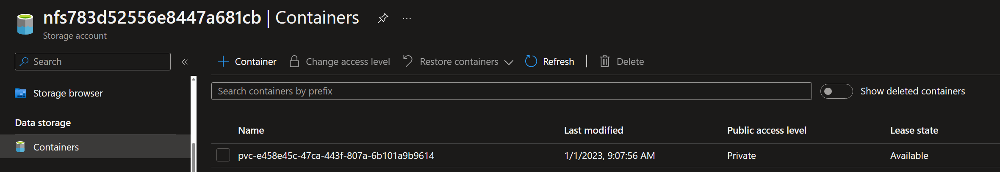

# Using Azure Blob Storage in AKS

## Introduction

The Azure Blob storage Container Storage Interface (CSI) driver is a CSI specification-compliant driver used by Azure Kubernetes Service (AKS) to manage the lifecycle of Azure Blob storage. The CSI is a standard for exposing arbitrary block and file storage systems to containerized workloads on Kubernetes.

By adopting and using CSI, AKS now can write, deploy, and iterate plug-ins to expose new or improve existing storage systems in Kubernetes. Using CSI drivers in AKS avoids having to touch the core Kubernetes code and wait for its release cycles.

## 0. Setup demo environment

```powershell
# Variables
$AKS_RG="rg-aks-storage-blob"
$AKS_NAME="aks-cluster"

# Create and connect to AKS cluster
az group create --name $AKS_RG --location westeurope

az aks create --name $AKS_NAME --resource-group $AKS_RG --node-count 3 --zones 1 2 3 --kubernetes-version "1.25.2" --network-plugin azure  --enable-blob-driver

az aks get-credentials -n $AKS_NAME -g $AKS_RG --overwrite-existing

kubectl get nodes
# NAME                                STATUS   ROLES   AGE    VERSION
# aks-nodepool1-32086527-vmss000000   Ready    agent   100m   v1.25.2
# aks-nodepool1-32086527-vmss000001   Ready    agent   100m   v1.25.2
# aks-nodepool1-32086527-vmss000002   Ready    agent   100m   v1.25.2
```

Verify the blob driver (DaemonSet) was installed

```powershell
Set-Alias -Name grep -Value select-string # if using powershell
kubectl get pods -n kube-system | grep csi
# NAME                                  READY   STATUS    RESTARTS   AGE
# csi-azuredisk-node-8wlc8              3/3     Running   0          100m
# csi-azuredisk-node-9z2wt              3/3     Running   0          100m
# csi-azuredisk-node-q9pwk              3/3     Running   0          100m
# csi-azurefile-node-7tzps              3/3     Running   0          100m
# csi-azurefile-node-8lwrl              3/3     Running   0          100m
# csi-azurefile-node-zdnpn              3/3     Running   0          100m
# csi-blob-node-8spm4                   3/3     Running   0          100m
# csi-blob-node-ctv9c                   3/3     Running   0          100m
# csi-blob-node-jbx9r                   3/3     Running   0          100m
```

When the Azure Blob storage CSI driver is enabled on AKS, there are two built-in storage classes: azureblob-fuse-premium and azureblob-nfs-premium.

```powershell
kubectl get storageclass
# NAME                     PROVISIONER          RECLAIMPOLICY   VOLUMEBINDINGMODE      ALLOWVOLUMEEXPANSION   AGE
# azureblob-fuse-premium   blob.csi.azure.com   Delete          Immediate              true                   6m23s
# azureblob-nfs-premium    blob.csi.azure.com   Delete          Immediate              true                   6m23s
# azurefile                file.csi.azure.com   Delete          Immediate              true                   67m
# azurefile-csi            file.csi.azure.com   Delete          Immediate              true                   67m
# azurefile-csi-premium    file.csi.azure.com   Delete          Immediate              true                   67m
# azurefile-premium        file.csi.azure.com   Delete          Immediate              true                   67m
# default (default)        disk.csi.azure.com   Delete          WaitForFirstConsumer   true                   67m
# managed                  disk.csi.azure.com   Delete          WaitForFirstConsumer   true                   67m
# managed-csi              disk.csi.azure.com   Delete          WaitForFirstConsumer   true                   67m
# managed-csi-premium      disk.csi.azure.com   Delete          WaitForFirstConsumer   true                   67m
# managed-premium          disk.csi.azure.com   Delete          WaitForFirstConsumer   true                   67m
```

```powershell
kubectl get sc azureblob-fuse-premium -o yaml
# allowVolumeExpansion: true
# apiVersion: storage.k8s.io/v1
# kind: StorageClass
# metadata:
#   creationTimestamp: "2022-12-31T07:18:35Z"
#   labels:
#     addonmanager.kubernetes.io/mode: EnsureExists
#     kubernetes.io/cluster-service: "true"
#   name: azureblob-fuse-premium
#   resourceVersion: "340"
#   uid: 3a8edba6-6b39-4c4f-a364-ae593cc83727
# mountOptions:
# - -o allow_other
# - --file-cache-timeout-in-seconds=120
# - --use-attr-cache=true
# - --cancel-list-on-mount-seconds=10
# - -o attr_timeout=120
# - -o entry_timeout=120
# - -o negative_timeout=120
# - --log-level=LOG_WARNING
# - --cache-size-mb=1000
# parameters:
#   skuName: Premium_LRS
# provisioner: blob.csi.azure.com
# reclaimPolicy: Delete
# volumeBindingMode: Immediate
```

```powershell
kubectl get sc azureblob-nfs-premium -o yaml
# allowVolumeExpansion: true
# apiVersion: storage.k8s.io/v1
# kind: StorageClass
# metadata:
#   creationTimestamp: "2022-12-31T07:18:35Z"
#   labels:
#     addonmanager.kubernetes.io/mode: EnsureExists
#     kubernetes.io/cluster-service: "true"
#   name: azureblob-nfs-premium
#   resourceVersion: "341"
#   uid: ef318442-decd-4026-b7eb-4090a2c4d769
# parameters:
#   protocol: nfs
#   skuName: Premium_LRS
# provisioner: blob.csi.azure.com
# reclaimPolicy: Delete
# volumeBindingMode: Immediate
```

## 1. Deploy a sample Statefulset with mount volume

```powershell
kubectl apply -f azure-blob-nfs-ss.yaml
# statefulset.apps/statefulset-blob-nfs created
```

Check created resources

```powershell
kubectl get sts,pods,pvc,pv,secret
# NAME                                    READY   AGE
# statefulset.apps/statefulset-blob-nfs   1/1     49m

# NAME                         READY   STATUS    RESTARTS   AGE
# pod/statefulset-blob-nfs-0   1/1     Running   0          49m

# NAME                                                              STATUS   VOLUME                                     CAPACITY   ACCESS MODES   STORAGECLASS            AGE
# persistentvolumeclaim/persistent-storage-statefulset-blob-nfs-0   Bound    pvc-e458e45c-47ca-443f-807a-6b101a9b9614   100Gi      RWX            azureblob-nfs-premium   49m

# NAME                                                        CAPACITY   ACCESS MODES   RECLAIM POLICY   STATUS   CLAIM
#  STORAGECLASS            REASON   AGE
# persistentvolume/pvc-e458e45c-47ca-443f-807a-6b101a9b9614   100Gi      RWX            Delete           Bound    default/persistent-storage-statefulset-blob-nfs-0   azureblob-nfs-premium            48m

# NAME                                                          TYPE     DATA   AGE
# secret/azure-storage-account-fuse8d87a1d1a8324d7484f-secret   Opaque   2      46m
```

Check the created secret

```powershell
kubectl get secret -o yaml
# apiVersion: v1
# data:
#   azurestorageaccountkey: RXk4SHVwUURvZGMydjlnTXJ3THN5YmlGMUpsWjdVaVQrcDE4L25RblNwWktoNnNlbk8wYVA1dDFMUmMvWXlDbUFtQ0J2UVJscTlvWitBU3RXd1V5R2c9PQ==
#   azurestorageaccountname: ZnVzZThkODdhMWQxYTgzMjRkNzQ4NGY=
# kind: Secret
# metadata:
#   creationTimestamp: "2023-01-01T08:09:53Z"
#   name: azure-storage-account-fuse8d87a1d1a8324d7484f-secret
#   namespace: default
#   resourceVersion: "14689"
#   uid: 31b72fd7-5e43-4691-9b1f-15961f7ad638
# type: Opaque
```

Check the created storage account in Azure portal


View Storage Account configuration


Check the network configuration and note how it added access to AKS VNET


Check the storage account access keys


View the created container blob, note the same name as the PVC



View the content (the file we created inside the container) of the blob


View the file content


Get the created storage accounts using Azure CLI

```powershell
$NODE_RG=$(az aks show -g $AKS_RG -n $AKS_NAME --query nodeResourceGroup -o tsv)

az storage account list -g $NODE_RG -o table
# AllowBlobPublicAccess    CreationTime                      EnableHttpsTrafficOnly    Kind              Location    MinimumTlsVersion    Name                     PrimaryLocation    ProvisioningState    ResourceGroup                                  StatusOfPrimary    EnableNfsV3    IsHnsEnabled    PublicNetworkAccess
# -----------------------  --------------------------------  ------------------------  ----------------  ----------  -------------------  -----------------------  -----------------  -------------------  ---------------------------------------------  -----------------  -------------  --------------  ---------------------
# False                    2022-12-31T07:29:54.361380+00:00  True                      BlockBlobStorage  westeurope  TLS1_2               nfsd9cc03ad0a2e4bea9bab  westeurope         Succeeded            mc_rg-aks-blob-storage_aks-cluster_westeurope  available          True           True            Enabled
```

View the mounted Blob volume within the pod

```powershell
kubectl exec -it statefulset-blob-nfs-0 -- df -h
# Filesystem                                                                                                       Size  Used Avail Use% Mounted on
# overlay                                                                                                          124G   23G  102G  19% /
# tmpfs                                                                                                             64M     0   64M   0% /dev
# nfs783d52556e8447a681cb.blob.core.windows.net:/nfs783d52556e8447a681cb/pvc-e458e45c-47ca-443f-807a-6b101a9b9614  5.0P     0  5.0P   0% /mnt/azureblob
# /dev/root                                                                                                        124G   23G  102G  19% /etc/hosts
# shm                                                                                                               64M     0   64M   0% /dev/shm
# tmpfs                                                                                                            4.5G   12K  4.5G   1% /run/secrets/kubernetes.io/serviceaccount
# tmpfs                                                                                                            3.4G     0  3.4G   0% /proc/acpi
# tmpfs                                                                                                            3.4G     0  3.4G   0% /proc/scsi
# tmpfs                                                                                                            3.4G     0  3.4G   0% /sys/firmware
```

View the content of a Blob file

```powershell
kubectl exec -it statefulset-blob-nfs-0 -- cat /mnt/azureblob/data
# Sun Jan 1 08:08:08 UTC 2023
# Sun Jan 1 08:09:08 UTC 2023
# Sun Jan 1 08:10:09 UTC 2023
```

What if I scale the Statefulset

```powershell
kubectl scale statefulset statefulset-blob-nfs --replicas=3
```

Azure Blob CSI driver only supports NFS 3.0 protocol for Kubernetes versions 1.25 (preview) on AKS.