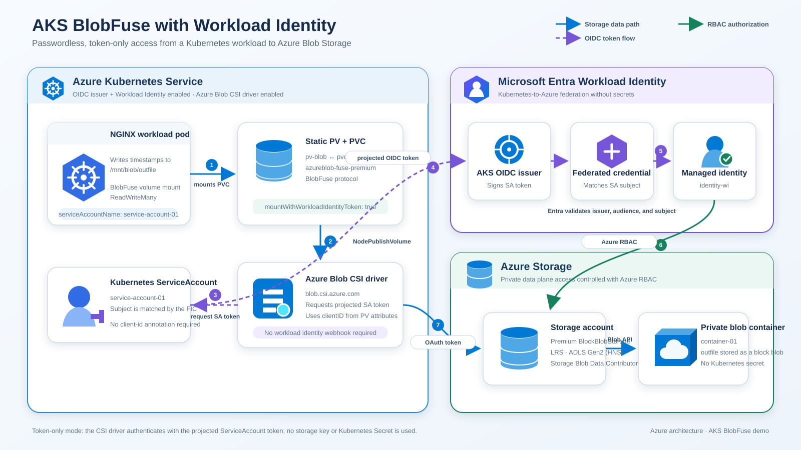

# AKS Blobfuse ADLS with Workload Identity

## Introduction

This example demonstrates how to mount an Azure Blob Storage container (with Data Lake Storage / hierarchical namespace enabled) into an AKS pod using **BlobFuse** and **Workload Identity** — with **no storage account key and no Kubernetes Secret** anywhere in the chain.

The infrastructure is deployed with Terraform, and the workload is deployed with Kubernetes manifests.

### What you will learn

* How the Blob CSI driver authenticates to Azure Storage using a federated Kubernetes ServiceAccount token.
* How to configure a **static** PersistentVolume for BlobFuse with `clientID` and `mountWithWorkloadIdentityToken`.
* Which Azure RBAC roles are actually required, and why key-based mounting can be disabled entirely.
* How to troubleshoot the most common federated-credential and mount failures.

### Prerequisites

| Requirement | Notes |
|---|---|
| Azure subscription | With permission to create resource groups, AKS clusters, and role assignments (`Owner` or `User Access Administrator` + `Contributor`). |
| Terraform | v1.5 or later. |
| Azure CLI | Logged in via `az login`, with the target subscription selected via `az account set --subscription <id>`. |
| kubectl | Installed and on `PATH`. |
| Blob CSI driver | **v1.27.0 or later** for `mountWithWorkloadIdentityToken`. Verified in [Step 3](#step-3-verify-the-blob-csi-driver-version). |
| Shell | The commands below use **PowerShell** syntax (here-strings, `$VAR`). |

## Architecture



### How the authentication flow works

There is no secret at any hop. The chain is:

1. **Pod → ServiceAccount.** The pod runs as `service-account-01`. The Blob CSI driver node plugin sees the PV is bound to that pod and calls the Kubernetes `TokenRequest` API to mint a short-lived, audience-scoped OIDC token (`api://AzureADTokenExchange`) for that ServiceAccount.
2. **OIDC token → Entra ID.** The driver presents that token to Microsoft Entra ID together with the `clientID` from `volumeAttributes`.
3. **Entra ID validates the federated credential.** Entra fetches the AKS cluster's public OIDC signing keys from the cluster's issuer URL, verifies the token signature, and matches the token's `sub` claim (`system:serviceaccount:default:service-account-01`) against the federated identity credential attached to the user-assigned managed identity. **If the namespace or ServiceAccount name does not match exactly, this step fails** — see [Troubleshooting](#troubleshooting).
4. **Entra ID issues an access token** for the user-assigned managed identity, scoped to Azure Storage.
5. **BlobFuse mounts with that token.** Because `mountWithWorkloadIdentityToken: "true"` is set, the driver passes the OAuth token straight to BlobFuse instead of first calling the storage management plane to retrieve an account key. Azure Storage authorizes the data-plane operations via the **Storage Blob Data Contributor** role assignment.

The critical consequence: the storage account key is never fetched, never stored, and never transits the cluster. You can prove this by setting `shared_access_key_enabled = false` on the storage account — the mount still works.

### Repository layout

| File | Purpose |
|---|---|
| [aks.tf](aks.tf) | AKS cluster with `oidc_issuer_enabled`, `workload_identity_enabled`, and `blob_driver_enabled`. |
| [storage_account.tf](storage_account.tf) | Premium BlockBlobStorage account with hierarchical namespace (ADLS Gen2) and the blob container. |
| [identity_wi.tf](identity_wi.tf) | User-assigned managed identity, its role assignments, and the federated identity credential. |
| [connect_to_aks.tf](connect_to_aks.tf) | Runs `az aks get-credentials` automatically after the cluster is created. |
| [output.tf](output.tf) | Terraform outputs consumed by the manifest-generation commands below. |
| [variables.tf](variables.tf) | Names for the resource group, storage account, container, namespace, and ServiceAccount. |
| [kubernetes/](kubernetes) | The generated ServiceAccount, PV, PVC, and Deployment manifests. |

## Step 1: Deploy the infrastructure

Run the following Terraform commands from this demo folder (`48_aks_blobfuse_wi`).

```powershell
terraform init
terraform plan -out tfplan
terraform apply tfplan
```

The following resources will be created:


> **Note:** [connect_to_aks.tf](connect_to_aks.tf) runs `az aks get-credentials ... --overwrite-existing` as a `local-exec` provisioner, so your kubeconfig is updated automatically and the current context is switched to this cluster. If you prefer to run it yourself, remove that file and run:
>
> ```powershell
> az aks get-credentials -g rg-aks-blob-adls-wi-48 -n aks-cluster --overwrite-existing
> ```

Confirm you are pointed at the right cluster before continuing:

```powershell
kubectl config current-context
# aks-cluster
```

## Step 2: Verify the Blob CSI driver version

Token-only mounting (`mountWithWorkloadIdentityToken`) requires **blob-csi-driver v1.27.0 or later**. On an older driver the attribute is silently ignored and the driver falls back to fetching the storage account key — which defeats the purpose of this demo and fails outright if shared keys are disabled.

Check the version shipped by your AKS cluster:

```powershell
kubectl -n kube-system get daemonset csi-blob-node -o jsonpath="{.spec.template.spec.containers[*].image}"
# ...csi-node-driver-registrar:v2.15.0 mcr.microsoft.com/oss/v2/kubernetes-csi/blob-csi:v1.27.0 ...livenessprobe:v2.17.0
```

The version that matters is the one on the `blob-csi` image. If it is below `v1.27.0`, upgrade the AKS cluster — the managed add-on version is tied to the cluster version and cannot be upgraded independently.

Also confirm the OIDC issuer, workload identity, and blob driver are all enabled:

```powershell
az aks show -g rg-aks-blob-adls-wi-48 -n aks-cluster `
  --query "{oidc:oidcIssuerProfile.enabled, wi:securityProfile.workloadIdentity.enabled, blob:storageProfile.blobCsiDriver.enabled}" -o table
# Oidc    Wi     Blob
# ------  -----  ------
# True    True   True
```

## Step 3: Deploy the Kubernetes resources

Get the output values from Terraform and set them as environment variables.

```powershell
$SERVICE_ACCOUNT_NAME=$(terraform output -raw service_account_name)
$SERVICE_ACCOUNT_NAMESPACE=$(terraform output -raw service_account_namespace)

$STORAGE_ACCOUNT_RG=$(terraform output -raw storage_account_rg)
$STORAGE_ACCOUNT_NAME=$(terraform output -raw storage_account_name)
$CONTAINER_NAME=$(terraform output -raw container_name)

$IDENTITY_CLIENT_ID=$(terraform output -raw identity_wi_client_id)
```

Each command below expands those variables into a manifest under `./kubernetes/`. Because PowerShell here-strings (`@"..."@`) interpolate `$variables`, the generated files contain the real resource names — inspect them after generation to see exactly what will be applied.

### ServiceAccount

This is the identity the pod runs as, and it is the subject the federated credential trusts. Its name and namespace **must** match the `subject` configured in [identity_wi.tf](identity_wi.tf).

```powershell
@"
apiVersion: v1
kind: ServiceAccount
metadata:
  name: $SERVICE_ACCOUNT_NAME
  namespace: $SERVICE_ACCOUNT_NAMESPACE
"@ > ./kubernetes/service_account_01.yaml
```

### PersistentVolume (PV)

This is where the workload identity configuration actually lives. Three attributes matter:

| Attribute | Why it matters |
|---|---|
| `volumeHandle` | Must be **unique per container across the whole cluster**. Reusing a handle causes the driver to mount the wrong container or fail to attach. |
| `clientID` | The **client ID** of the user-assigned managed identity — not the object/principal ID, and not the resource ID. This tells the driver which identity to federate into. |
| `mountWithWorkloadIdentityToken` | `"true"` passes the OAuth token straight to BlobFuse. Without it, the driver falls back to retrieving the storage account key. |

The `mountOptions` are BlobFuse2 flags: `-o allow_other` lets processes other than the FUSE mounter read the mount (required, since the container process is not the mounter), and `--file-cache-timeout-in-seconds=120` controls how long file content is cached on the node.

```powershell
@"
apiVersion: v1
kind: PersistentVolume
metadata:
  annotations:
    pv.kubernetes.io/provisioned-by: blob.csi.azure.com
  name: pv-blob
spec:
  capacity:
    storage: 100Gi
  accessModes:
    - ReadWriteMany
  persistentVolumeReclaimPolicy: Retain
  storageClassName: azureblob-fuse-premium
  mountOptions:
    - -o allow_other
    - --file-cache-timeout-in-seconds=120
  csi:
    driver: blob.csi.azure.com
    readOnly: false
    # make sure volumeHandle is unique for every storage blob container in the cluster
    volumeHandle: $STORAGE_ACCOUNT_NAME-$CONTAINER_NAME
    volumeAttributes:
      protocol: fuse
      resourceGroup: $STORAGE_ACCOUNT_RG
      storageAccount: $STORAGE_ACCOUNT_NAME
      containerName: $CONTAINER_NAME
      # refer to https://github.com/Azure/azure-storage-fuse#environment-variables
      # AzureStorageAuthType: msi  # key, sas, msi, spn
      clientID: $IDENTITY_CLIENT_ID
      # AzureStorageIdentityResourceID: <full resource id of the managed identity, alternative to clientID>
      mountWithWorkloadIdentityToken: "true"   # token-only mode (driver v1.27.0+); requires the Storage Blob Data Contributor role
"@ > ./kubernetes/pv_blobfuse.yaml
```

### PersistentVolumeClaim (PVC)

The PVC binds explicitly to the PV above via `volumeName: pv-blob` — that explicit binding is what makes this **static** provisioning. The `storage: 10Gi` request is not enforced (blob containers have no fixed size) but it must not exceed the PV's declared `100Gi` capacity, or the claim stays `Pending`.

```powershell
@"
kind: PersistentVolumeClaim
apiVersion: v1
metadata:
  name: pvc-blob
  namespace: $SERVICE_ACCOUNT_NAMESPACE
spec:
  accessModes:
    - ReadWriteMany
  resources:
    requests:
      storage: 10Gi
  volumeName: pv-blob
  storageClassName: azureblob-fuse-premium
"@ > ./kubernetes/pvc_blobfuse.yaml
```

### Deployment

The pod appends a timestamp to a file on the mounted volume every 30 seconds, giving a simple continuous write test.

> **Watch out:** inside a PowerShell here-string, `$(date)` would be evaluated **by PowerShell at generation time**, baking one fixed timestamp into the YAML. The backtick in `` `$(date) `` escapes it so the substitution happens inside the container's shell instead.

```powershell
@"
apiVersion: apps/v1
kind: Deployment
metadata:
  name: deployment-blob
  namespace: $SERVICE_ACCOUNT_NAMESPACE
  labels:
    app: nginx
spec:
  replicas: 1
  selector:
    matchLabels:
      app: nginx
  template:
    metadata:
      labels:
        app: nginx
    spec:
      serviceAccountName: $SERVICE_ACCOUNT_NAME   # required for workload identity
      nodeSelector:
        kubernetes.io/os: linux
      containers:
        - name: deployment-blob
          image: mcr.microsoft.com/oss/nginx/nginx:1.17.3-alpine
          command:
            - "/bin/sh"
            - "-c"
            # the backtick escapes `$(date) so it is evaluated inside the container, not by PowerShell
            - while true; do echo `$(date) >> /mnt/blob/outfile; sleep 30; done
          volumeMounts:
            - name: blob
              mountPath: /mnt/blob
      volumes:
        - name: blob
          persistentVolumeClaim:
            claimName: pvc-blob
  strategy:
    rollingUpdate:
      maxSurge: 0
      maxUnavailable: 1
    type: RollingUpdate
"@ > ./kubernetes/deployment_blob.yaml
```

Deploy the resources to AKS.

```powershell
kubectl apply -f ./kubernetes/
```

## Step 4: Verify the mount

Check the created resources.

```powershell
kubectl get pods,svc,pvc,pv -n $SERVICE_ACCOUNT_NAMESPACE
# NAME                                   READY   STATUS    RESTARTS   AGE
# pod/deployment-blob-6568867bd6-pll26   1/1     Running   0          39m

# NAME                 TYPE        CLUSTER-IP   EXTERNAL-IP   PORT(S)   AGE
# service/kubernetes   ClusterIP   10.0.0.1     <none>        443/TCP   29h

# NAME                             STATUS   VOLUME    CAPACITY   ACCESS MODES   STORAGECLASS             VOLUMEATTRIBUTESCLASS   AGE
# persistentvolumeclaim/pvc-blob   Bound    pv-blob   100Gi      RWX            azureblob-fuse-premium   <unset>                 39m

# NAME                       CAPACITY   ACCESS MODES   RECLAIM POLICY   STATUS   CLAIM              STORAGECLASS             VOLUMEATTRIBUTESCLASS   REASON   AGE
# persistentvolume/pv-blob   100Gi      RWX            Retain           Bound    default/pvc-blob   azureblob-fuse-premium   <unset>                          39m
```

The pod reaching `Running` and the PVC reaching `Bound` is itself the proof that the token exchange succeeded — if the federated credential were misconfigured, the pod would be stuck in `ContainerCreating` with a `FailedMount` event.

Confirm the volume is really a FUSE mount and not an emptyDir:

```powershell
kubectl exec deployment/deployment-blob -- df -h /mnt/blob
# Filesystem      Size  Used Avail Use% Mounted on
# blobfuse2       physical volume size  ...  /mnt/blob
```

Check the outfile in the pod.

```powershell
kubectl exec deployment/deployment-blob -- cat /mnt/blob/outfile
# Tue Jul 28 21:02:53 UTC 2026
# Tue Jul 28 21:03:26 UTC 2026
# Tue Jul 28 21:03:56 UTC 2026
# Tue Jul 28 21:04:26 UTC 2026
# Tue Jul 28 21:04:56 UTC 2026
```

Timestamps must be **increasing**. If every line is identical, the `$(date)` escaping was lost during manifest generation — regenerate the Deployment manifest.

Confirm the same blob exists in Azure, read through a completely separate code path (the control plane, not the CSI driver):

```powershell
az storage blob list --account-name $STORAGE_ACCOUNT_NAME --container-name $CONTAINER_NAME --auth-mode login -o table
# Name       Blob Type    Blob Tier    Length    Content Type              Last Modified
# ---------  -----------  -----------  --------  ------------------------  -------------------------
# outfile    BlockBlob                 145       application/octet-stream  2026-07-28T21:04:56+00:00
```

Verify in the Azure portal that the file is created in the blob container.


### Prove no storage account key is involved

This is the point of the whole exercise. Two independent checks:

```powershell
# 1. No secret is mounted into the pod and no storage key is in its environment
kubectl get secrets -n $SERVICE_ACCOUNT_NAMESPACE
# No resources found in default namespace.

# 2. Disable shared key access entirely, then restart the pod — the mount still works
az storage account update -g $STORAGE_ACCOUNT_RG -n $STORAGE_ACCOUNT_NAME --allow-shared-key-access false
kubectl rollout restart deployment/deployment-blob
kubectl rollout status deployment/deployment-blob
# deployment "deployment-blob" successfully rolled out
```

If the rollout succeeds with shared keys disabled, the mount is provably token-only. To make this the permanent state, set `shared_access_key_enabled = false` in [storage_account.tf](storage_account.tf).

## Troubleshooting

Start by looking at the pod events — almost every failure surfaces there:

```powershell
kubectl describe pod -l app=nginx -n $SERVICE_ACCOUNT_NAMESPACE
```

Then check the CSI node plugin logs on the node running the pod:

```powershell
$NODE=$(kubectl get pod -l app=nginx -n $SERVICE_ACCOUNT_NAMESPACE -o jsonpath="{.items[0].spec.nodeName}")
kubectl -n kube-system logs -l app=csi-blob-node --field-selector spec.nodeName=$NODE -c blob --tail=100
```

| Symptom | Likely cause | Fix |
|---|---|---|
| `AADSTS70021: No matching federated identity record found for presented assertion subject` | The `subject` on the federated credential does not exactly match `system:serviceaccount:<namespace>:<sa-name>`. Most often the pod was deployed into a different namespace than the credential expects. | Compare `terraform output service_account_namespace`/`service_account_name` against the deployed ServiceAccount. Both are case-sensitive. |
| Pod stuck in `ContainerCreating`, event `MountVolume.SetUp failed ... AuthorizationPermissionMismatch` | The managed identity has no data-plane role on the container. | Grant **Storage Blob Data Contributor** on the storage account (already done in [identity_wi.tf](identity_wi.tf)). Role assignment propagation can take a few minutes. |
| Mount fails only after disabling shared keys | The driver is older than v1.27.0 and is still trying to fetch the account key, or `mountWithWorkloadIdentityToken` is missing/misspelled. | Re-check [Step 2](#step-2-verify-the-blob-csi-driver-version). The value must be the **string** `"true"`, quoted. |
| PVC stuck in `Pending` | The PVC's `storageClassName` or requested capacity does not match the PV, or the PV is already `Bound`/`Released` from a previous run. | `kubectl describe pvc pvc-blob`. Because the reclaim policy is `Retain`, a deleted PVC leaves the PV in `Released` and it will not rebind — delete and recreate the PV. |
| `failed to get OIDC issuer` or empty issuer URL | The cluster was created without `oidc_issuer_enabled`. | `terraform output aks_oidc_issuer_url` must return a URL. |
| Writes appear in the pod but not in Azure | BlobFuse file caching. Content is flushed on close, not on every write. | Wait for the cache timeout (`--file-cache-timeout-in-seconds=120`) or exec into the pod and close the file. |

## Cleanup

Remove the Kubernetes resources first so the PV is released cleanly, then destroy the Azure infrastructure:

```powershell
kubectl delete -f ./kubernetes/
terraform destroy -auto-approve
```

> **Note:** the PV uses `persistentVolumeReclaimPolicy: Retain`, so `kubectl delete` leaves the blob data intact in the storage account. `terraform destroy` removes the storage account and all its data.

## Important notes

* **NFS mount is not supported.** NFS v3 on Azure Blob does not present credentials at mount time — access is controlled by the storage account's network rules — so workload identity does not apply. Use `protocol: fuse`, as this demo does.

* **Two authentication modes exist.** By default the Blob CSI driver uses the federated identity to call the storage *management* plane and retrieve the account key, then hands that key to BlobFuse. Setting `mountWithWorkloadIdentityToken: "true"` skips that entirely and passes the OAuth token to BlobFuse directly. Only the second mode is truly keyless.

* **Token-only mode requirements** (driver v1.27.0+):
  * Set `mountWithWorkloadIdentityToken: "true"` in the StorageClass `parameters` (dynamic provisioning) or the PersistentVolume `volumeAttributes` (static provisioning, as here).
  * Grant **Storage Blob Data Contributor** — a *data-plane* role — to the managed identity. The **Storage Account Contributor** *control-plane* role is only needed for the default key-retrieval mode.

* **Both static and dynamic provisioning are supported.** This demo uses static provisioning (a hand-authored PV bound by `volumeName`) so the container name and identity are explicit. Dynamic provisioning moves the same attributes into a StorageClass and creates a new container per PVC.

* **Storage account types supporting Data Lake Storage:** `Standard general-purpose v2` and `Premium block blob`. This demo uses the latter (`account_tier = "Premium"`, `account_kind = "BlockBlobStorage"`, `is_hns_enabled = true`).

* **"Private" here means container ACL, not networking.** The container's `container_access_type = "private"` blocks anonymous access, but `public_network_access_enabled = true` still allows authenticated traffic from the internet. For a production setup, add a private endpoint and set that flag to `false`.

* **The ServiceAccount needs no annotation or label — unlike the upstream sample.** The upstream blob-csi-driver doc adds `azure.workload.identity/client-id` to the ServiceAccount and `azure.workload.identity/use: "true"` to the pod. Those are required only when the **application code** authenticates via the workload identity mutating webhook, which injects a projected token and the `AZURE_*` environment variables. Here it is the *CSI driver* that authenticates, not the app: it reads the client ID from `volumeAttributes.clientID` and calls `TokenRequest` for the ServiceAccount itself. The annotation is harmless but redundant.

## Least-privilege RBAC

[identity_wi.tf](identity_wi.tf) grants three overlapping roles to the managed identity so the demo works in either authentication mode. In token-only mode, only one is actually required:

| Role | Plane | Needed in token-only mode? |
|---|---|---|
| Storage Blob Data Contributor | Data | **Yes** — this is what authorizes BlobFuse read/write. |
| Storage Blob Data Owner | Data | No — a superset of Contributor; only needed to manage POSIX ACLs on ADLS Gen2. |
| Storage Account Contributor | Control | No — used only by the default key-retrieval path, which token-only mode bypasses. |

Removing the two unnecessary assignments and setting `shared_access_key_enabled = false` makes it structurally impossible for the workload to obtain an account key.

## Workload Identity vs node-assigned Managed Identity

These are often presented as alternatives, but that is imprecise: **workload identity federates *into* a user-assigned managed identity**. The real contrast is *how* a pod obtains a token for that identity — via the node's IMDS endpoint, or via OIDC federation bound to a ServiceAccount.

| | Node-assigned Managed Identity (IMDS) | Workload Identity (OIDC federation) |
|---|---|---|
| Granularity | Per node — every pod on the node shares the same identity | Per Kubernetes ServiceAccount, scoped to a namespace |
| Token acquisition | HTTP call to the IMDS endpoint at `169.254.169.254` | ServiceAccount token exchanged with Entra ID for an access token |
| Credential lifetime | Platform-managed, long-lived on the node | Short-lived projected token, auto-rotated |
| Portability | Azure-only, tied to the VM lifecycle | Any OIDC-issuing platform — AKS, GitHub Actions, other Kubernetes distributions, on-prem |
| Blast radius | Any pod that can reach IMDS can assume the node identity unless blocked by a NetworkPolicy | Bound to exactly one `namespace:serviceaccount` pair by the federated credential |
| Auditability | Sign-in logs show the node identity, not which pod acted | The federated credential subject identifies the ServiceAccount |
| Status in AKS | Still appropriate for node-level components (kubelet, cluster autoscaler, image pulls) | Recommended standard for pod-to-Azure auth; successor to the retired AAD Pod Identity (`aad-pod-identity`) |

## Resources

* [blob-csi-driver: workload identity static PV mount](https://github.com/kubernetes-sigs/blob-csi-driver/blob/master/docs/workload-identity-static-pv-mount.md)
* [Mount Azure Blob Storage in AKS](https://learn.microsoft.com/en-us/azure/aks/create-volume-azure-blob-storage?tabs=NFS%2Cblobfuse)
* [AKS workload identity overview](https://learn.microsoft.com/en-us/azure/aks/workload-identity-overview)
* [BlobFuse2 mount options](https://github.com/Azure/azure-storage-fuse)
* [Azure built-in roles for Storage](https://learn.microsoft.com/en-us/azure/role-based-access-control/built-in-roles/storage)