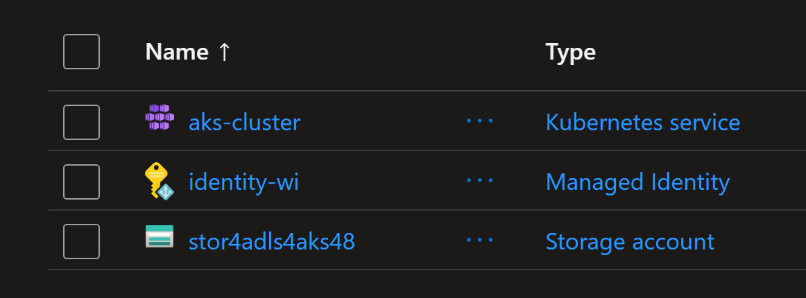
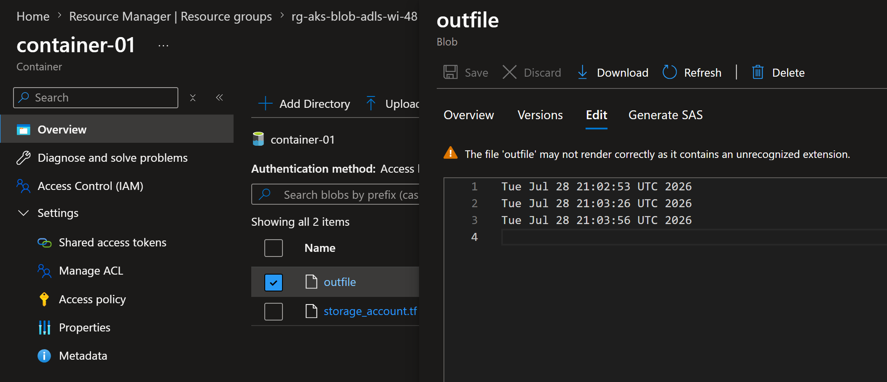

# AKS Blobfuse ADLS with Workload Identity

## Introduction

This example demonstrates how to use Azure Blobfuse with Workload Identity in AKS. The example uses Terraform to deploy the infrastructure and Kubernetes manifests to deploy the resources.

## Deploying the infrastructure

Run the following Terraform commands from the root folder.

```powershell
terraform init
terraform plan -out tfplan
terraform apply tfplan
```

The following resources will be created:



## Deploying Kubernetes resources

Get the output values from Terraform and set them as environment variables.

```powershell
$SERVICE_ACCOUNT_NAME=$(terraform output -raw service_account_name)
$SERVICE_ACCOUNT_NAMESPACE=$(terraform output -raw service_account_namespace)

$STORAGE_ACCOUNT_RG=$(terraform output -raw storage_account_rg)
$STORAGE_ACCOUNT_NAME=$(terraform output -raw storage_account_name)
$CONTAINER_NAME=$(terraform output -raw container_name)

$IDENTITY_CLIENT_ID=$(terraform output -raw identity_wi_client_id)
```

Create the Kubernetes resources using the following commands.

Create the ServiceAccount.

```powershell
@"
apiVersion: v1
kind: ServiceAccount
metadata:
  name: $SERVICE_ACCOUNT_NAME
  namespace: $SERVICE_ACCOUNT_NAMESPACE
"@ > ./kubernetes/service_account_01.yaml
```

Create the PersistentVolume (PV).

```powershell
@"
apiVersion: v1
kind: PersistentVolume
metadata:
  annotations:
    pv.kubernetes.io/provisioned-by: blob.csi.azure.com
  name: pv-blob
spec:
  capacity:
    storage: 100Gi
  accessModes:
    - ReadWriteMany
  persistentVolumeReclaimPolicy: Retain
  storageClassName: azureblob-fuse-premium
  mountOptions:
    - -o allow_other
    - --file-cache-timeout-in-seconds=120
  csi:
    driver: blob.csi.azure.com
    readOnly: false
    # make sure volumeHandle is unique for every storage blob container in the cluster
    volumeHandle: $STORAGE_ACCOUNT_NAME-$CONTAINER_NAME
    volumeAttributes:
      protocol: fuse
      resourceGroup: $STORAGE_ACCOUNT_RG
      storageAccount: $STORAGE_ACCOUNT_NAME
      containerName: $CONTAINER_NAME
      # refer to https://github.com/Azure/azure-storage-fuse#environment-variables
      # AzureStorageAuthType: msi  # key, sas, msi, spn
      clientID: $IDENTITY_CLIENT_ID
      # AzureStorageIdentityResourceID: $IDENTITY_ID
      mountWithWorkloadIdentityToken: "true"   # uncomment for token-only mode (supported from v1.27.0); requires Storage Blob Data Contributor role
"@ > ./kubernetes/pv_blobfuse.yaml
```

Create the PersistentVolumeClaim (PVC).

```powershell
@"
kind: PersistentVolumeClaim
apiVersion: v1
metadata:
  name: pvc-blob
  namespace: $SERVICE_ACCOUNT_NAMESPACE
spec:
  accessModes:
    - ReadWriteMany
  resources:
    requests:
      storage: 10Gi
  volumeName: pv-blob
  storageClassName: azureblob-fuse-premium
"@ > ./kubernetes/pvc_blobfuse.yaml
```

Create the Deployment.

```powershell
@"
apiVersion: apps/v1
kind: Deployment
metadata:
  name: deployment-blob
  namespace: $SERVICE_ACCOUNT_NAMESPACE
  labels:
    app: nginx
spec:
  replicas: 1
  selector:
    matchLabels:
      app: nginx
  template:
    metadata:
      labels:
        app: nginx
    spec:
      serviceAccountName: $SERVICE_ACCOUNT_NAME   # required for workload identity
      nodeSelector:
        kubernetes.io/os: linux
      containers:
        - name: deployment-blob
          image: mcr.microsoft.com/oss/nginx/nginx:1.17.3-alpine
          command:
            - "/bin/sh"
            - "-c"
            - while true; do echo $(date) >> /mnt/blob/outfile; sleep 30; done
          volumeMounts:
            - name: blob
              mountPath: /mnt/blob
      volumes:
        - name: blob
          persistentVolumeClaim:
            claimName: pvc-blob
  strategy:
    rollingUpdate:
      maxSurge: 0
      maxUnavailable: 1
    type: RollingUpdate
"@ > ./kubernetes/deployment_blob.yaml
```

Deploy the resources to AKS.

```powershell
kubectl apply -f ./kubernetes/
```

Check the created resources.

```powershell
kubectl get pods,svc,pvc,pv -n $SERVICE_ACCOUNT_NAMESPACE
# NAME                                   READY   STATUS    RESTARTS   AGE
# pod/deployment-blob-6568867bd6-pll26   1/1     Running   0          39m

# NAME                 TYPE        CLUSTER-IP   EXTERNAL-IP   PORT(S)   AGE
# service/kubernetes   ClusterIP   10.0.0.1     <none>        443/TCP   29h

# NAME                             STATUS   VOLUME    CAPACITY   ACCESS MODES   STORAGECLASS             VOLUMEATTRIBUTESCLASS   AGE
# persistentvolumeclaim/pvc-blob   Bound    pv-blob   100Gi      RWX            azureblob-fuse-premium   <unset>                 39m

# NAME                       CAPACITY   ACCESS MODES   RECLAIM POLICY   STATUS   CLAIM              STORAGECLASS             VOLUMEATTRIBUTESCLASS   REASON   AGE
# persistentvolume/pv-blob   100Gi      RWX            Retain           Bound    default/pvc-blob   azureblob-fuse-premium   <unset>                          39m
```

Check the outfile in the pod.

```powershell
kubectl exec deployment/deployment-blob -- cat /mnt/blob/outfile
# Tue Jul 28 21:02:53 UTC 2026
# Tue Jul 28 21:03:26 UTC 2026
# Tue Jul 28 21:03:56 UTC 2026
# Tue Jul 28 21:04:26 UTC 2026
# Tue Jul 28 21:04:56 UTC 2026
```

Verify in the Azure portal that the file is created in the blob container.



## Important Notes

* NFS mount is not supported — NFS does not require credentials during mount, so workload identity is not applicable.

* By default, this feature retrieves the storage account key using federated identity credentials.

* Mount with workload identity token only: Supported from v1.27.0. To enable:
  * Set mountWithWorkloadIdentityToken: "true" in parameters of the StorageClass or volumeAttributes of the PersistentVolume
  * Grant Storage Blob Data Contributor role (instead of Storage Account Contributor) to the managed identity

* Supports both Static and Dynamic provisioning of Persistent Volumes.

* The following types of storage accounts support Data Lake Storage capabilities: `Standard general-purpose v2` and `Premium block blob`.

* The ServiceAccount does not need the `azure.workload.identity/client-id` annotation or `azure.workload.identity/use` label. The Blob CSI driver gets the identity from `volumeAttributes.clientID` and requests the ServiceAccount token directly; the label is only needed on pods that use the workload identity webhook.


## Resources

* https://github.com/kubernetes-sigs/blob-csi-driver/blob/master/docs/workload-identity-static-pv-mount.md
* https://learn.microsoft.com/en-us/azure/aks/create-volume-azure-blob-storage?tabs=NFS%2Cblobfuse