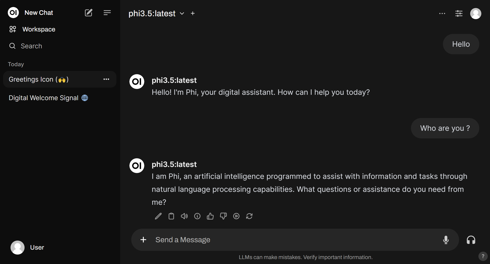

# Ollama AI model deployment on Azure Kubernetes Service (AKS)

This lab will guide you through running `LLM` models on your local machine and on `AKS`. The lab will use the `ollama` server and client app `Open-WebUI` to deploy the models. The `ollama` server is a REST API server that can run LLM models. The client app is a web-based user interface that can interact with the `ollama` server. The `ollama` server and client app are deployed in AKS using Kubernetes manifests.

## 1. Run LLM models on your local machine

The `ollama` server can run LLM models on your local machine. The `ollama` server can run LLM models like `llama3.1`, `phi3`, `gemma2`, `mistral`, `moondream`, `neural-chat`, `starling`, `codellama`, `llama2-uncensored`, `llava`, and `solar`.

### 1.1. Run `ollama` container

`ollama` server can run as a program in your machine or as a `docker` container. Here are the steps to install `ollama` server as a `docker` container. The container is available in Dockeer Hub: [https://hub.docker.com/r/ollama/ollama[(https://hub.docker.com/r/ollama/ollama).

```sh
docker run -d -v ollama:/root/.ollama -p 11434:11434 --name ollama ollama/ollama
```

> For simplicity, we are running `ollama` in `CPU only` mode. Note that it can also support `GPU` and `NPU` for better performance.

### 1.2. Run Microsoft `Phi3.5` LLM model on ollama

```sh
docker exec -it ollama sh -c 'ollama run phi3.5'
# then ctrl + d to exit
```

### 1.3. Run `Open-WebUI` client app

```sh
docker run -d -p 3000:8080 --add-host=host.docker.internal:host-gateway -v open-webui:/app/backend/data -e WEBUI_AUTH=False --name open-webui --restart always ghcr.io/open-webui/open-webui:main
```

Now open your browser on `http://localhost:3000` to access the `Open-WebUI` client app and you can chat with the model.



## 2. Run LLM models on Azure Kubernetes Service (AKS)

`ollama` and `Open-WebUI` are both available as Docker containers. This makes it easy to deploy it into AKS.

`ollama` and `Open-WebUI` can be deployed in AKS using Kubernetes manifests. The `ollama` server is deployed as a StatefulSet with one replica. The `Open-WebUI` client app is deployed as a Deployment with one replica. The `ollama` server and client app are deployed in the `ollama` namespace.

```sh
$AKS_RG="rg-aks-ollama-llm"
$AKS_NAME="aks-cluster"

# create resource group
az group create -n $AKS_RG -l swedencentral

# create an AKS cluster 
az aks create -n $AKS_NAME -g $AKS_RG --network-plugin azure --network-plugin-mode overlay -k 1.30.3 --node-vm-size Standard_D4s_v5

# get credentials
az aks get-credentials -n $AKS_NAME -g $AKS_RG --overwrite-existing

# deploy Ollama server and client app (Open-WebUI) into AKS
kubectl apply -f .

# check the install
kubectl get all -n ollama

# install LLM model likw phi3 or llama3.1 into ollama server
kubectl exec ollama-0 -n ollama -it -- ollama run phi3

# or you can run another model like llama3.1
kubectl exec ollama-0 -n ollama -it -- ollama run llama3.1

# get the public IP of the client service
kubectl get svc -n ollama
```

Now you can navigate to the public IP of the client service to chat with the model.

Here are some example models that can be used in `ollama` [available here](https://github.com/ollama/ollama/blob/main/README.md#model-library):

| Model              | Parameters | Size  | Download                       |
| ------------------ | ---------- | ----- | ------------------------------ |
| Llama 3.1          | 8B         | 4.7GB | `ollama run llama3.1`          |
| Llama 3.1          | 70B        | 40GB  | `ollama run llama3.1:70b`      |
| Llama 3.1          | 405B       | 231GB | `ollama run llama3.1:405b`     |
| Phi 3 Mini         | 3.8B       | 2.3GB | `ollama run phi3`              |
| Phi 3 Medium       | 14B        | 7.9GB | `ollama run phi3:medium`       |
| Gemma 2            | 2B         | 1.6GB | `ollama run gemma2:2b`         |
| Gemma 2            | 9B         | 5.5GB | `ollama run gemma2`            |
| Gemma 2            | 27B        | 16GB  | `ollama run gemma2:27b`        |
| Mistral            | 7B         | 4.1GB | `ollama run mistral`           |
| Moondream 2        | 1.4B       | 829MB | `ollama run moondream`         |
| Neural Chat        | 7B         | 4.1GB | `ollama run neural-chat`       |
| Starling           | 7B         | 4.1GB | `ollama run starling-lm`       |
| Code Llama         | 7B         | 3.8GB | `ollama run codellama`         |
| Llama 2 Uncensored | 7B         | 3.8GB | `ollama run llama2-uncensored` |
| LLaVA              | 7B         | 4.5GB | `ollama run llava`             |
| Solar              | 10.7B      | 6.1GB | `ollama run solar`             |

## Important notes

- The `ollama` server is running only on CPU. However, it can also run on GPU or also NPU.

## References

- [Ollama AI model deployment on Kubernetes](
https://github.com/open-webui/open-webui/tree/main/kubernetes/manifest/base)