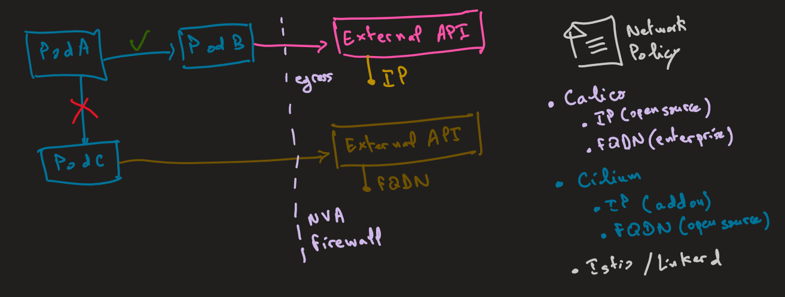
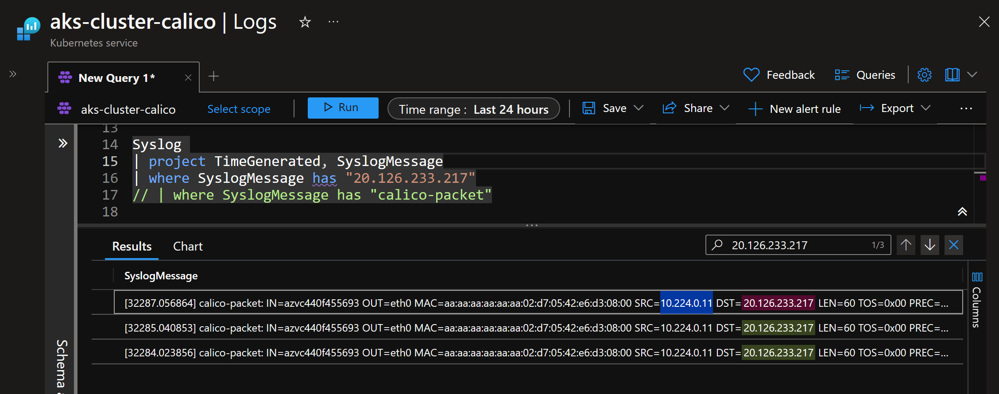

# Restrict Egress/Outbound Layer 3 traffic using Calico Network Policy



## 1. Create demo environment

```shell
$RG_NAME = "rg-aks-cluster-calico"
$AKS_NAME = "aks-cluster-calico"

# create an azure rsource group
az group create -n $RG_NAME --location westeurope

# create AKS cluster with Calico enabled
az aks create -g $RG_NAME -n $AKS_NAME --network-plugin azure --network-policy calico
```

Get AKS credentials

```shell
az aks get-credentials -g $RG_NAME -n $AKS_NAME --overwrite-existing
```

Deploy sample online service, just to get public IP

```shell
$EXTERNAL_IP=(az container create -g $RG_NAME -n aci-app --image nginx:latest --ports 80  --ip-address public --query ipAddress.ip --output tsv)
$EXTERNAL_IP
# 20.76.101.193
```

Deploy nginx pod

```shell
kubectl run nginx --image=nginx
```

Access the external service from nginx pod

```shell
kubectl exec -it nginx -- curl http://$EXTERNAL_IP
# <title>Welcome to nginx!</title>
# access is allowed
```

## 2. Restrict all ingress and egress traffic

Deny all ingress and egress traffic using the following network policy.

```yaml
apiVersion: networking.k8s.io/v1
kind: NetworkPolicy
metadata:
  name: default-deny-all
spec:
  podSelector: {}
  policyTypes:
  - Ingress
  - Egress
```

Deploy network policy to deny all traffic.

```shell
kubectl apply -f deny-all.yaml
```

Verify egress traffic is denied

```shell
kubectl exec -it nginx -- curl http://$EXTERNAL_IP --max-time 5
# timeout
```

## 3. Allow egress traffic to external service IP address

Allow Nginx pod egress traffic to external service IP address by using a network policy like the following.

```yaml
apiVersion: networking.k8s.io/v1
kind: NetworkPolicy
metadata:
  name: allow-egress-ip
spec:
  podSelector:
    matchLabels:
      run: nginx
  policyTypes:
  - Egress
  egress:
  - to:
    - ipBlock:
        cidr: 20.126.233.217/32
```

Make sure to update pod labels and destination IP address or CIDR range.

Get labels of Nginx pod.

```shell
kubectl get pods --show-labels
```

Deploy the allow egress policy.

```shell
kubectl apply -f allow-egress-ip.yaml
```

Access the external service from nginx pod

```shell
kubectl exec -it nginx -- curl http://$EXTERNAL_IP
# <title>Welcome to nginx!</title>
```

## 4. Verify that egress traffic to external IP is blocked to other pods

Verify with another pod with different labels

```shell
kubectl run nginx1 --image=nginx
kubectl exec -it nginx1 -- curl http://$EXTERNAL_IP --max-time 5
# access denied
```

## 5. Logging denied traffic

Calico enables logging denied and allowed traffic to `syslog`.
you need to use the `Calico Network Policy` instead of `Kubernetes Network Policy`.
you need to install Calico API Server to deploy Calico Network Policy using `kubectl` instead of `calicoctl`.
Src: [https://docs.tigera.io/calico/latest/operations/install-apiserver](https://docs.tigera.io/calico/latest/operations/install-apiserver)

```shell
kubectl apply -f calico-apiserver.yaml
# apiserver.operator.tigera.io/default created

kubectl get tigerastatus apiserver
# NAME        AVAILABLE   PROGRESSING   DEGRADED   SINCE
# apiserver   True        False         False      119s
```

Deploy Calico Network Policy that denies egress traffic and logs it to syslog.

Once the `Calico API server` has been installed, you can use `kubectl` to interact with the Calico APIs.

deploy calico network policy to enable logging.

```yaml
kind: NetworkPolicy
apiVersion: projectcalico.org/v3
metadata:
  name: logging-traffic
spec:
  selector: run=='nginx'
  types:
    - Egress
  egress:
    - action: Log
      destination:
        nets:
          - 20.126.233.217/32
    - action: Deny
      destination:
        nets:
          - 20.126.233.217/32
```

```shell
kubectl apply -f logging-traffic.yaml
```

Enable AKS monitoring and syslog features as logged traffic will be sent to `syslog`.

```shell
az aks enable-addons -a monitoring --enable-syslog -g $RG_NAME -n $AKS_NAME
```

Test logging with nginx pod.

```shell
kubectl exec -it nginx1 -- curl http://$EXTERNAL_IP --max-time 5
```

Check generated logs in Log Analytics by running this KQL query:

```kql
Syslog 
| project TimeGenerated, SyslogMessage
| where SyslogMessage has "20.126.233.217"
// | where SyslogMessage has "calico-packet"
```

You should see the following result.

