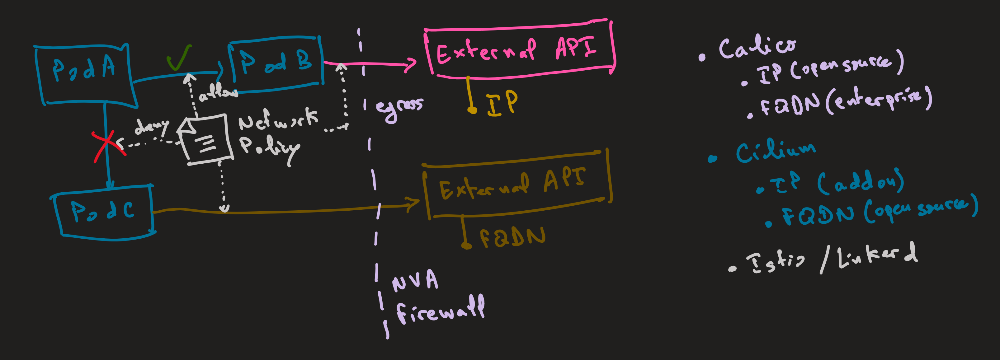
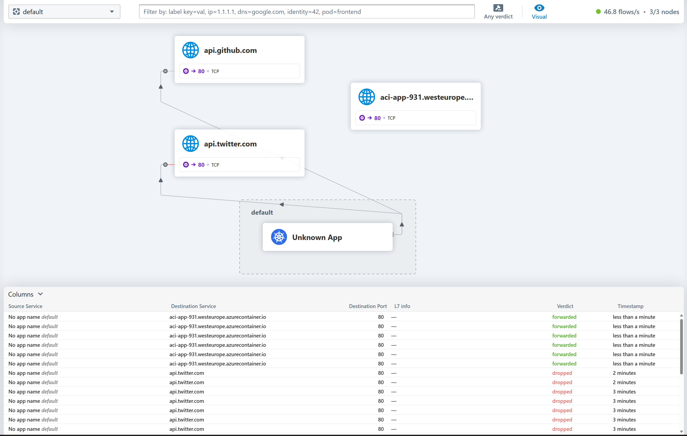

# Restrict Egress/Outbound Layer 7 traffic using Cilium (OSS) Network Policy  

## Introduction

You will learn how to use Cilium (OSS) Network Policy to filter egress traffic based on FQDN.



## 1. Create demo environment  
  
Firstly, set the resource group name and AKS cluster name:  
  
```shell
$RG_NAME="rg-aks-cluster-cilium"  
$AKS_NAME="aks-cluster-cilium"  
 ```

Create the resource group and AKS cluster:

```shell
az group create -n $RG_NAME -l westeurope  
az aks create -n $AKS_NAME -g $RG_NAME --network-plugin none  
```

Get credentials for the AKS cluster:

```shell
az aks get-credentials -n $AKS_NAME -g $RG_NAME --overwrite-existing  
```

Add the Cilium helm repo and install Cilium:

```shell
helm repo add cilium https://helm.cilium.io/  
  
helm upgrade --install cilium cilium/cilium --version 1.14.2 `  
  --namespace kube-system `  
  --set aksbyocni.enabled=true `  
  --set nodeinit.enabled=true `  
  --set sctp.enabled=true `  
  --set hubble.enabled=true `  
  --set hubble.metrics.enabled="{dns,drop,tcp,flow,icmp,http}" `  
  --set hubble.relay.enabled=true `  
  --set hubble.ui.enabled=true `  
  --set hubble.ui.service.type=NodePort `  
  --set hubble.relay.service.type=NodePort  
  # --set gatewayAPI.enabled=true  
```

Restart unmanaged Pods (required by new Cilium install):

```shell
kubectl get pods --all-namespaces -o custom-columns=NAMESPACE:.metadata.namespace,NAME:.metadata.name,HOSTNETWORK:.spec.hostNetwork --no-headers=true | grep '<none>' | awk '{print "-n "$1" "$2}' | xaRG_NAMEs -L 1 -r kubectl delete pod  
```

Ensure cilium CLI is installed on your machine (https://github.com/cilium/cilium-cli/releases/tag/v0.15.0) and on the AKS cluster, and that the cluster has proper network connectivity:

```shell
cilium version --client  
cilium status --wait  
cilium connectivity test  
```

Deploy a sample online service to get a public IP:

```shell
$FQDN=(az container create -g $RG_NAME -n aci-app --image nginx:latest --ports 80  --ip-address public --dns-name-label aci-app-931 --query ipAddress.fqdn --output tsv)  
$FQDN  
# aci-app-931.westeurope.azurecontainer.io  
```

## 2. Deploy Network Policy to deny all traffic
 
Deny all traffic using the following policy.

```yaml
apiVersion: networking.k8s.io/v1
kind: NetworkPolicy
metadata:
  name: default-deny-all
spec:
  podSelector: {}
  policyTypes:
  - Ingress
  - Egress
```

```shell
kubectl apply -f deny-all.yaml  
kubectl get networkpolicy  
# NAME               POD-SELECTOR   AGE  
# default-deny-all   <none>         160m  
```

Access the external service FQDN from nginx pod:

```shell
kubectl run nginx --image=nginx  
kubectl exec -it nginx -- curl http://$FQDN --max-time 5   
# curl: (6) Could not resolve host: aci-app-931.westeurope.azurecontainer.io  
# access denied  
```

Allow access to external service FQDN. Replace FQDN in allow-egress-fqdn.yaml with the FQDN of the external service and pod labels:

```shell
kubectl apply -f allow-egress-fqdn.yaml  
kubectl get ciliumnetworkpolicy  
# NAME                AGE  
# allow-egress-fqdn   4m50s  
```

Test the access:

```shell
kubectl exec -it nginx -- curl http://$FQDN --max-time 5
# <title>Welcome to nginx!</title>

kubectl exec -it nginx -- curl http://api.github.com --max-time 5
# success

kubectl exec -it nginx -- curl http://api.twitter.com --max-time 5
# curl: (28) Connection timed out after 5000 milliseconds
```

Verify that egress traffic to external FQDN is blocked to other pods with different labels

```shell
kubectl run nginx1 --image=nginx

kubectl exec -it nginx1 -- curl http://$FQDN --max-time 5
# curl: (28) Resolving timed out after 5000 milliseconds
```

## 3. Logging the dropped traffic

Get nginx pod node name

```shell
kubectl get pods -o wide
```

Get Cilium pods

```shell
kubectl get pods -n kube-system -l k8s-app=cilium -o wide
```

View dropped traffic by Cilium, choose the pod within the same node as the nginx pod

```shell
kubectl -n kube-system exec -it cilium-wgd28 -- cilium monitor --type drop 
# xx drop (Policy denied) flow 0xe7142f72 to endpoint 0, ifindex 32, file bpf_lxc.c:1276, , identity 9655->world: 10.0.1.51:60738 -> 104.244.42.66:80 tcp SYN
```

## 4. Exploring Hubble UI

We had already enabled Hubble in Helm install.
Open Hubble UI.

```shell
cilium hubble ui
# ℹ️  Opening "http://localhost:12000" in your browser...
```

You should get the following app running on your browser.



## Cleanup resources

```shell
az group delete --name $RG_NAME --yes --no-wait
```

## Resources

More resources ofr learning : [https://docs.cilium.io/en/stable/installation/k8s-install-helm/](https://docs.cilium.io/en/stable/installation/k8s-install-helm/)

## Notes

Deny policies take precedence over allow policies, 
regardless of whether they are a Cilium Network Policy, a Clusterwide Cilium Network Policy or even a Kubernetes Network Policy.

Deny policies do not support: policy enforcement at L7, i.e., specifically denying an URL and toFQDNs, i.e., specifically denying traffic to a specific domain name.