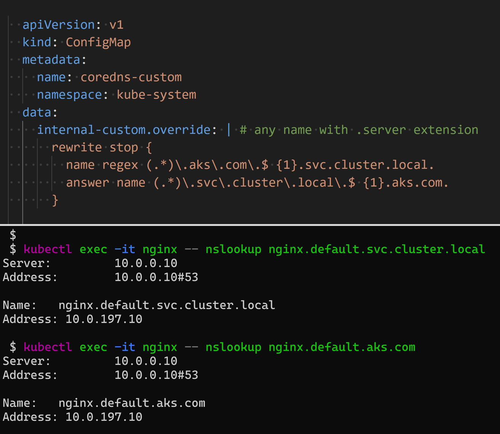

# Custom domain names using Kubernetes CoreDNS

## Introduction

`CoreDNS` is the DNS service discovery plugin for Kubernetes.
CoreDNS is a replacement to `kube-dns` that was previously used in kubernetes.
CoreDNS is pre-installed in `kube-system` namespace.



The objective of this lab is to use CoreDNS to provide custom domain names inside the cluster.
We can replace the service named `myapp.default.svc.cluster.local` to something like `mayapp.aks.com`.

```shell
kubectl get pods,service,configmap -n kube-system -l=k8s-app=kube-dns
# NAME                           READY   STATUS    RESTARTS   AGE
# pod/coredns-77f75ff65d-jzhl4   1/1     Running   0          98m
# pod/coredns-77f75ff65d-qm7th   1/1     Running   0          98m

# NAME               TYPE        CLUSTER-IP   EXTERNAL-IP   PORT(S)         AGE
# service/kube-dns   ClusterIP   10.0.0.10    <none>        53/UDP,53/TCP   3h38m

# NAME                       DATA   AGE
# configmap/coredns          1      3h38m
# configmap/coredns-custom   1      3h38m
```

CoreDNS configuration is saved into a configmap.

```shell
kubectl describe configmap coredns -n kube-system  
# Name:         coredns
# Namespace:    kube-system
# Labels:       addonmanager.kubernetes.io/mode=Reconcile
#               k8s-app=kube-dns
#               kubernetes.io/cluster-service=true
# Annotations:  <none>

# Data
# ====
# Corefile:
# ----
# .:53 {
#     errors
#     ready
#     health
#     kubernetes cluster.local in-addr.arpa ip6.arpa {
#       pods insecure
#       fallthrough in-addr.arpa ip6.arpa
#     }
#     prometheus :9153
#     forward . /etc/resolv.conf
#     cache 30
#     loop
#     reload
#     loadbalance
#     import custom/*.override
# }
# import custom/*.server


# BinaryData
# ====

# Events:  <none>
```

To provide a custom confiuration, we can use the coredns-custom confgmap which is already empty.

```shell
kubectl describe configmap coredns-custom -n kube-system
# Name:         coredns-custom
# Namespace:    kube-system
# Labels:       addonmanager.kubernetes.io/mode=EnsureExists
#               k8s-app=kube-dns
#               kubernetes.io/cluster-service=true
# Annotations:  <none>

# Data
# ====

# BinaryData
# ====

# Events:  <none>
```

Let us start by creating a demo app: a deployment and a service called nginx.

```shell
kubectl create deployment nginx --image=nginx --replicas=3
# deployment.apps/nginx created

kubectl expose deployment nginx --name nginx --port=80
# service/nginx exposed

kubectl get deploy,svc
# NAME                    READY   UP-TO-DATE   AVAILABLE   AGE
# deployment.apps/nginx   3/3     3            3           36s

# NAME                 TYPE        CLUSTER-IP     EXTERNAL-IP   PORT(S)   AGE
# service/kubernetes   ClusterIP   10.0.0.1       <none>        443/TCP   7h30m
# service/nginx        ClusterIP   10.0.235.219   <none>        80/TCP    16s
```

Now let us create and deploy a custom domain name resolvable inside kubernetes.

```shell
kubectl apply -f custom-coredns.yaml
# configmap/coredns-custom configured
```

Let us try to resolve the service name from a test pod inside kubernetes.

```shell
kubectl run nginx --image=nginx
# pod/nginx created

kubectl exec -it nginx -- curl http://nginx
# <!DOCTYPE html>
# <html>
# <head>
# <title>Welcome to nginx!</title>
# ...

kubectl exec -it nginx -- curl http://nginx.default.svc.cluster.local
# <!DOCTYPE html>
# <html>
# <head>
# <title>Welcome to nginx!</title>
# ...
```

Let us now try to resolve using the custom domain `*.aks.com`

```shell
kubectl exec -it nginx -- curl http://nginx.default.aks.com 
# <!DOCTYPE html>
# <html>
# <head>
# <title>Welcome to nginx!</title>
```

Note in the previous example, we should put the namespace name as a prefix to the domain name.
Let us resolve the custom service name but without a namespace prefix.

Replace `rewrite stop` block in configmap with the following:

```shell
rewrite stop {
  name regex (.*)\.aks\.com\.$ {1}.default.svc.cluster.local.
  answer name (.*).\default\.svc\.cluster\.local\.$ {1}.aks.com.
}
```

Let us apply the new custom CoreDNS configmap

```shell
kubectl apply -f custom-coredns.yaml

# delete CoreDNS pods after updating the custom configmap to reload the new configmap
kubectl delete pod --namespace kube-system -l k8s-app=kube-dns
```

Let us try resolving with '.aks.com'

```shell
kubectl exec -it nginx -- curl http://nginx.aks.com
# <!DOCTYPE html>
# <html>
# <head>
# <title>Welcome to nginx!</title>
```

And it works !

Let us understand how that works.

```shell
kubectl exec -it nginx -- apt-get update
kubectl exec -it nginx -- apt-get install dnsutils -y

kubectl exec -it nginx -- nslookup nginx.aks.com
# Server:         10.0.0.10
# Address:        10.0.0.10#53

# Name:   nginx.default.svc.cluster.local
# Address: 10.0.117.180
```