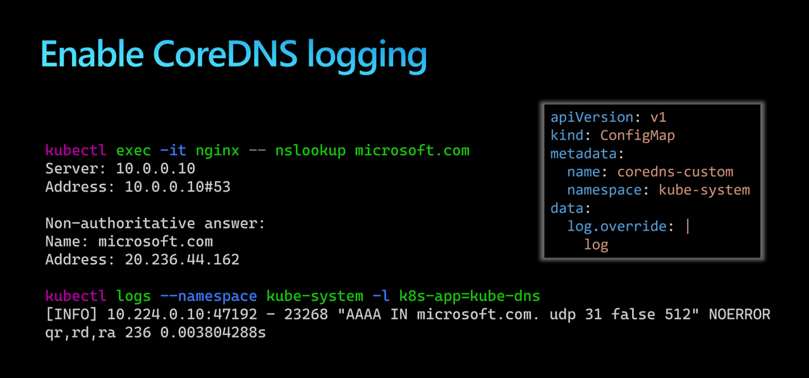

# Enabling logging in CoreDNS

## Introduction

`CoreDNS` is the DNS service discovery plugin for Kubernetes.
CoreDNS is a replacement to `kube-dns` that was previously used in kubernetes.
CoreDNS is pre-installed in `kube-system` namespace.



The objective of this lab is to enable logs for CoreDNS to log DNS queries.

```sh
# create an AKS cluster

$AKS_RG="rg-aks-cluster-dns-logs"
$AKS_NAME="aks-cluster"

az group create --name $AKS_RG --location westeurope

az aks create -g $AKS_RG -n $AKS_NAME --network-plugin azure --node-vm-size "Standard_B2als_v2"

az aks get-credentials -g $AKS_RG -n $AKS_NAME --overwrite-existing

# create demo application

kubectl run nginx --image=nginx

kubectl exec -it nginx -- apt update
kubectl exec -it nginx -- apt install dnsutils -y

kubectl exec -it nginx -- nslookup microsoft.com

# Did CoreDNS logged this DNS request ?

# check CoreDNS logs

kubectl get pods -n kube-system -l k8s-app=kube-dns
# NAME                      READY   STATUS    RESTARTS   AGE
# coredns-789789675-5mq2l   1/1     Running   0          5m11s
# coredns-789789675-j55lz   1/1     Running   0          5m39s

kubectl logs coredns-789789675-5mq2l -n kube-system

kubectl logs coredns-789789675-j55lz -n kube-system

# nothing was logged !

# Is logging enabled in CoreDNS ?

kubectl get configmap -n kube-system -l k8s-app=kube-dns
# NAME             DATA   AGE
# coredns          1      4m18s
# coredns-custom   0      4m25s

kubectl describe configmap coredns -n kube-system
# Name:         coredns
# Namespace:    kube-system
# Labels:       addonmanager.kubernetes.io/mode=Reconcile
#               k8s-app=kube-dns
#               kubernetes.io/cluster-service=true
# Annotations:  <none>

# Data
# ====
# Corefile:
# ----
# .:53 {
#     errors
#     ready
#     health {
#       lameduck 5s
#     }
#     kubernetes cluster.local in-addr.arpa ip6.arpa {
#       pods insecure
#       fallthrough in-addr.arpa ip6.arpa
#       ttl 30
#     }
#     prometheus :9153
#     forward . /etc/resolv.conf
#     cache 30
#     loop
#     reload
#     loadbalance
#     import custom/*.override
# }
# import custom/*.server


# BinaryData
# ====

# Events:  <none>

kubectl describe cm coredns-custom -n kube-system
# Data
# ====

# enable logging for CoreDNS

code coredns-custom.yaml

kubectl apply -f coredns-custom.yaml

# Force CoreDNS to reload the ConfigMap

kubectl -n kube-system rollout restart deployment coredns

kubectl get pods -n kube-system -l k8s-app=kube-dns

# create DNS query

kubectl exec -it nginx -- nslookup microsoft.com

# View the CoreDNS logs

kubectl logs --namespace kube-system -l k8s-app=kube-dns
# [INFO] 10.224.0.10:47320 - 15830 "A IN microsoft.com. udp 31 false 512" NOERROR qr,rd,ra 176 0.001047529s
# [INFO] 10.224.0.10:47575 - 61320 "AAAA IN microsoft.com. udp 31 false 512" NOERROR qr,rd,ra 236 0.001028862s
```
