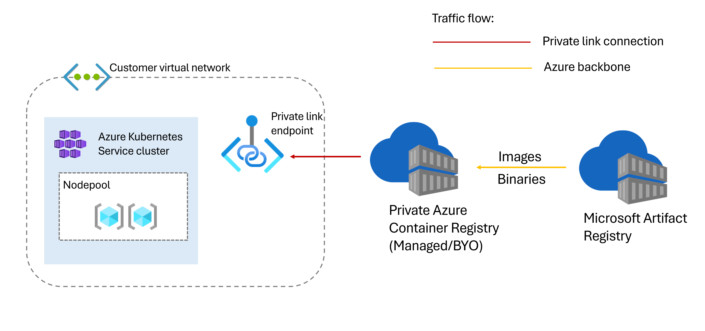

# Network Isolated AKS cluster

A network isolated AKS cluster (preview), simplifies setting up outbound restrictions for a cluster out of the box. The cluster operator can then incrementally set up allowed outbound traffic for each scenario they want to enable. A network isolated AKS cluster thus reduces the risk of data exfiltration.

## How a network isolated cluster works ?

The following diagram shows the network communication between dependencies for an AKS network isolated cluster.



AKS clusters pull images required for the cluster and its features or add-ons from the Microsoft Artifact Registry (MAR). This image pull allows AKS to provide newer versions of the cluster components and to also address critical security vulnerabilities. A network isolated cluster attempts to pull those images from a private Azure Container Registry (ACR) instance connected to the cluster instead of pulling from MAR. If the images aren't present, the private ACR pulls them from MAR and serves them via its private endpoint, eliminating the need to enable egress from the cluster to the public MAR endpoint.

The following options are supported for a private ACR with network isolated clusters:

1. AKS-managed ACR - AKS creates, manages, and reconciles an ACR resource in this option. You don't need to assign any permissions or manage the ACR. AKS manages the cache rules, private link, and private endpoint used in the network isolated cluster. An AKS-managed ACR follows the same behavior as other resources (route table, Azure Virtual Machine Scale Sets, etc.) in the infrastructure resource group. To avoid the risk of cluster components or new node bootstrap failing, do not update or delete the ACR, its cache rules, or its system images.. The AKS-managed ACR is continuously reconciled so that cluster components and new nodes work as expected.

2. Bring your own (BYO) ACR - The BYO ACR option requires creating an ACR with a private link between the ACR resource and the AKS cluster. See Connect privately to an Azure container registry using Azure Private Link to understand how to configure a private endpoint for your registry.

## Definning environment variables

```sh
RESOURCE_GROUP=rg-aks-cluster
LOCATION=swedencentral
VNET_NAME=vnet-spoke
AKS_SUBNET_NAME=snet-aks
ACR_SUBNET_NAME=snet-acr
REGISTRY_NAME=acr4aks17
CLUSTER_IDENTITY_NAME=identity-aks-control-plane
KUBELET_IDENTITY_NAME=identity-aks-kubelet
AKS_NAME=aks-cluster-network-isolated
```

## Create the virtual network and subnets

```sh
az group create --name ${RESOURCE_GROUP} --location ${LOCATION}

az network vnet create  --resource-group ${RESOURCE_GROUP} --name ${VNET_NAME} --address-prefixes 192.168.0.0/16

az network vnet subnet create --name ${AKS_SUBNET_NAME} --vnet-name ${VNET_NAME} --resource-group ${RESOURCE_GROUP} --address-prefixes 192.168.1.0/24

SUBNET_ID=$(az network vnet subnet show --name ${AKS_SUBNET_NAME} --vnet-name ${VNET_NAME} --resource-group ${RESOURCE_GROUP} --query 'id' --output tsv)

az network vnet subnet create --name ${ACR_SUBNET_NAME} --vnet-name ${VNET_NAME} --resource-group ${RESOURCE_GROUP} --address-prefixes 192.168.2.0/24 --private-endpoint-network-policies Disabled
```

## Disable virtual network outbound connectivity

There are multiple ways to disable the virtual network outbound connectivity, for example you can choose to use private subnet.
The following command disables the outbound connectivity for the AKS subnet.

```sh
az network vnet subnet update --name ${AKS_SUBNET_NAME} --vnet-name ${VNET_NAME} --resource-group ${RESOURCE_GROUP} --default-outbound-access
 false
```

## Create the ACR and enable artifact cache

```sh
az acr create --resource-group ${RESOURCE_GROUP} --name ${REGISTRY_NAME} --sku Premium --public-network-enabled false

REGISTRY_ID=$(az acr show --name ${REGISTRY_NAME} -g ${RESOURCE_GROUP}  --query 'id' --output tsv)

az acr cache create -n aks-managed-mcr -r ${REGISTRY_NAME} -g ${RESOURCE_GROUP} --source-repo "mcr.microsoft.com/*" --target-repo "aks-managed-repository/*"
```

## Create a private endpoint for the ACR

```sh
az network private-endpoint create --name pe-acr --resource-group ${RESOURCE_GROUP} --vnet-name ${VNET_NAME} --subnet ${ACR_SUBNET_NAME} --private-connection-resource-id ${REGISTRY_ID} --group-id registry --connection-name connection-acr

NETWORK_INTERFACE_ID=$(az network private-endpoint show --name pe-acr --resource-group ${RESOURCE_GROUP} --query 'networkInterfaces[0].id' --output tsv)

REGISTRY_PRIVATE_IP=$(az network nic show --ids ${NETWORK_INTERFACE_ID} --query "ipConfigurations[?privateLinkConnectionProperties.requiredMemberName=='registry'].privateIPAddress" --output tsv)

DATA_ENDPOINT_PRIVATE_IP=$(az network nic show --ids ${NETWORK_INTERFACE_ID} --query "ipConfigurations[?privateLinkConnectionProperties.requiredMemberName=='registry_data_$LOCATION'].privateIPAddress" --output tsv)
```

## Create a private DNS zone and add records

```sh
az network private-dns zone create --resource-group ${RESOURCE_GROUP} --name "privatelink.azurecr.io"

az network private-dns link vnet create --resource-group ${RESOURCE_GROUP} --zone-name "privatelink.azurecr.io" --name MyDNSLink --virtual-network ${VNET_NAME} --registration-enabled false

az network private-dns record-set a create --name ${REGISTRY_NAME} --zone-name "privatelink.azurecr.io" --resource-group ${RESOURCE_GROUP}

az network private-dns record-set a add-record --record-set-name ${REGISTRY_NAME} --zone-name "privatelink.azurecr.io" --resource-group ${RESOURCE_GROUP} --ipv4-address ${REGISTRY_PRIVATE_IP}

az network private-dns record-set a create --name ${REGISTRY_NAME}.${LOCATION}.data --zone-name "privatelink.azurecr.io" --resource-group ${RESOURCE_GROUP}

az network private-dns record-set a add-record --record-set-name ${REGISTRY_NAME}.${LOCATION}.data --zone-name "privatelink.azurecr.io" --resource-group ${RESOURCE_GROUP} --ipv4-address ${DATA_ENDPOINT_PRIVATE_IP}
```

## Create control plane and kubelet identities

```sh
az identity create --name ${CLUSTER_IDENTITY_NAME} --resource-group ${RESOURCE_GROUP}

CLUSTER_IDENTITY_RESOURCE_ID=$(az identity show --name ${CLUSTER_IDENTITY_NAME} --resource-group ${RESOURCE_GROUP} --query 'id' -o tsv)

CLUSTER_IDENTITY_PRINCIPAL_ID=$(az identity show --name ${CLUSTER_IDENTITY_NAME} --resource-group ${RESOURCE_GROUP} --query 'principalId' -o tsv)

az identity create --name ${KUBELET_IDENTITY_NAME} --resource-group ${RESOURCE_GROUP}

KUBELET_IDENTITY_RESOURCE_ID=$(az identity show --name ${KUBELET_IDENTITY_NAME} --resource-group ${RESOURCE_GROUP} --query 'id' -o tsv)

KUBELET_IDENTITY_PRINCIPAL_ID=$(az identity show --name ${KUBELET_IDENTITY_NAME} --resource-group ${RESOURCE_GROUP} --query 'principalId' -o tsv)
```

## Grant AcrPull permissions for the Kubelet identity

```sh
az role assignment create --role AcrPull --scope ${REGISTRY_ID} --assignee-object-id ${KUBELET_IDENTITY_PRINCIPAL_ID} --assignee-principal-type ServicePrincipal
```

## Create network isolated cluster using the BYO ACR

```sh
az aks create --resource-group ${RESOURCE_GROUP} --name ${AKS_NAME} --kubernetes-version 1.30.3 --vnet-subnet-id ${SUBNET_ID} --assign-identity ${CLUSTER_IDENTITY_RESOURCE_ID} --assign-kubelet-identity ${KUBELET_IDENTITY_RESOURCE_ID} --bootstrap-artifact-source Cache --bootstrap-container-registry-resource-id ${REGISTRY_ID} --outbound-type none --network-plugin azure --enable-private-cluster
```

## Connect to the cluster

```sh
az aks get-credentials --resource-group ${RESOURCE_GROUP} --name ${AKS_NAME} --overwrite-existing
```

## Check that all system pods are running

```sh
az aks command invoke -g $RESOURCE_GROUP -n $AKS_NAME --command "kubectl get pods -n kube-system"
```

## Connection to the internet should be disabled

```sh
az aks command invoke -g $RESOURCE_GROUP -n $AKS_NAME --command "kubectl run nginx --image=nginx"
# pod/nginx created # not true

az aks command invoke -g $RESOURCE_GROUP -n $AKS_NAME --command "kubectl get pods"
# NAME    READY   STATUS             RESTARTS   AGE
# nginx   0/1     ImagePullBackOff   0          46s
```

## Connection to the MCR should be enabled, required for the AKS system pods updates

```sh
az aks command invoke -g $RESOURCE_GROUP -n $AKS_NAME --command "kubectl run nginx-mcr --image=mcr.microsoft.com/azurelinux/base/nginx:1.25"
# pod/nginx-mcr created

az aks command invoke -g $RESOURCE_GROUP -n $AKS_NAME --command "kubectl get pods"
# NAME                                                    READY   STATUS             RESTARTS   AGE
# nginx                                                   0/1     ImagePullBackOff   0          8m40s
# nginx-mcr                                               1/1     Running            0          32s
```
