# AKS Egress Traffic with Load Balancer, NAT Gateway, and User Defined Route

## Introduction

Welcome to this lab where we will explore the different outbound types in Azure Kubernetes Service (AKS).
Outbound traffic refers to the network traffic that originates from a pod or node in a cluster and is destined for external destinations.
Outbound traffic will leave the cluster through one of the supported load balancing solutions for egress. 
These solutions are the outbound types in AKS.

There are four outbound types.  
1. Load Balancer (default)  
2. Managed NAT Gateway  
3. User defined NAT Gateway  
4. User Defined Routes (UDR)  

The egress traffic destination could be:  
1. Microsoft Container Registry (MCR) used to pull system container images  
2. Azure Container Registry (ACR) used to pull user container images  
3. Ubuntu or Windows update server used to download node images updates  
4. External resources used by the apps like Azure Key vault, Storage Account, Cosmos DB, etc  
5. External third party REST API  

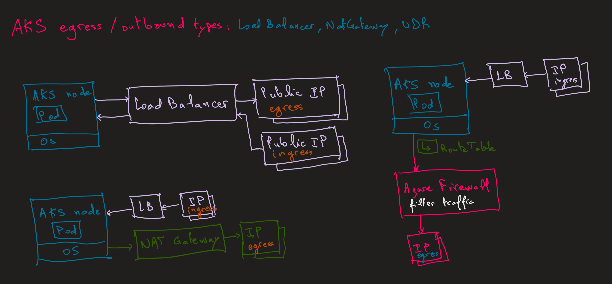

We will discuss the differences between these outbound types and their use cases.
By the end of this lab, participants will have a better understanding of the outbound types available in AKS and will be able to implement the appropriate outbound type to suit their specific requirements.

For each type, you will learn how to configure it, their features and the IP address they use to leave the cluster.

## 1. AKS cluster with outbound type load balancer

Let's create an AKS cluster with default LoadBalancer outboundType and let's see how it works.

```sh
az group create -n rg-aks-lb -l westeurope

az aks create -g rg-aks-lb -n aks-lb `
              --outbound-type loadBalancer # default

az aks get-credentials -g rg-aks-lb -n aks-lb
```

Check the created resources in the node resource group. 
Note the public Load Balancer (LB) and the public IP address (PIP). 
These resources will be used for egress traffic.

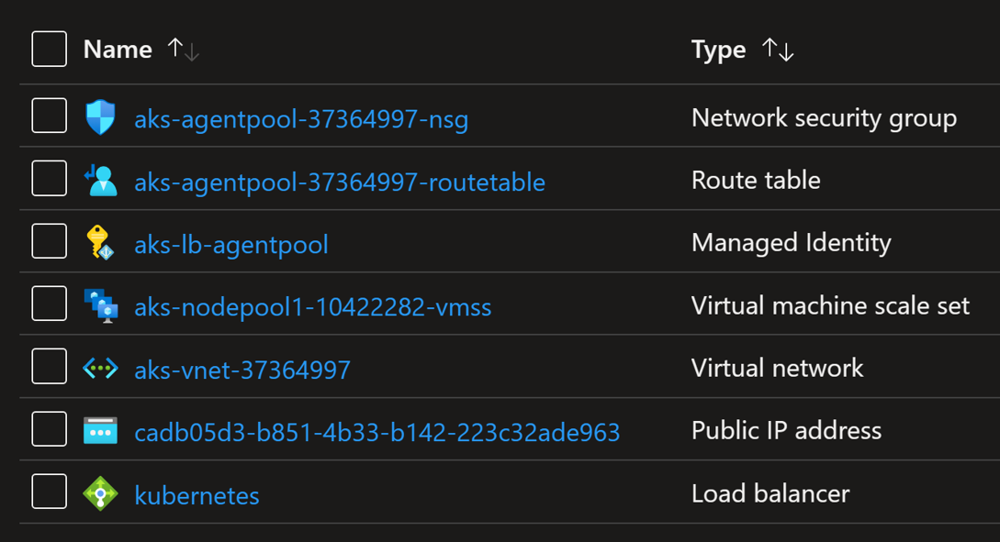

Verify that outbound egress traffic uses Load Balancer public IP address.

```sh
kubectl run nginx --image=nginx
kubectl exec nginx -it -- curl http://ifconfig.me
# 20.126.14.246
```

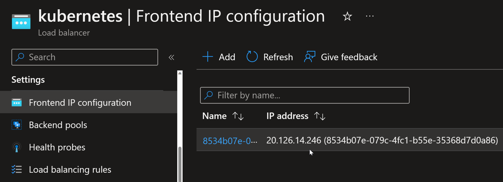

Note that is the public IP of the Load Balancer.
This is the default behavior of AKS clusters.

When user creates a kubernetes public service object or an ingress controller, a new public IP address will be created and attached to the Load Balancer for ingress traffic.

```sh
kubectl expose deployment nginx --name nginx --port=80 --type LoadBalancer 
kubectl get svc
# NAME         TYPE           CLUSTER-IP    EXTERNAL-IP     PORT(S)        AGE
# kubernetes   ClusterIP      10.0.0.1      <none>          443/TCP        10h
# nginx        LoadBalancer   10.0.106.59   20.31.208.171   80:31371/TCP   9s
```

`20.31.208.171` is the new created public IP address attached to the Load Balancer.

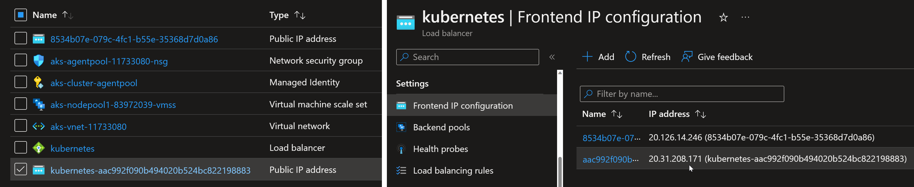

To conclude, with Load Balancer mode, AKS uses one (default) single IP address for egress and one or more IP addresses for ingress traffic.

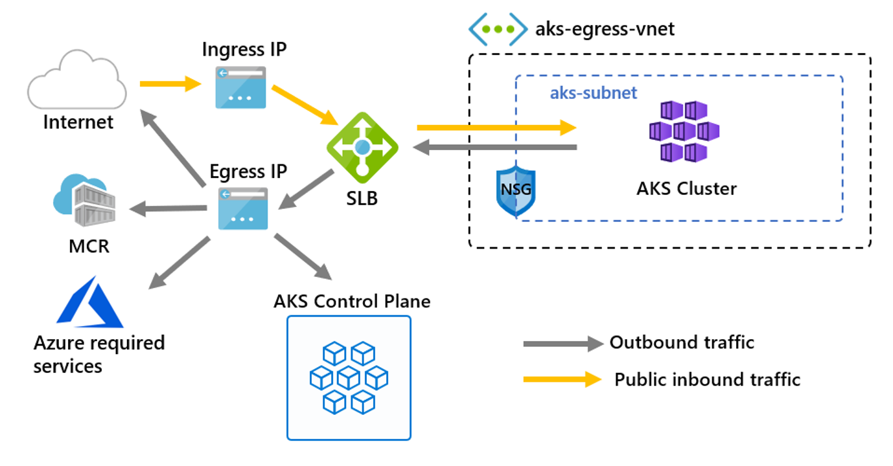

### 1.1. SNAT port exhaustion issue with Load Balancer

A Load Balancer is a simple and easy solution as outbound type. 
But it doesn't scale well in terms of SNAT port numbers.
When there are so many pods trying to connect to external services, they will use source network address translation (SNAT) to translate virtual machine's private IP into the load balancer's public IP address.
That is a known issue with LB. 
Here is why.

With LB, each VM use a fixed number (up to 1024) pre-allocated SNAT ports. 
If a VM need more, it will run into port exhaustion and connection will be dropped.
Meanwhile, other VMs might have available SNAT ports!
With NAT Gateway, pre-allocation of SNAT ports isn't required, which means SNAT ports aren't left unused by VMs not actively needing them.

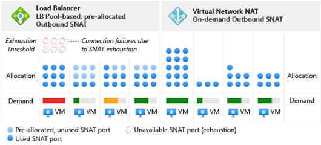

There are two solutions for this issue.

### 1.2. Solution 1: Adding public IP addresses for egress traffic

We can scale the number of managed outbound public IPs.
Each IP address provides 64k ephemeral ports to use as SNAT ports.

```sh
az aks update -g rg-aks-lb -n aks-lb --load-balancer-managed-outbound-ip-count 3
```

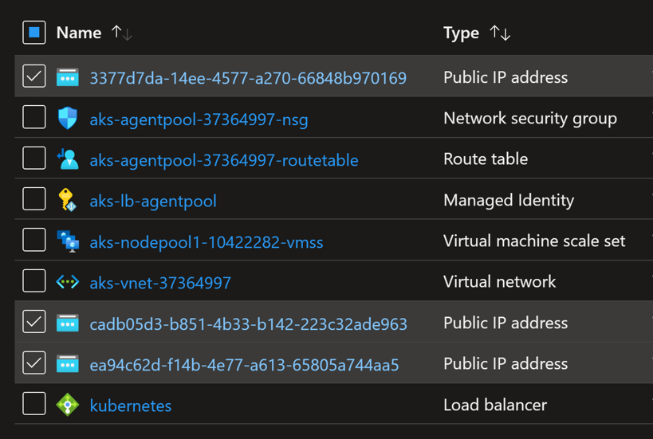

But still the free pre-allocated IPs are not reused by other VMs.
This might be acceptable at a certain limit.

### 1.3. Solution 2: Replacing the Load Balancer with NAT Gateway.

The NAT Gateway service was created to resolve this exact issue.
Let's explore how it works in the next section.

## 2. AKS cluster with outbound type managed NAT Gateway

Virtual Network NAT is a fully managed and highly resilient Network Address Translation (NAT) service. 
It simplifies outbound Internet connectivity for virtual networks.

It acts “like” a Load Balancer for outbound traffic.
And it reduces the risk of SNAT port exhaustion.


Let's create an AKS cluster that uses managed NAT Gateway.

```sh
az group create -n rg-aks-natgateway -l westeurope

az aks create -g rg-aks-natgateway -n aks-natgateway `
    --outbound-type managedNATGateway `
    --nat-gateway-managed-outbound-ip-count 2 `
    --nat-gateway-idle-timeout 4

az aks get-credentials -g rg-aks-natgateway -n aks-natgateway
```

NAT Gateway and Public IPs are created.
There are no Load Balancer.

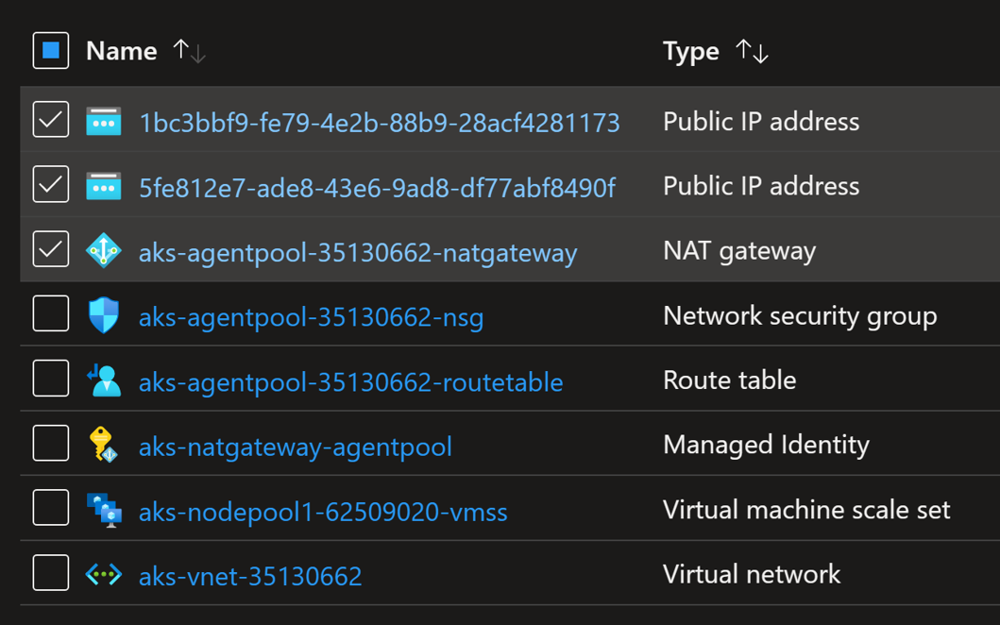

Note the egress traffic uses the two public IPs of the NAT Gateway.

```sh
kubectl run nginx --image=nginx
kubectl exec nginx -it -- curl http://ifconfig.me
# 20.101.4.185
kubectl exec nginx -it -- curl http://ifconfig.me
# 20.102.5.80
```

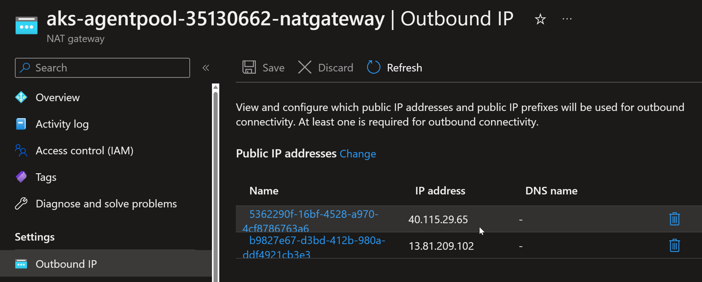

NAT Gateway could have 1 to 16 public IPs or a public IP Prefix.

Each IP address provides 64k SNAT ports ephemeral ports to use as SNAT ports.

64k SNAT ports * 16 IPs = 1,024,000 (~1 million) max SNAT ports.

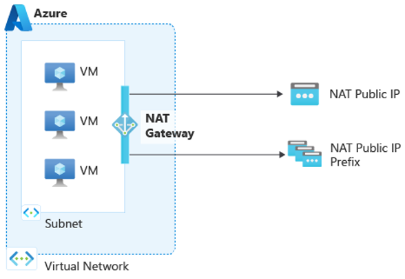

We saw that there is no Load Balancer created during cluster creation.

So how to handle ingress traffic ?

If we create a service of type LoadBalancer, AKS will create a new Load Balancer and public IP.

```sh
kubectl expose deployment nginx --name nginx --port=80 --type LoadBalancer
kubectl get svc
# NAME         TYPE           CLUSTER-IP     EXTERNAL-IP     PORT(S)        AGE
# kubernetes   ClusterIP      10.0.0.1       <none>          443/TCP        53m
# nginx        LoadBalancer   10.0.138.225   20.61.131.120   80:31702/TCP   3m21s
```


## 3. AKS cluster with outbound type user assigned NAT Gateway

This option is the same as managed NAT Gateway explained earlier.
The only difference is that you bring your own (BYO) NAT GAteway. 
You create it and configure it yourself instead of letting AKS to create it for you.

Here is a sample script to create a NAT Gateway and configure it with AKS.

```sh
az group create -n rg-aks-usernatgateway -l westeurope

# Create a managed identity for network permissions and store the ID to $IDENTITY_ID for later use.

$IDENTITY_ID=$(az identity create `
--resource-group rg-aks-usernatgateway `
--name natClusterId `
--location westeurope `
--query id `
--output tsv)

# Create a public IP for the NAT gateway.
az network public-ip create `
    --resource-group rg-aks-usernatgateway `
    --name myNatGatewayPip `
    --location westeurope `
    --sku standard

# Create the NAT gateway.

az network nat gateway create `
    --resource-group rg-aks-usernatgateway `
    --name myNatGateway `
    --location westeurope `
    --public-ip-addresses myNatGatewayPip

# Create a virtual network.

az network vnet create `
    --resource-group rg-aks-usernatgateway `
    --name myVnet `
    --location westeurope `
    --address-prefixes 172.16.0.0/20 

# Create a subnet in the virtual network using the NAT gateway and store the ID to $SUBNET_ID for later use.

$SUBNET_ID=$(az network vnet subnet create `
    --resource-group rg-aks-usernatgateway `
    --vnet-name myVnet `
    --name natCluster `
    --address-prefixes 172.16.0.0/22 `
    --nat-gateway myNatGateway `
    --query id `
    --output tsv)

# Create an AKS cluster using the subnet with the NAT gateway and the managed identity.

az aks create `
    --resource-group rg-aks-usernatgateway `
    --name natCluster `
    --location westeurope `
    --network-plugin azure `
    --vnet-subnet-id $SUBNET_ID `
    --outbound-type userAssignedNATGateway `
    --enable-managed-identity `
    --assign-identity $IDENTITY_ID

az aks get-credentials -g rg-aks-usernatgateway -n natCluster
```

Note the egress traffic uses public IP address of the `NAT Gateway`.

```sh
kubectl run nginx --image=nginx
kubectl exec nginx -it -- curl http://ifconfig.me
# 20.16.100.134
```

## 4. AKS cluster with outbound type user defined routing (UDR)

UDR is useful when we want to filter and control AKS egress traffic through an NVA like `Azure Firewall`.
This option is widely used by enterprises adopting `Hub & Spoke` architecture and using `Azure Landing Zones`.

How it works ?

Simply you enable the `UDR` mode in AKS to not create or use a Load Balancer for egress traffic.
Then you create a `Route Table` and attach it to the cluster Subnet with a routing rule from `0.0.0.0/0` to the `Firewall` private IP address.

```sh
# 4.1. Set configuration via environment variables

$RG="rg-aks-udr"
$LOC="westeurope"
$AKSNAME="aks-udr"
$VNET_NAME="aks-vnet"
$AKSSUBNET_NAME="aks-subnet"
# DO NOT CHANGE FWSUBNET_NAME - This is currently a requirement for Azure Firewall.
$FWSUBNET_NAME="AzureFirewallSubnet"
$FWNAME="hub-firewall"
$FWPUBLICIP_NAME="firewall-publicip"
$FWIPCONFIG_NAME="firewall-config"
$FWROUTE_TABLE_NAME="firewall-routetable"
$FWROUTE_NAME="firewall-route"
$FWROUTE_NAME_INTERNET="firewall-route-internet"

# 4.2. Create a virtual network with multiple subnets

# Create Resource Group

az group create --name $RG --location $LOC

# Create a virtual network with two subnets to host the AKS cluster and the Azure Firewall. Each will have their own subnet. Let's start with the AKS network.

# Dedicated virtual network with AKS subnet

az network vnet create `
    --resource-group $RG `
    --name $VNET_NAME `
    --location $LOC `
    --address-prefixes 10.42.0.0/16 `
    --subnet-name $AKSSUBNET_NAME `
    --subnet-prefix 10.42.1.0/24

# Dedicated subnet for Azure Firewall (Firewall name cannot be changed)

az network vnet subnet create `
    --resource-group $RG `
    --vnet-name $VNET_NAME `
    --name $FWSUBNET_NAME `
    --address-prefix 10.42.2.0/24

# 3. Create and set up an Azure Firewall with a UDR

# Azure Firewall inbound and outbound rules must be configured. The main purpose of the firewall is to enable organizations to configure granular ingress and egress traffic rules into and out of the AKS Cluster.

az network public-ip create -g $RG -n $FWPUBLICIP_NAME -l $LOC --sku "Standard"

# Install Azure Firewall preview CLI extension

az extension add --name azure-firewall --upgrade

# Deploy Azure Firewall

az network firewall create -g $RG -n $FWNAME -l $LOC --enable-dns-proxy true

# Configure Firewall IP Config

az network firewall ip-config create -g $RG -f $FWNAME -n $FWIPCONFIG_NAME --public-ip-address $FWPUBLICIP_NAME --vnet-name $VNET_NAME

# Capture Firewall IP Address for Later Use

$FWPUBLIC_IP=$(az network public-ip show -g $RG -n $FWPUBLICIP_NAME --query "ipAddress" -o tsv)
$FWPRIVATE_IP=$(az network firewall show -g $RG -n $FWNAME --query "ipConfigurations[0].privateIpAddress" -o tsv)
echo $FWPRIVATE_IP

# Create UDR and add a route for Azure Firewall

az network route-table create -g $RG -l $LOC --name $FWROUTE_TABLE_NAME

az network route-table route create -g $RG --name $FWROUTE_NAME --route-table-name $FWROUTE_TABLE_NAME --address-prefix 0.0.0.0/0 --next-hop-type VirtualAppliance --next-hop-ip-address $FWPRIVATE_IP

az network route-table route create -g $RG --name $FWROUTE_NAME_INTERNET --route-table-name $FWROUTE_TABLE_NAME --address-prefix $FWPUBLIC_IP/32 --next-hop-type Internet

# 4. Adding firewall rules

# Add FW Network Rules

az network firewall network-rule create -g $RG -f $FWNAME --collection-name 'aksfwnr' -n 'apiudp' --protocols 'UDP' --source-addresses '*' --destination-addresses "AzureCloud.$LOC" --destination-ports 1194 --action allow --priority 100

az network firewall network-rule create -g $RG -f $FWNAME --collection-name 'aksfwnr' -n 'apitcp' --protocols 'TCP' --source-addresses '*' --destination-addresses "AzureCloud.$LOC" --destination-ports 9000

az network firewall network-rule create -g $RG -f $FWNAME --collection-name 'aksfwnr' -n 'time' --protocols 'UDP' --source-addresses '*' --destination-fqdns 'ntp.ubuntu.com' --destination-ports 123

# Add FW Application Rules

az network firewall application-rule create -g $RG -f $FWNAME --collection-name 'aksfwar' -n 'fqdn' --source-addresses '*' --protocols 'http=80' 'https=443' --fqdn-tags "AzureKubernetesService" --action allow --priority 100

# 5. Associate the route table to AKS

# Associate route table with next hop to Firewall to the AKS subnet

az network vnet subnet update -g $RG --vnet-name $VNET_NAME --name $AKSSUBNET_NAME --route-table $FWROUTE_TABLE_NAME

# 6. Deploy AKS with outbound type of UDR to the existing network

$SUBNETID=$(az network vnet subnet show -g $RG --vnet-name $VNET_NAME --name $AKSSUBNET_NAME --query id -o tsv)
echo $SUBNETID

az aks create -g $RG -n $AKSNAME -l $LOC `
  --node-count 3 `
  --network-plugin azure `
  --outbound-type userDefinedRouting `
  --vnet-subnet-id $SUBNETID `
  --api-server-authorized-ip-ranges $FWPUBLIC_IP
```

Check the created resources.
Note there are no Load Balancer created.
That is because with UDR mode, egress traffic will be managed by Route Table and Firewall. 
So there is no need for a Load Balancer for egress.
However, if you create a public Kubernetes service or ingress controller, AKS will create the Load Balancer to handle the ingress traffic.
In this case, the egress traffic will still be handled by Firewall.

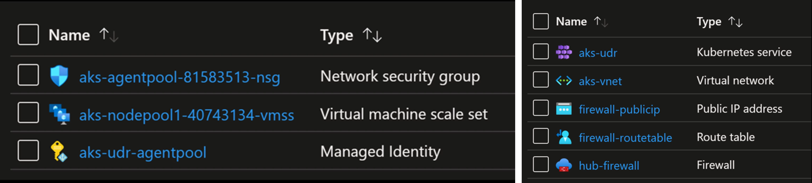

Azure Firewall will deny all traffic by default.
However, AKS, during the creation, needs to connect to external resources like `MCR`, Ubuntu updates server, etc. 
This is in order to pull system container images and get nodes updates.
For that reason, we opened traffic into these resources and more using the `Service Tag` or also named `FQDN Tag` called `AzureKubernetesService`.

Check that configuration in the following picture.

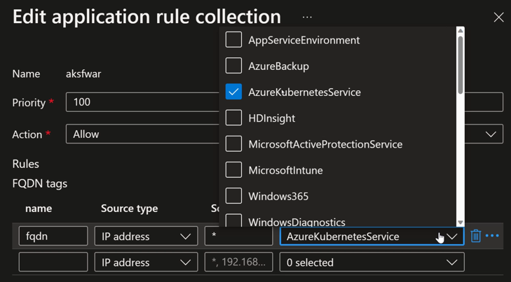

Verify the egress traffic is using the Firewall public IP.

```sh
kubectl run nginx --image=nginx
# pod/nginx created

kubectl exec nginx -it -- /bin/bash
# error: unable to upgrade connection: container not found ("nginx")

kubectl get pods
# NAME    READY   STATUS         RESTARTS   AGE
# nginx   0/1     ErrImagePull   0          32s
```

The above error is because Azure Firewall blocks access to non allowed endpoints.
Let's create an application rule to allow access to `Docker Hub` to pull the `nginx` container image.

```sh
az network firewall application-rule create -g $RG -f $FWNAME --collection-name 'dockerhub-registry' -n 'dockerhub-registry' --action allow --priority 200 --source-addresses '*' --protocols 'https=443' --target-fqdns hub.docker.com registry-1.docker.io production.cloudflare.docker.com auth.docker.io cdn.auth0.com login.docker.com
# Creating rule collection 'dockerhub-registry'.
# {
#   "actions": [],
#   "description": null,
#   "direction": "Inbound",
#   "fqdnTags": [],
#   "name": "dockerhub-registry",
#   "priority": 0,
#   "protocols": [
#     {
#       "port": 443,
#       "protocolType": "Https"
#     }
#   ],
#   "sourceAddresses": [
#     "*"
#   ],
#   "sourceIpGroups": [],
#   "targetFqdns": [
#     "hub.docker.com",
#     "registry-1.docker.io",
#     "production.cloudflare.docker.com",
#     "auth.docker.io",
#     "cdn.auth0.com",
#     "login.docker.com"
#   ]
# }
```

Let's retry now. 
The image should be pulled and pod works just fine.

```sh
kubectl get pods
# NAME    READY   STATUS    RESTARTS   AGE
# nginx   1/1     Running   0          21m
```

Let's see what IP address is used by the pod to access external services. 
We use `ifconfig.me` to view the IP address on the remote server.

```sh
kubectl exec nginx -it -- curl http://ifconfig.me
# Action: Deny. Reason: No rule matched. Proceeding with default action.
```

Again, access is blocked by the Firewall.
Create an application rule to allow access to `ifconfig.me`.

```sh
az network firewall application-rule create -g $RG -f $FWNAME --collection-name 'ifconfig' -n 'ifconfig' --action allow --priority 300 --source-addresses '*' --protocols 'http=80' --target-fqdns ifconfig.me
```

Let's retry again now. 
We should see the Pod outbound traffic uses the Firewall public IP address.

```sh
kubectl exec nginx -it -- curl http://ifconfig.me
# 20.229.246.163
```

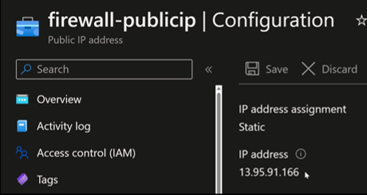

### 4.1. Issues with UDR mode (asymmetric routing)

Asymmetric routing is where a packet takes one path to the destination and takes another path when returning to the source. 
This issue occurs when a subnet has a default route going to the firewall's private IP address and you're using a public load balancer. 
In this case, the incoming load balancer traffic is received via its public IP address, but the return path goes through the firewall's private IP address. 
Since the firewall is stateful, it drops the returning packet because the firewall isn't aware of such an established session.

### 4.2. Solution 1 to the asymmetric routing issue

The solution is simply to use the Firewall public IP address instead of the Load Balancer public IP.
More details here: [learn.microsoft.com/en-us/azure/firewall/integrate-lb](https://learn.microsoft.com/en-us/azure/firewall/integrate-lb).


### 4.3. Solution 2 to the asymmetric routing isuue

A second solution is to use `Azure Application Gateway` or `Azure Application Gateway for Containers`.
These two services will receive ingress traffic through public IP address. 
Then they will route it to the cluster pods using private IP address.
So, the ingress traffic will not go through Firewall.
In addition to that, when the ingress traffic returns to its originator, it will go back through the App Gateway.
Again, the Firewall will not control that traffic.

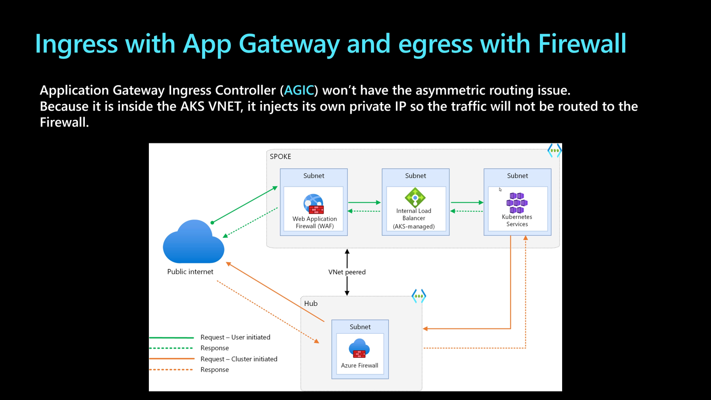

### 4.8. [Optional] Deploy the Azure Application Gateway Ingress Controller

```sh
az aks enable-addons -n $AKSNAME -g $RG -a ingress-appgw --appgw-name azure-appgateway --appgw-subnet-cidr '10.42.3.0/24'
#  \ Running ..
```

### 4.8.1. Deploy an application

```sh
kubectl apply -f pod-svc-ingress.yaml
# pod/aspnetapp created
# service/aspnetapp created
# ingress.networking.k8s.io/aspnetapp created
```

### 4.8.2. Test the application

```sh
kubectl get pod,svc,ingress
# NAME            READY   STATUS    RESTARTS   AGE
# pod/aspnetapp   1/1     Running   0          21s
# pod/nginx       1/1     Running   0          98m

# NAME                 TYPE        CLUSTER-IP   PORT(S)   AGE
# service/aspnetapp    ClusterIP   10.0.8.241   80/TCP    21s
# service/kubernetes   ClusterIP   10.0.0.1     443/TCP   6h9m

# NAME                                  HOSTS   ADDRESS        PORTS
# ingress.networking.k8s.io/aspnetapp   *       20.13.91.180   80   
```

View the application in the browser: `http://20.13.91.180`. 
It should be working. 
The ingress traffic go through and returns through the App Gateway. 
It is not routed to the Firewall. 
That is because the App Gateway is inside the cluster VNET. 
Traffic from App Gateway is considered "internal" traffic.

## More resources

Here are more resources to get even more details about outbound types in AKS.
[learn.microsoft.com/en-us/azure/aks/limit-egress-traffic#restrict-egress-traffic-using-azure-firewall](https://learn.microsoft.com/en-us/azure/aks/limit-egress-traffic#restrict-egress-traffic-using-azure-firewall)