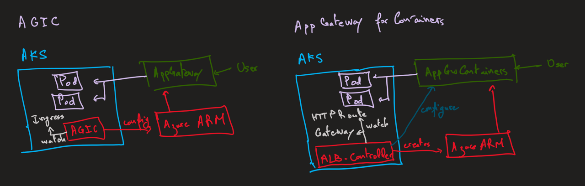
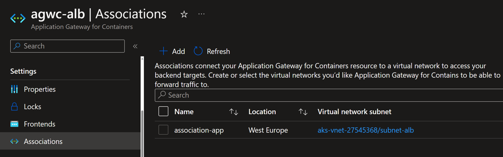

# Application Gateway for Containers

## Introduction
Application Gateway for Containers is a new application (layer 7) load balancing and dynamic traffic management product for workloads running in a Kubernetes cluster. It extends Azure's Application Load Balancing portfolio and is a new offering under the Application Gateway product family.

Application Gateway for Containers is the evolution of the Application Gateway Ingress Controller (AGIC), a Kubernetes application that enables Azure Kubernetes Service (AKS) customers to use Azure's native Application Gateway application load-balancer. In its current form, AGIC monitors a subset of Kubernetes Resources for changes and applies them to the Application Gateway, utilizing Azure Resource Manager (ARM).

Ingress API vs Gateway API.


AGIC vs Application Gateway for Containers.


## 1. Setup the environment

Create environment variables

```powershell
$AKS_NAME="aks-cluster"
$RG_NAME="rg-aks"
$LOCATION="westeurope"
$IDENTITY_ALB="identity-azure-alb"
$AGFC_NAME="agwc-alb" # Name of the Application Gateway for Containers
$AGFC_SUBNET_PREFIX="10.225.0.0/24"
$AGFC_SUBNET_NAME="subnet-alb" # subnet name can be any non-reserved subnet name (i.e. GatewaySubnet, AzureFirewallSubnet, AzureBastionSubnet would all be invalid)
$AGFC_FRONTEND_NAME="frontend-app"
$AGFC_ASSOCIATION="association-app"
```

Create resource group

```powershell
az group create --name $RG_NAME --location $LOCATION -o table
```

Create AKS cluster with CNI plugin and OIDC & Workload Identity enabled

```powershell
az aks create `
    --resource-group $RG_NAME `
    --name $AKS_NAME `
    --location $LOCATION `
    --network-plugin azure `
    --enable-oidc-issuer `
    --enable-workload-identity `
    --output table
```

## 2. Install the ALB Controller with its Managed Identity

Create identity $IDENTITY_ALB in resource group $RG_NAME

```powershell
az identity create --resource-group $RG_NAME --name $IDENTITY_ALB

$IDENTITY_ALB_PRINCIPAL_ID=$(az identity show -g $RG_NAME -n $IDENTITY_ALB --query principalId -otsv)
echo $IDENTITY_ALB_PRINCIPAL_ID
```

Waiting 60 seconds to allow for replication of the identity...
```powershell
sleep 60
```

Apply Reader role to the AKS managed cluster resource group for the newly provisioned identity

```powershell
$MC_RG=$(az aks show --name $AKS_NAME --resource-group $RG_NAME --query "nodeResourceGroup" -o tsv)
echo $MC_RG

$MC_RG_ID=$(az group show --name $MC_RG --query id -otsv)
echo $MC_RG_ID
```

Assign Reader role

```powershell
az role assignment create --assignee-object-id $IDENTITY_ALB_PRINCIPAL_ID `
        --assignee-principal-type ServicePrincipal `
        --scope $MC_RG_ID --role "acdd72a7-3385-48ef-bd42-f606fba81ae7"
```

Set up federation with AKS OIDC issuer

```powershell
$AKS_OIDC_ISSUER="$(az aks show -n $AKS_NAME -g $RG_NAME --query "oidcIssuerProfile.issuerUrl" -o tsv)"
echo $AKS_OIDC_ISSUER

az identity federated-credential create --name "identity-azure-alb" `
    --identity-name $IDENTITY_ALB `
    --resource-group $RG_NAME `
    --issuer $AKS_OIDC_ISSUER `
    --subject "system:serviceaccount:azure-alb-system:alb-controller-sa"
```

Verify the applied configuration.


Login to the cluster

```powershell
az aks get-credentials --resource-group $RG_NAME --name $AKS_NAME --overwrite-existing
```

Install ALB controller through Helm chart

```powershell
$IDENTITY_ALB_CLIENT_ID=$(az identity show -g $RG_NAME -n $IDENTITY_ALB --query clientId -o tsv)
echo $IDENTITY_ALB_CLIENT_ID

helm install alb-controller oci://mcr.microsoft.com/application-lb/charts/alb-controller `
     --version 0.4.023971 `
     --set albController.podIdentity.clientID=$IDENTITY_ALB_CLIENT_ID
```

Verify the ALB Controller installation

```powershell
sleep 60 # wait for the controller to be ready 
kubectl get pods -n azure-alb-system
```

Verify GatewayClass azure-application-lb is installed on AKS

```powershell
kubectl get gatewayclass azure-alb-external -o yaml
```

## 3. Create the Application Gateway for Containers resource

```powershell
az network alb create -g $RG_NAME -n $AGFC_NAME
```

Verify the deployed resource.


Create a frontend resource in the App Gateway for Containers

```powershell
az network alb frontend create -g $RG_NAME -n $AGFC_FRONTEND_NAME --alb-name $AGFC_NAME
```

Verify the applied configuration.


## 4. Create a new Subnet for the AppGw for Containers association 

Create a new subnet containing at least 250 available IP addresses 
and enable subnet delegation for the Application Gateway for Containers association resource

```powershell
$CLUSTER_SUBNET_ID=$(az vmss list --resource-group $MC_RG --query '[0].virtualMachineProfile.networkProfile.networkInterfaceConfigurations[0].ipConfigurations[0].subnet.id' -o tsv)
echo $CLUSTER_SUBNET_ID

$VNET_NAME=$(az network vnet show --ids $CLUSTER_SUBNET_ID --query name -o tsv)
echo $VNET_NAME

$VNET_RG=$(az network vnet show --ids $CLUSTER_SUBNET_ID --query resourceGroup -o tsv)
echo $VNET_RG

$VNET_ID=$(az network vnet show --ids $CLUSTER_SUBNET_ID --query id -o tsv)
echo $VNET_ID

az network vnet subnet create `
  --resource-group $VNET_RG `
  --vnet-name $VNET_NAME `
  --name $AGFC_SUBNET_NAME `
  --address-prefixes $AGFC_SUBNET_PREFIX `
  --delegations "Microsoft.ServiceNetworking/trafficControllers"
```

Verify the applied configuration.


Delegate AppGw for Containers Configuration Manager role to AKS Managed Cluster RG

```powershell
$ALB_SUBNET_ID=$(az network vnet subnet show --name $AGFC_SUBNET_NAME --resource-group $VNET_RG --vnet-name $VNET_NAME --query '[id]' --output tsv)
echo $ALB_SUBNET_ID

$IDENTITY_ALB_PRINCIPAL_ID=$(az identity show -g $RG_NAME -n $IDENTITY_ALB --query principalId -otsv)
echo $IDENTITY_ALB_PRINCIPAL_ID

$RG_ID=$(az group show --name $RG_NAME --query id -otsv)
echo $RG_ID

az role assignment create --assignee-object-id $IDENTITY_ALB_PRINCIPAL_ID `
        --assignee-principal-type ServicePrincipal `
        --scope $RG_ID `
        --role "fbc52c3f-28ad-4303-a892-8a056630b8f1" 

# Delegate Network Contributor permission for join to association subnet

az role assignment create --assignee-object-id $IDENTITY_ALB_PRINCIPAL_ID `
        --assignee-principal-type ServicePrincipal `
        --scope $ALB_SUBNET_ID `
        --role "4d97b98b-1d4f-4787-a291-c67834d212e7"
```

Verify the applied configuration.


## 5. Create the AppGw for Containers association and connect it to the referenced subnet
 
It can take 5-6 minutes for the Application Gateway for Containers association to be created.

```powershell
az network alb association create -g $RG_NAME -n $AGFC_ASSOCIATION `
           --alb-name $AGFC_NAME `
           --subnet $ALB_SUBNET_ID
```

Verify the applied configuration.


## 6. Create Kubernetes Gateway resource

Replace the $AGFC_ID and $AGFC_FRONTEND_NAME

```powershell
$AGFC_ID=$(az network alb show --resource-group $RG_NAME --name $AGFC_NAME --query id -o tsv)
echo $AGFC_ID

@"
apiVersion: v1
kind: Namespace
metadata:
  name: ns-gateway
---
apiVersion: gateway.networking.k8s.io/v1beta1
kind: Gateway
metadata:
  name: gateway-app
  namespace: ns-gateway
  annotations:
    alb.networking.azure.io/alb-id: $AGFC_ID
spec:
  gatewayClassName: azure-alb-external
  listeners:
  - name: http-listener
    port: 80
    protocol: HTTP
    allowedRoutes:
      namespaces:
        from: All # Same
  addresses:
  - type: alb.networking.azure.io/alb-frontend
    value: $AGFC_FRONTEND_NAME
"@ > gateway.byo.yaml

kubectl apply -f gateway.byo.yaml
```

Once the gateway resource has been created, ensure the status is valid, 
the listener is Programmed, and an address is assigned to the gateway.

```powershell
kubectl get gateway gateway-app -n ns-gateway -o yaml

sleep 60 # wait for the gateway to be ready

kubectl get gateway gateway-app -n ns-gateway -o yaml
```

Get the address assigned to the gateway / frontend

```powershell
$FQDN=$(kubectl get gateway gateway-app -n ns-gateway -o jsonpath='{.status.addresses[0].value}')
echo $FQDN
```

## 7. Deploy an application to the AKS cluster

Deploy a new namespace, deployment and service

```powershell
kubectl apply -f ns-deploy-svc.yaml
```

## 8. Create a new HTTPRoute resource

```powershell
kubectl apply -f httproute.yaml

kubectl get httproute -A
```

## 9. Verify the app is running in the browser on $FQDN

```powershell
curl $FQDN
```
