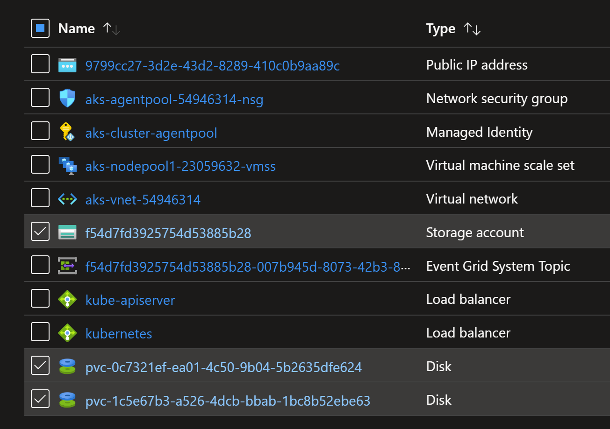

# Copying Disk and File Shares in AKS

## Creating an AKS cluster

```sh
az group create --name rg-aks-cluster --location francecentral
az aks create -n aks-cluster -g rg-aks-cluster --network-plugin azure --network-plugin-mode overlay -k 1.32.4 --node-vm-size standard_d2ads_v6 --node-osdisk-type Ephemeral --node-osdisk-size 64 --enable-apiserver-vnet-integration
az aks get-credentials -n aks-cluster -g rg-aks-cluster --overwrite-existing
```

## Install Pods that mounts Disk and File Share

```sh
kubectl apply -f pod-nginx-azure-disk.yaml,pod-nginx-azure-fileshare.yaml
```

## Check the Pods and created Disks and File share

```sh
kubectl get pods
kubectl get pv,pvc
```

```sh
# get AKS node resource group
$NODE_RESOURCE_GROUP=$(az aks show -n aks-cluster -g rg-aks-cluster --query nodeResourceGroup -o tsv)

az disk list -g $NODE_RESOURCE_GROUP -o table
# Name                                      ResourceGroup                                Location       Zones    Sku              SizeGb    ProvisioningState
# ----------------------------------------  -------------------------------------------  -------------  -------  ---------------  --------  -------------------
# pvc-0c7321ef-ea01-4c50-9b04-5b2635dfe624  MC_rg-aks-cluster_aks-cluster_swedencentral  swedencentral           StandardSSD_LRS  10        Succeeded
```

## Create the copy of the Disk and File Share

```sh
kubectl apply -f pod-nginx-azure-disk-copy.yaml,pod-nginx-azure-fileshare-copy.yaml
```

Check the Pods and created Disks and File share.

```sh
kubectl get pods
# NAME                        READY   STATUS    RESTARTS   AGE
# nginx-azuredisk             1/1     Running   0          3d12h
# nginx-azuredisk-copy        1/1     Running   0          3d12h
# nginx-azurefileshare        1/1     Running   0          3d11h
# nginx-azurefileshare-copy   1/1     Running   0          3d11h

kubectl get pv,pvc
# NAME                                                        CAPACITY   ACCESS MODES   RECLAIM POLICY   STATUS   CLAIM                             STORAGECLASS    VOLUMEATTRIBUTESCLASS   REASON   AGE
# persistentvolume/pvc-0c7321ef-ea01-4c50-9b04-5b2635dfe624   10Gi       RWO            Delete           Bound    default/pvc-azuredisk             managed-csi     <unset>                          3d13h
# persistentvolume/pvc-1c5e67b3-a526-4dcb-bbab-1bc8b52ebe63   10Gi       RWO            Delete           Bound    default/pvc-azuredisk-copy        managed-csi     <unset>                          3d12h
# persistentvolume/pvc-5fad3705-1774-4022-a486-88b596067d07   10Gi       RWO            Delete           Bound    default/pvc-azurefileshare-copy   azurefile-csi   <unset>                          3d11h
# persistentvolume/pvc-8c83e278-d601-4785-b7fd-8ffade4c9201   10Gi       RWO            Delete           Bound    default/pvc-azurefileshare        azurefile-csi   <unset>                          3d11h

# NAME                                            STATUS   VOLUME                                     CAPACITY   ACCESS MODES   STORAGECLASS    VOLUMEATTRIBUTESCLASS   AGE
# persistentvolumeclaim/pvc-azuredisk             Bound    pvc-0c7321ef-ea01-4c50-9b04-5b2635dfe624   10Gi       RWO            managed-csi     <unset>                 3d13h
# persistentvolumeclaim/pvc-azuredisk-copy        Bound    pvc-1c5e67b3-a526-4dcb-bbab-1bc8b52ebe63   10Gi       RWO            managed-csi     <unset>                 3d12h
# persistentvolumeclaim/pvc-azurefileshare        Bound    pvc-8c83e278-d601-4785-b7fd-8ffade4c9201   10Gi       RWO            azurefile-csi   <unset>                 3d11h
# persistentvolumeclaim/pvc-azurefileshare-copy   Bound    pvc-5fad3705-1774-4022-a486-88b596067d07   10Gi       RWO            azurefile-csi   <unset>                 3d11h

az disk list -g $NODE_RESOURCE_GROUP -o table
# Name                                      ResourceGroup                                Location       Zones    Sku              SizeGb    ProvisioningState
# ----------------------------------------  -------------------------------------------  -------------  -------  ---------------  --------  -------------------
# pvc-0c7321ef-ea01-4c50-9b04-5b2635dfe624  MC_rg-aks-cluster_aks-cluster_swedencentral  swedencentral           StandardSSD_LRS  10        Succeeded
# pvc-1c5e67b3-a526-4dcb-bbab-1bc8b52ebe63  MC_rg-aks-cluster_aks-cluster_swedencentral  swedencentral           StandardSSD_LRS  10        Succeeded
```

