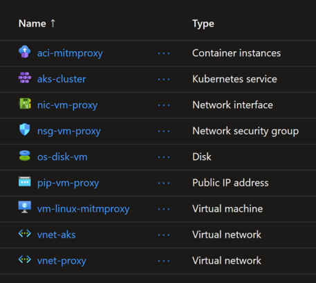

# Controlling AKS egress using an HTTP Proxy

Azure Kubernetes Service (AKS) clusters, whether deployed into a managed or custom virtual network, have certain outbound dependencies necessary to function properly. Previously, in environments requiring internet access to be routed through HTTP proxies, this was a problem. Nodes had no way of bootstrapping the configuration, environment variables, and certificates necessary to access internet services.

This feature adds HTTP proxy support to AKS clusters, exposing a straightforward interface that cluster operators can use to secure AKS-required network traffic in proxy-dependent environments.

Both AKS nodes and Pods will be configured to use the HTTP proxy.

## Architecture


## Deploy demo using Terraform

You will create an environment where AKS egress traffic go through an HTTP Proxy server.
You will use MITM-Proxy as an HTTP Proxy server for AKS. Note you can use another proxy servers like `Squidhead` or `Zscaler`.

### Generate Certificate for MITM-Proxy server

By default, MITM6-Proxy generates a certificate when it starts. You can get this certificate from `~\.mitmproxy\` folder and use it with AKS.
But, for an enterprise use case, they will create their own certificate and then import it into MITM-Proxy.
That is what you will do here.

Refer to the script ``generate-cert.sh` to generate a certificate for MITM-Proxy and print it as base64 encoded.

```sh
openssl genrsa -out cert.key 2048

# (Specify the mitm domain as Common Name, e.g. \*.google.com or for all: *)

openssl req -new -x509 -key cert.key -out mitmproxy-ca-cert.pem

cat cert.key mitmproxy-ca-cert.pem > mitmproxy-ca.pem

openssl pkcs12 -export -inkey cert.key -in mitmproxy-ca-cert.pem -out mitmproxy-ca-cert.p12

cat mitmproxy-ca-cert.pem | base64 -w0
# sample output
# LS0tLS1CRUdJTiBDRVJUSUZJQ0FURS0tLS0tCk1JSURnekNDQW11Z0F3SUJBZ0lVUzJTOHNMblQ1bi8vNkM3QTErMG01WXJUejhRd0RRWUpLb1pJaHZjTkFRRUwKQlFBd1VURUxNQWtHQTFVRUJoTUNSbEl4RXpBUkJnTlZCQWdNQ2xOdmJXVXRVM1JoZEdVeElUQWZCZ05WQkFvTQpHRWx1ZEdWeWJtVjBJRmRwWkdkcGRITWdVSFI1SUV4MFpERUtNQWdHQTFVRUF3d0JLakFlRncweU5EQXpNVFl3Ck9UUTVNemxhRncweU5EQTBNVFV3T1RRNU16bGFNRkV4Q3pBSkJnTlZCQVlUQWtaU01STXdFUVlEVlFRSURBcFQKYjIxbExWTjBZWFJsTVNFd0h3WURWUVFLREJoSmJuUmxjbTVsZENCWGFXUm5hWFJ6SUZCMGVTQk1kR1F4Q2pBSQpCZ05WQkFNTUFTb3dnZ0VpTUEwR0NTcUdTSWIzRFFFQkFRVUFBNElCRHdBd2dnRUtBb0lCQVFDWjVsUncvZFVlCkJsNXFjSzZSUUUrM1RwdTV5bWgxZDVDR0RwYkt2RDZ0djUwRjc5Y0JuUDJYODJ4aVJWU2R2TXJYZEx4MWJkek4KMVBnbjY4cVloSHVSOSt6TVdUN2VZUUtMZi9FYm9mSUEzbWhhS0xsVXFnTjNIRTNaMDU0RUdkQ0RrTlB3c3QyUAp6ckdBM3dVeDJyYkhXRzRpcC9SN1MvN0hIamtHdWh4QXFYZEdUM1BZdnBvKzh6RGVVeTdVRUxWYXg5VS9zdUFOCmhOMktweWxUZThLQmNVNnNFclNjUjdxYU8xLzdJYmVFRW9oQXhpblJ5SFQzaHJQZlY3WktjR0Q3NWtZUkJyRUMKWUdVL203bUsyeDJwek4zNmpad012ckxWZ3dkQkFieHpTSkxFSkR2YlVBWmZZalg3Y2w2SDNqL3ozYW1sTVdMbgpvU2NBeStkVTBFVkRBZ01CQUFHalV6QlJNQjBHQTFVZERnUVdCQlN1Y2VBWXQ2NE96Wk1XUXp3Q3BvZWVvRHk4ClVEQWZCZ05WSFNNRUdEQVdnQlN1Y2VBWXQ2NE96Wk1XUXp3Q3BvZWVvRHk4VURBUEJnTlZIUk1CQWY4RUJUQUQKQVFIL01BMEdDU3FHU0liM0RRRUJDd1VBQTRJQkFRQkswdFdybDZ3b1dDUCs1bS81VWx4SWl3MnE2d1QvdVQwVgpCR2J5QllYTGZKcms5L1lXQVBZR05yaFdmekhVQU8vaEIrbVY5TDU2UlU3NHAvYk51MXdqdGZuT0phRjl5YmUwCmhyMFNsaDlkdFdvRnBHeFVzMGlFVVFHNmhEVzM5bDg2TTlweVJ6NFYrWjVGVHMvMEkya2NTUk1ySk9PZk5JZm4KMkJiVSs4Z1FUV0U5L3gvcThOcWJocUZxSUQybkZXWjl4aUlvWG1GSmt5T3hNeU1ZS2RyTERERUlHa2ZEWHhqNQphUHp1Y3l4S0ZBVzNtbWEwd1Y3WEZFdE8yYjVDMkh1YjdEN2RlbDBkSzFmZUsveWR6Z2szaTdIREFvaFZKSFlLCmZxVzVZWlpNMjkyLzY1VThPaWJmNmtjYTNZOGRFTFRPYzkxRUdPdkt2SVBJQVQvdTFFTmgKLS0tLS1FTkQgQ0VSVElGSUNBVEUtLS0tLQo=
```

An Azure VM `vm-linux-proxy-mitm.tf` will be used to install MITM-Proxy and import the generated certificate. Note how it runs the script `install-mitmproxy.sh` as custom data. For simplicity, the certificate will be imported from a Git repository.

```sh
#!/bin/bash

# 1. install MITM proxy from official package

wget https://downloads.mitmproxy.org/10.2.4/mitmproxy-10.2.4-linux-x86_64.tar.gz

tar -xvf mitmproxy-10.2.4-linux-x86_64.tar.gz

# [Other option] install MITM proxy using Python pip

# sudo apt install python3-pip -y
# pip3 install mitmproxy
# sudo apt install wget -y # install if not installed

# MITM proxy can create a certificate for us on starting, but we will use our own certificate
# 2. download the certificate files

wget 'https://raw.githubusercontent.com/HoussemDellai/docker-kubernetes-course/main/_egress_proxy/certificate/mitmproxy-ca-cert.pem'
wget 'https://raw.githubusercontent.com/HoussemDellai/docker-kubernetes-course/main/_egress_proxy/certificate/mitmproxy-ca.pem'
wget 'https://raw.githubusercontent.com/HoussemDellai/docker-kubernetes-course/main/_egress_proxy/certificate/mitmproxy-ca-cert.p12'

# 3. start MITM proxy with the certificate and expose the web interface

./mitmweb --listen-port 8080 --web-host 0.0.0.0 --web-port 8081 --set block_global=false --certs *=./mitmproxy-ca.pem --set confdir=./
```

To configure AKS with an HTTP Proxy, you should use the following configuration sample.

```json
{
    "httpProxy": "http://20.73.245.90:8080/",
    "httpsProxy": "https://20.73.245.90:8080/",
    "noProxy": [
        "localhost",
        "127.0.0.1",
        "docker.io",
        "docker.com"
    ],
    "trustedCA": "LS0tLS1CRUdJTiBDRVJUSUZJQ0FURS0tLS0tCk1JSURnekNDQW11Z0F3SUJBZ0lVUzJTOHNMblQ1bi8vNkM3QTErMG01WXJUejhRd0RRWUpLb1pJaHZjTkFRRUwKQlFBd1VURUxNQWtHQTFVRUJoTUNSbEl4RXpBUkJnTlZCQWdNQ2xOdmJXVXRVM1JoZEdVeElUQWZCZ05WQkFvTQpHRWx1ZEdWeWJtVjBJRmRwWkdkcGRITWdVSFI1SUV4MFpERUtNQWdHQTFVRUF3d0JLakFlRncweU5EQXpNVFl3Ck9UUTVNemxhRncweU5EQTBNVFV3T1RRNU16bGFNRkV4Q3pBSkJnTlZCQVlUQWtaU01STXdFUVlEVlFRSURBcFQKYjIxbExWTjBZWFJsTVNFd0h3WURWUVFLREJoSmJuUmxjbTVsZENCWGFXUm5hWFJ6SUZCMGVTQk1kR1F4Q2pBSQpCZ05WQkFNTUFTb3dnZ0VpTUEwR0NTcUdTSWIzRFFFQkFRVUFBNElCRHdBd2dnRUtBb0lCQVFDWjVsUncvZFVlCkJsNXFjSzZSUUUrM1RwdTV5bWgxZDVDR0RwYkt2RDZ0djUwRjc5Y0JuUDJYODJ4aVJWU2R2TXJYZEx4MWJkek4KMVBnbjY4cVloSHVSOSt6TVdUN2VZUUtMZi9FYm9mSUEzbWhhS0xsVXFnTjNIRTNaMDU0RUdkQ0RrTlB3c3QyUAp6ckdBM3dVeDJyYkhXRzRpcC9SN1MvN0hIamtHdWh4QXFYZEdUM1BZdnBvKzh6RGVVeTdVRUxWYXg5VS9zdUFOCmhOMktweWxUZThLQmNVNnNFclNjUjdxYU8xLzdJYmVFRW9oQXhpblJ5SFQzaHJQZlY3WktjR0Q3NWtZUkJyRUMKWUdVL203bUsyeDJwek4zNmpad012ckxWZ3dkQkFieHpTSkxFSkR2YlVBWmZZalg3Y2w2SDNqL3ozYW1sTVdMbgpvU2NBeStkVTBFVkRBZ01CQUFHalV6QlJNQjBHQTFVZERnUVdCQlN1Y2VBWXQ2NE96Wk1XUXp3Q3BvZWVvRHk4ClVEQWZCZ05WSFNNRUdEQVdnQlN1Y2VBWXQ2NE96Wk1XUXp3Q3BvZWVvRHk4VURBUEJnTlZIUk1CQWY4RUJUQUQKQVFIL01BMEdDU3FHU0liM0RRRUJDd1VBQTRJQkFRQkswdFdybDZ3b1dDUCs1bS81VWx4SWl3MnE2d1QvdVQwVgpCR2J5QllYTGZKcms5L1lXQVBZR05yaFdmekhVQU8vaEIrbVY5TDU2UlU3NHAvYk51MXdqdGZuT0phRjl5YmUwCmhyMFNsaDlkdFdvRnBHeFVzMGlFVVFHNmhEVzM5bDg2TTlweVJ6NFYrWjVGVHMvMEkya2NTUk1ySk9PZk5JZm4KMkJiVSs4Z1FUV0U5L3gvcThOcWJocUZxSUQybkZXWjl4aUlvWG1GSmt5T3hNeU1ZS2RyTERERUlHa2ZEWHhqNQphUHp1Y3l4S0ZBVzNtbWEwd1Y3WEZFdE8yYjVDMkh1YjdEN2RlbDBkSzFmZUsveWR6Z2szaTdIREFvaFZKSFlLCmZxVzVZWlpNMjkyLzY1VThPaWJmNmtjYTNZOGRFTFRPYzkxRUdPdkt2SVBJQVQvdTFFTmgKLS0tLS1FTkQgQ0VSVElGSUNBVEUtLS0tLQo="
}
```

Now you can deploy the Terraform template using the following commands.

```sh
terraform init
terraform plan -out tfplan
terraform apply tfplan
```

## Check the created resources



## Testing the HTTP Proxy

Deploy a sample Nginx pod and check the injected environment variables for the Proxy server.
Note the variables: `httpProxy`, `httpsProxy`, `noProxy` and `trustedCa`.

```sh
kubectl run nginx --image=nginx

kubectl exec -it nginx -- env
# http_proxy=http://10.0.0.4:8080/
# HTTP_PROXY=http://10.0.0.4:8080/
# https_proxy=https://10.0.0.4:8080/
# HTTPS_PROXY=https://10.0.0.4:8080/
# no_proxy=localhost,aks-8v0n0swv.hcp.westeurope.azmk8s.io,10.10.0.0/24,10.0.0.0/16,169.254.169.254,docker.com,127.0.0.1,docker.io,konnectivity,10.10.0.0/16,168.63.129.16
# NO_PROXY=localhost,aks-8v0n0swv.hcp.westeurope.azmk8s.io,10.10.0.0/24,10.0.0.0/16,169.254.169.254,docker.com,127.0.0.1,docker.io,konnectivity,10.10.0.0/16,168.63.129.16
```

>Note: Note how AKS injected other CIDR ranges and domain names for the `NO_PROXY` environment variable. These are needed by the platform.

Check also these environment variables are injected into the cluster nodes.

```sh
kubectl get nodes
# NAME                                 STATUS   ROLES    AGE   VERSION
# aks-systempool-48300357-vmss000000   Ready    <none>   11m   v1.29.0
# aks-systempool-48300357-vmss000001   Ready    <none>   11m   v1.29.0
# aks-systempool-48300357-vmss000002   Ready    <none>   11m   v1.29.0

kubectl debug node/aks-systempool-48300357-vmss000000 -it --image=ubuntu

root@aks-systempool-48300357-vmss000000:/# chroot /host

env
# http_proxy=http://10.0.0.4:8080/
# HTTP_PROXY=http://10.0.0.4:8080/
# https_proxy=https://10.0.0.4:8080/
# HTTPS_PROXY=https://10.0.0.4:8080/
# no_proxy=localhost,aks-8v0n0swv.hcp.westeurope.azmk8s.io,10.10.0.0/24,10.0.0.0/16,169.254.169.254,docker.com,127.0.0.1,docker.io,konnectivity,10.10.0.0/16,168.63.129.16
# NO_PROXY=localhost,aks-8v0n0swv.hcp.westeurope.azmk8s.io,10.10.0.0/24,10.0.0.0/16,169.254.169.254,docker.com,127.0.0.1,docker.io,konnectivity,10.10.0.0/16,168.63.129.16
# ... removed for brievety
```

## Bypass HTTP Proxy

By default all egress traffic for nodes and pods will go through the Proxy because the environment variables for proxy are injected into all pods and nodes.
However, if you need to bypass the proxy, you just need to not inject these environment variables.
In kubernetes, this could be done declaratively using the annotation `"kubernetes.azure.com/no-http-proxy-vars": "true"`.

```yaml
apiVersion: v1
kind: Pod
metadata:
  name: nginx-noproxy
  annotations:
    "kubernetes.azure.com/no-http-proxy-vars": "true"
spec:
  containers:
  - image: nginx
    name: nginx
```

```sh
kubectl apply -f noproxy-pod.yaml
```

Now if you check the environment variables for this pod, you will notice that the environment variables for the proxy were not injected.
And if you try to connect to internet, the egress traffic will be carried through the cluster Load Balancer and it's Public IP address.

```sh
kubectl exec -it nginx-noproxy -- env
# PATH=/usr/local/sbin:/usr/local/bin:/usr/sbin:/usr/bin:/sbin:/bin
# HOSTNAME=nginx-noproxy
# NGINX_VERSION=1.25.4
# NJS_VERSION=0.8.3
# PKG_RELEASE=1~bookworm
# KUBERNETES_PORT=tcp://10.0.0.1:443
# KUBERNETES_PORT_443_TCP=tcp://10.0.0.1:443
# KUBERNETES_PORT_443_TCP_PROTO=tcp
# KUBERNETES_PORT_443_TCP_PORT=443
# KUBERNETES_PORT_443_TCP_ADDR=10.0.0.1
# KUBERNETES_SERVICE_HOST=10.0.0.1
# KUBERNETES_SERVICE_PORT=443
# KUBERNETES_SERVICE_PORT_HTTPS=443
# TERM=xterm
# HOME=/root

kubectl exec -it nginx-noproxy -- curl ifconf.me
# 4.245.123.106 # this is cluster LB
```

## Updating Proxy configuration

You can update a cluster with existing proxy settings, but could not enable proxy for existing cluster.

```sh
az aks update -n aks -g rg-aks --http-proxy-config aks-proxy-config.json
```

An aks update for httpProxy, httpsProxy, and/or NoProxy will automatically inject new environment variables into pods with the new httpProxy, httpsProxy, or NoProxy values. 
Pods must be rotated for the apps to pick it up.

For components under kubernetes, like containerd and the node itself, this won't take effect until a node image upgrade is performed.
