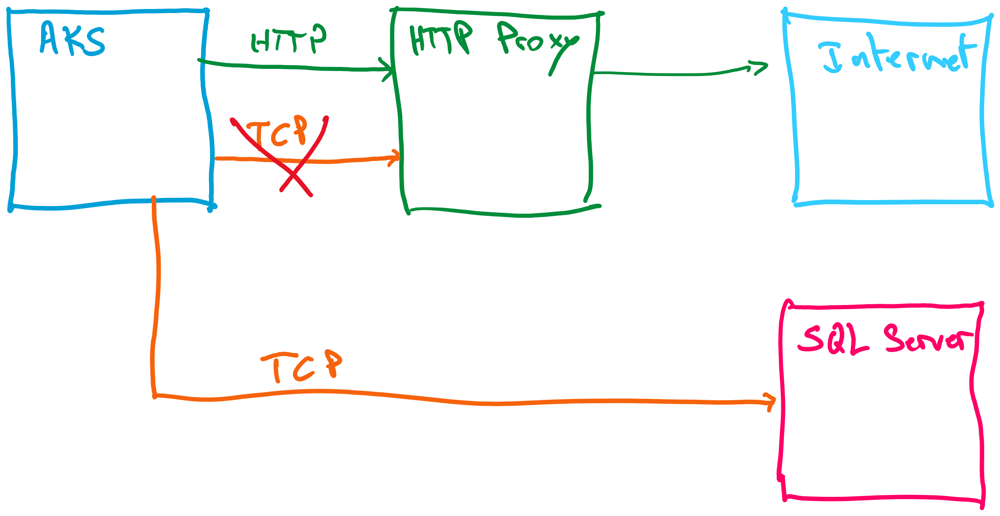
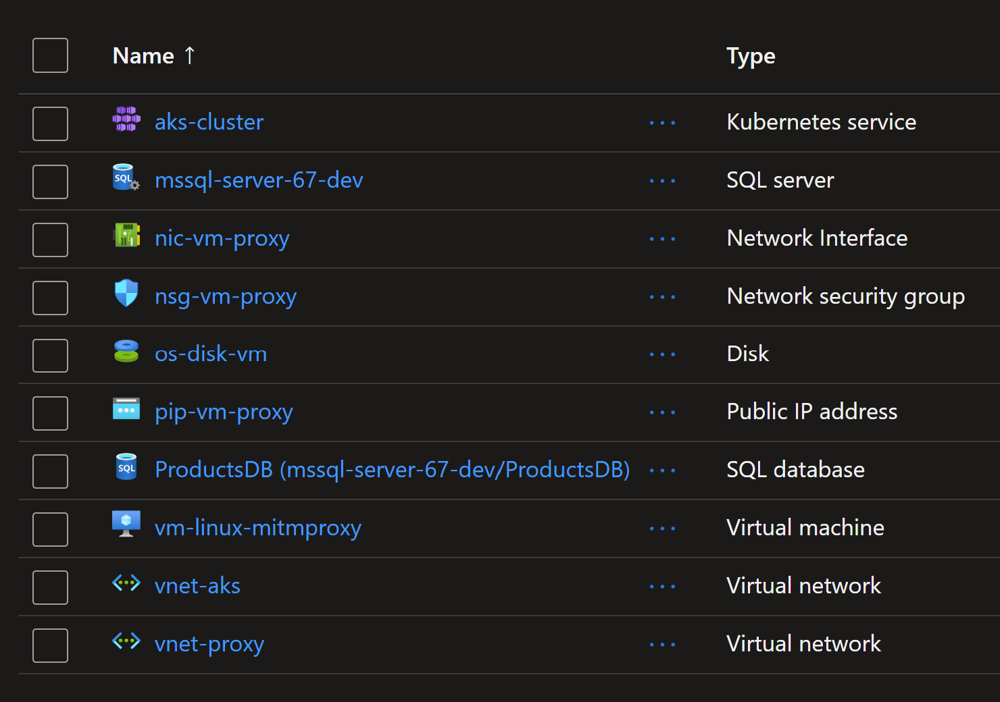

# AKS HTTP Proxy config ignores TCP connections

When AKS is configured to egress traffic to an `HTTP Proxy`, all HTTP connections will traverse the HTTP Proxy like connections to web services and web sites.

But, what about non-HTTP connections like `TCP` or `AMQP` ? Will they be forced through the HTTP Proxy ?

The short answer is no. End of the test :)

The rest is a lab where an environment is created and used to get the answer.

## Architecture



## Deploy demo using Terraform

You will create an environment where AKS egress traffic go through an HTTP Proxy server.
You will use `MITM-Proxy` as an HTTP Proxy server for AKS. Note you can use another proxy servers like `Squidhead` or `Zscaler`.
An `Azure SQL Server database` was created to test the TCP connection.
The connection will be initiated by a Pod in AKS.

Now you can deploy the Terraform template using the following commands.

```sh
terraform init
terraform plan -out tfplan
terraform apply tfplan
```

## Check the created resources



## AKS and HTTP Proxy config

Configuring an AKS cluster with an HTTP Proxy was covered during the previous lab under this folder [67_egress_proxy](../67_egress_proxy).

## Test the TCP connection

To proceed with the test, you will deploy a pod `mcr.microsoft.com/mssql-tools` that wil initiate a connection to the SQL Server database.

```sh
kubectl apply -f pod-mssql-tools.yaml
```

Then you will need to connect to the pod and use `sqlcmd` command line tool to start a connection to the database.
Make sure to use the correct values for database URL, login and password.
The query `select @@version` will check the version of the database. It is used to verify the connection was successful.

```sh
kubectl exec -it mssql-tools -- /bin/bash
# root@mssql-tools:/#
# root@mssql-tools:/# 
sqlcmd -S mssql-server-67-dev.database.windows.net -U azureuser -P @Aa123456789 -d ProductsDB -Q 'select @@version'
# -----------------------------------------------------------------------------------------------------------------
# Microsoft SQL Azure (RTM) - 12.0.2000.8
#         Apr 19 2024 18:03:25
#         Copyright (C) 2022 Microsoft Corporation
# (1 rows affected)
```
