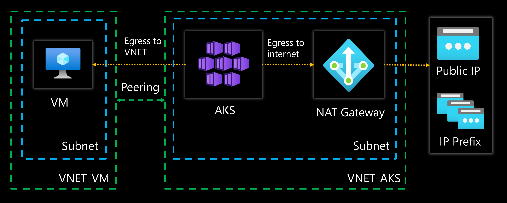

# AKS migration to Nat Gateway

## Introduction

You will learn here:
* NAT Gateway will handle only the traffic outgoing to the internet.
* AKS still can connect to resources within its own VNET or within peered VNETs.



## 1. Deploy demo environment

Use terraform to deploy :
1. AKS cluster with outbound type load balancer 
2. Azure Linux VM with web app deployed and Bastion
3. Nat Gateway
4. Two separate peered VNETs

```sh
terraform init
terraform apply -auto-approve
```

Connect to AKS

```sh
$RG = "rg-aks-cluster"
az aks get-credentials -g $RG -n aks-cluster --overwrite-existing
```

Check outbound egress traffic uses Load Balancer public IP

```sh
kubectl run nginx --image=nginx
sleep 10
kubectl exec nginx -it -- curl http://ifconf.me
# 20.160.240.183
```

## 2. Update AKS subnet to use Nat Gateway

```sh
az network vnet subnet update -g $RG --vnet-name vnet-aks --name subnet-aks --nat-gateway nat-gateway
```

Update cluster from loadBalancer to userAssignedNATGateway in BYO vnet scenario<>

```sh
az aks update -g $RG -n aks-cluster --outbound-type userAssignedNATGateway
```

Check outbound egress traffic uses Nat Gateway public IP.

```sh
kubectl exec nginx -it -- curl http://ifconf.me
# 172.201.129.36
```

Test connection to web app hosted on the Azure VM within a peered VNET.
First you need to get the VM's private IP.
The VM hosts an Nginx web app displaying VM's name and private IP.

```sh
kubectl exec nginx -it -- curl 10.0.1.4
# Hello from virtual machine: vm-linux, with IP address: 10.0.1.4
```

## Cleanup resources

```sh
az group delete -n $RG --yes --no-wait
terraform destroy -auto-approve
```sh