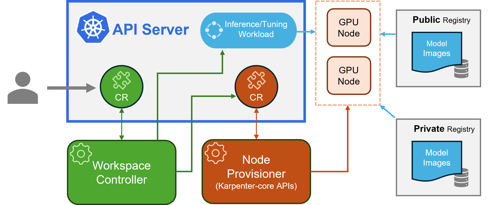

# Running AI and LLM models in AKS with KAITO

## Introduction

`KAITO` is a `CNCF Sandbox` project that simplifies and optimizes your inference and tuning workloads on `Kubernetes`. By default, it integrates with `vLLM`, a high-throughput `LLM` inference engine optimized for serving large models efficiently.

In this lab you will learn how to run AI and LLM models like `Llama`, `Phi`, `Qwen`, `GPT-OSS` etc on `AKS` using `KAITO`.
Why `KAITO` is useful here ?
`KAITO` will make it easy to:
* Provision the GPU VMs (`NC*, NV*, ND*` sku)
* Install `Nvidia GPU` drivers
* Install `device plugin` for GPU
* Run the model on the GPU VMs using `vLLM`
* Expose an endpoint for the inference through a Kubernetes Service
* Scale the infrastructure to meet customer demand
* Monitor GPU usage



>KAITO can also run RAG workloads using `RAG engine` which is based on `Haystack` framework, but in this lab we will focus on the LLM inference part.

## Lab Instructions

### Provision the infrastructure

In this lab, you will create the following resources in Azure:
* AKS cluster with a system nodepool
* Managed GPU Nodepool with sku `Standard_NC24ads_A100_v4` that runs `Nvidia A100` GPU
* Install KAITO using Helm chart

These resources could be created either using `Terraform` or Azure CLI.

### [Option 1] Provison the infrastructure using Terraform

From within the `infra` folder, run the following Terraform commands:

```sh
terraform init
terraform plan -out=tfplan
terraform apply tfplan
```

### [Option 2] Provison the infrastructure using Azure CLI

```sh
$RG = "rg-aks-kaito-swc1"
$LOCATION = "swedencentral"
$CLUSTER_NAME = "aks-cluster"

az group create --name $RG --location $LOCATION

az aks create -g $RG -n $CLUSTER_NAME --enable-oidc-issuer 
# --enable-ai-toolchain-operator

# add nodepool to the cluster with sku Standard_NC24ads_A100_v4 and type spot
# enable managed GPU Nodepool through tag `EnableManagedGPUExperience=true`
az aks nodepool add --name nc24adsa100g `
    --resource-group $RG `
    --cluster-name $CLUSTER_NAME `
    --node-vm-size Standard_NC24ads_A100_v4 `
    --tags EnableManagedGPUExperience=true `
    --node-count 1 `
    --enable‐cluster‐autoscaler `
    --min‐count 1 `
    --max‐count 3 `
    --priority Spot `
    --eviction-policy Delete

az aks get-credentials -g $RG -n $CLUSTER_NAME --overwrite-existing

kubectl get nodes
NAME                                  STATUS   ROLES    AGE     VERSION
# aks-nc24adsa100-86536742-vmss000000   Ready    <none>   4m3s    v1.33.7
# aks-systemnp-35024557-vmss000000      Ready    <none>   9m44s   v1.33.7
# aks-systemnp-35024557-vmss000001      Ready    <none>   10m     v1.33.7
```

### Verify GPU driver installation

Verify that the GPU driver is installed correctly by running the following command where you should see `nvidia.com/gpu: "1"` in the output which means the GPU is available for scheduling.

```sh
kubectl get nodes aks-nc24adsa100-86536742-vmss000000 -o yaml
  # capacity:
  #   cpu: "24"
  #   ephemeral-storage: 520125348Ki
  #   hugepages-1Gi: "0"
  #   hugepages-2Mi: "0"
  #   memory: 226764656Ki
  #   nvidia.com/gpu: "1"
  #   pods: "250"
```

You can also check the GPU driver installation by running the `nvidia-smi` command on the GPU node using `kubectl debug`:

```sh
kubectl debug node/aks-nc24adsa100-86536742-vmss000000 --image=ubuntu -it --env="NVIDIA_VISIBLE_DEVICES=all" --env="NVIDIA_DRIVER_CAPABILITIES=compute, utility"

root@aks-nc24adsa100-86536742-vmss000000:/# chroot /host

nvidia-smi

Fri Mar 13 08:02:22 2026
+-----------------------------------------------------------------------------------------+
| NVIDIA-SMI 580.126.09             Driver Version: 580.126.09     CUDA Version: 13.0     |
+-----------------------------------------+------------------------+----------------------+
| GPU  Name                 Persistence-M | Bus-Id          Disp.A | Volatile Uncorr. ECC |
| Fan  Temp   Perf          Pwr:Usage/Cap |           Memory-Usage | GPU-Util  Compute M. |
|                                         |                        |               MIG M. |
|=========================================+========================+======================|
|   0  NVIDIA A100 80GB PCIe          Off |   00000001:00:00.0 Off |                    0 |
| N/A   30C    P0             45W /  300W |       0MiB /  81920MiB |      0%      Default |
|                                         |                        |             Disabled |
+-----------------------------------------+------------------------+----------------------+

+-----------------------------------------------------------------------------------------+
| Processes:                                                                              |
|  GPU   GI   CI              PID   Type   Process name                        GPU Memory |
|        ID   ID                                                               Usage      |
|=========================================================================================|
|  No running processes found                                                             |
+-----------------------------------------------------------------------------------------+
```

### Install KAITO

>You will install KAITO using Helm chart as the managed AKS addon doesn't yet support all input values.

The Terraform template already installs Kaito in file `infra/kaito.tf`, but if you want to use Helm command line instead, here is the config:

```sh
helm repo add kaito https://kaito-project.github.io/kaito/charts/kaito
helm repo update
helm upgrade --install kaito-workspace kaito/workspace `
  --namespace kaito-workspace `
  --create-namespace `
  --set clusterName=$CLUSTER_NAME `
  --set defaultNodeImageFamily="ubuntu" `
  --set featureGates.gatewayAPIInferenceExtension=true `
  --set featureGates.disableNodeAutoProvisioning=false `
  --set gpu-feature-discovery.nfd.enabled=true `
  --set gpu-feature-discovery.gfd.enabled=true `
  --set nvidiaDevicePlugin.enabled=true `
  --wait `
  --take-ownership
```

>Node Image Family could be either `ubuntu` or `azurelinux`.

>`gpu-feature-discovery.nfd.enabled=true`, `gpu-feature-discovery.gfd.enabled=true` and `nvidiaDevicePlugin.enabled=true` are the default values in the chart.

>Make sure you have Quota for the GPU SKU in the region you are deploying, otherwise the GPU nodepool creation will fail. You can check the quota in Azure portal.

Check that the KAITO workspace controller is running:

```sh
kubectl get pods -n kaito-workspace
# NAME                                   READY   STATUS    RESTARTS   AGE
# csi-local-manager-f954b6d6-njbh7       1/1     Running   0          39m
# csi-local-manager-f954b6d6-pvgrc       1/1     Running   0          39m
# csi-local-node-58z8t                   4/4     Running   0          39m
# csi-local-node-cj94r                   4/4     Running   0          39m
# csi-local-node-n7kzp                   4/4     Running   0          39m
# helm-controller-5c98ff4f68-fn5bj       1/1     Running   0          39m
# kaito-workspace-6fcd6f4fd7-5m7tk       1/1     Running   0          39m
# nvidia-device-plugin-daemonset-4hdb5   1/1     Running   0          39m
# nvidia-device-plugin-daemonset-m457c   1/1     Running   0          39m
# source-controller-68dbfc6d94-9r4ks     1/1     Running   0          39m

# you should notice that DaemonSet pods are not deployed on Spot instance because of taint

# View the taints on the Spot instance node
kubectl describe node aks-nc24adsa100g-10854801-vmss000000
# Taints: kubernetes.azure.com/scalesetpriority=spot:NoSchedule
```

>Note: The GPU nodes created in this lab runs under Spot instances and have a taint `kubernetes.azure.com/scalesetpriority=spot:NoSchedule` which means that no Pod can be scheduled on those nodes unless they have a toleration for that taint. This is to prevent non-GPU workloads from being scheduled on the expensive GPU nodes.

>**Important note:** As per the time of writing this lab, KAITO didn't support Spot instances natively, so we are getting around this limitation by manually adding tolerations. But it should add support in future releases. For more details, refer to the KAITO github repository: https://github.com/kaito-project/kaito/

Add the following toleration to `nvidia-device-plugin-daemonset` DaemonSet in order for it to be scheduled on Spot instances.

```yaml
        - key: kubernetes.azure.com/scalesetpriority
          operator: Equal
          value: spot
          effect: NoSchedule
```

You can add the toleration using the following kubectl command:

```sh
kubectl patch daemonset nvidia-device-plugin-daemonset -n kaito-workspace --type='json' -p='[
  {
    "op": "add",
    "path": "/spec/template/spec/tolerations/-",
    "value": {
      "key": "kubernetes.azure.com/scalesetpriority",
      "operator": "Equal",
      "value": "spot",
      "effect": "NoSchedule"
    }
  }
]'
```

### Deploying an LLM model using KAITO

Deploy the `Phi-4` model from the `KAITO` model repository using the kubectl apply command.

```sh
kubectl apply -f kaito_workspace_phi_4_mini.yaml -n kaito-workspace
```

This creates a StatefulSet and a Pod should be deployed into the Spot instance, but get blocked because of spot node's taint

```sh
kubectl get workspace -n kaito-workspace

# check the stuck Pod
kubectl get pods -n kaito-workspace
```

Add the following toleration for Spot VMs to: `workspace-phi-4-mini` StatefulSet in order for it to be scheduled on Spot instances.

```yaml
        - key: kubernetes.azure.com/scalesetpriority
          operator: Equal
          value: spot
          effect: NoSchedule
```

You can add the toleration using the following kubectl command:

```sh
kubectl patch statefulset workspace-phi-4-mini -n kaito-workspace --type='json' -p='[
  {
    "op": "add",
    "path": "/spec/template/spec/tolerations/-",
    "value": {
      "key": "kubernetes.azure.com/scalesetpriority",
      "operator": "Equal",
      "value": "spot",
      "effect": "NoSchedule"
    }
  }
]'
```

This will force the Pod recreation with new Toleration, now verify that the Pod get deployed:

```sh
kubectl get pods -n kaito-workspace -w

# List your GPU nodes and verify that they are all present and ready.
kubectl get nodes -l accelerator=nvidia
# NAME                                   STATUS   ROLES    AGE   VERSION
# aks-nc24adsa100g-10854801-vmss000000   Ready    <none>   14m   v1.33.7
```

The GPU nodes will need a label in order for a KAITO Workspace to select it. We'll use the label `apps=phi-4` for this example. Terraform template already labeled the node. If you are using Azure CLI, you can label the nodes you want to use.

```sh
kubectl label node aks-nc24adsa100g-10854801-vmss000000 apps=phi-4
# node/aks-nc24adsa100g-10854801-vmss000000 labeled
```

### Monitor Deployment

Track the workspace status to see when the model has been deployed successfully:

```sh
kubectl get workspace
# NAME                   INSTANCE                   RESOURCEREADY   INFERENCEREADY   JOBSTARTED   WORKSPACESUCCEEDED   AGE
# workspace-phi-4-mini   Standard_NC24ads_A100_v4   True            True                          True                 4h15m
```

When the WORKSPACESUCCEEDED column becomes True, the model has been deployed successfully.

### Test the Model

Find the inference service's cluster IP and test it using a temporary curl pod.
First, get the service endpoint.

```sh
kubectl get svc workspace-phi-4-mini -n kaito-workspace
```

List available models:

```sh
kubectl run -it --rm --restart=Never curl --image=curlimages/curl -- curl -s http://workspace-phi-4-mini.kaito-workspace/v1/models | jq
```

### Making an Inference Call

Now make an inference call using the model:

```sh
kubectl run -it --rm --restart=Never curl --image=curlimages/curl -- curl -X POST http://workspace-phi-4-mini.kaito-workspace/v1/chat/completions \
  -H "Content-Type: application/json" \
  -d '{
    "model": "phi-4-mini-instruct",
    "messages": [{"role": "user", "content": "What is kubernetes?"}],
    "max_tokens": 50,
    "temperature": 0
  }' | jq
```

Or you can use the `Responses API` to stream the response:

```sh
curl -X POST "http://workspace-phi-4-mini.kaito-workspace:80/v1/responses" -H "Content-Type: application/json" -d '{
        "model": "phi-4-mini-instruct",
        "input": "What is Kubernetes ?",
        "max_output_tokens": 200
    }' | jq
```

### Monitoring

`vLLM` exposes Prometheus metrics at the `/metrics` endpoint. These metrics provide detailed insights into the system's performance, resource utilization, and request processing statistics.

```sh
curl http://workspace-phi-4-mini.kaito-workspace:80/metrics
# # HELP python_gc_objects_collected_total Objects collected during gc
# # TYPE python_gc_objects_collected_total counter
# python_gc_objects_collected_total{generation="0"} 12171.0
# python_gc_objects_collected_total{generation="1"} 1037.0
# python_gc_objects_collected_total{generation="2"} 1607.0
# # HELP python_gc_objects_uncollectable_total Uncollectable objects found during GC
# # TYPE python_gc_objects_uncollectable_total counter
# python_gc_objects_uncollectable_total{generation="0"} 0.0
# python_gc_objects_uncollectable_total{generation="1"} 0.0
# python_gc_objects_uncollectable_total{generation="2"} 0.0
# # HELP python_gc_collections_total Number of times this generation was collected
# # TYPE python_gc_collections_total counter
# python_gc_collections_total{generation="0"} 1438.0
# python_gc_collections_total{generation="1"} 130.0
# python_gc_collections_total{generation="2"} 10.0
# # HELP python_info Python platform information
# # TYPE python_info gauge
# python_info{implementation="CPython",major="3",minor="12",patchlevel="12",version="3.12.12"} 1.0
# # HELP process_virtual_memory_bytes Virtual memory size in bytes.
# ...
```

Add the following label to your KAITO inference service so that a Kubernetes ServiceMonitor deployment can detect it:

```sh
kubectl label svc workspace-phi-4-mini app=phi-4-mini -n kaito-workspace
# service/workspace-phi-4-mini labeled
```

Create a ServiceMonitor resource to define the inference service endpoints and the required configurations to scrape the vLLM Prometheus metrics. Export these metrics to the managed service for Prometheus by deploying the following ServiceMonitor YAML manifest in the kube-system namespace:

```yaml
# service_monitor.yaml
apiVersion: azmonitoring.coreos.com/v1
kind: ServiceMonitor
metadata:
  name: prometheus-kaito-monitor
spec:
  selector:
    matchLabels:
      app: phi-4-mini
  endpoints:
  - port: http
    interval: 30s
    path: /metrics
    scheme: http
```

```sh
kubectl apply -f service_monitor.yaml -n kube-system
# servicemonitor.azmonitoring.coreos.com/prometheus-kaito-monitor created
```

Verify that your ServiceMonitor deployment is running successfully:

```sh
kubectl get servicemonitor prometheus-kaito-monitor -n kube-system
# NAME                       AGE
# prometheus-kaito-monitor   46s
```

More resources for monitoring: 
- https://learn.microsoft.com/en-us/azure/aks/ai-toolchain-operator-monitoring
- https://docs.vllm.ai/en/stable/examples/online_serving/prometheus_grafana/#example-materials
- https://kaito-project.github.io/kaito/docs/monitoring
- https://grafana.com/grafana/dashboards/24756-vllm-monitoring-v2/

### Important notes

>You need to create GPU nodes in order to run a Workspace with KAITO. All NC, NV, ND series VMs are supported. If you want to add another VM sku, you should use the BYO mode.

>At the end of the lab, don't forget to delete the resource group to avoid unnecessary high cost of the GPU nodes.

## More resources

- https://learn.microsoft.com/en-us/azure/aks/ai-toolchain-operator

- https://kaito-project.github.io/kaito/docs/installation/

- https://learn.microsoft.com/en-us/azure/aks/aks-managed-gpu-nodes?tabs=add-ubuntu-gpu-node-pool