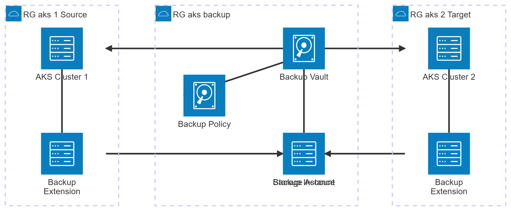

# AKS Backup with Terraform and Velero

## Introduction

## Architecture



### Resource Groups

| Resource Group | Location | Purpose |
|---|---|---|
| rg-aks-1 | swedencentral | Source AKS cluster |
| rg-aks-2 | swedencentral | Target AKS cluster (restore) |
| rg-aks-backup | swedencentral | Backup Vault, Storage Account, Snapshots |

### RBAC Role Assignments

| Principal | Role | Scope |
|---|---|---|
| Backup Vault MSI | Reader | AKS Cluster 1 |
| Backup Vault MSI | Reader | AKS Cluster 2 |
| Backup Vault MSI | Reader | RG aks backup |
| Backup Vault MSI | Disk Snapshot Contributor | RG aks backup |
| Backup Vault MSI | Data Operator for Managed Disks | RG aks backup |
| Backup Vault MSI | Storage Blob Data Contributor | Storage Account |
| AKS 1 Cluster MSI | Contributor | RG aks backup |
| AKS 2 Cluster MSI | Contributor | RG aks backup |
| Backup Extension 1 MSI | Storage Account Contributor | Storage Account |
| Backup Extension 2 MSI | Storage Account Contributor | Storage Account |

### Trusted Access

| AKS Cluster | Role | Source Resource |
|---|---|---|
| AKS Cluster 1 | backup-operator | Backup Vault |
| AKS Cluster 2 | backup-operator | Backup Vault |

## Deploying the resources using Terraform

To deploy the Terraform configuration files, run the following commands:

```sh
terraform init

terraform plan -out tfplan

terraform apply tfplan
```

The following resources will be created.


## Cleanup resources

To delete the creates resources, run the following command:

```sh
terraform destroy
```

## More readings

https://registry.terraform.io/providers/hashicorp/azurerm/latest/docs/resources/data_protection_backup_instance_kubernetes_cluster
