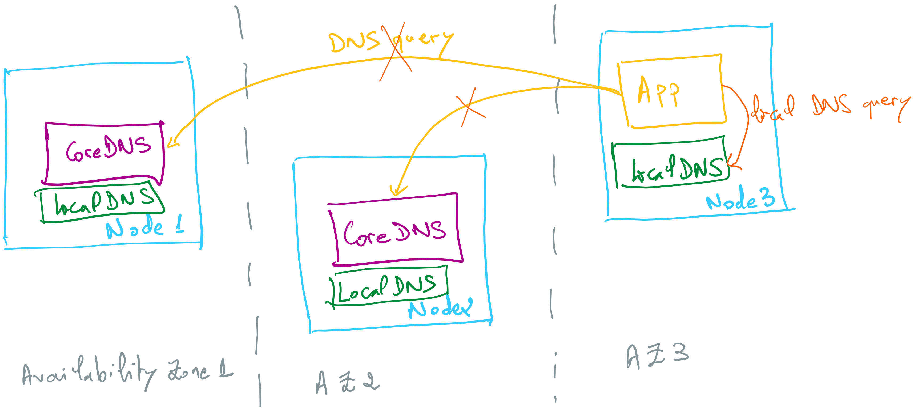

# AKS local DNS

This example demonstrates how to set up and verify LocalDNS functionality in an Azure Kubernetes Service (AKS) cluster. LocalDNS enhances DNS resolution performance and reliability by deploying DNS resolvers directly on the nodes of your AKS cluster.



## Creating an AKS cluster

Let's start by creating an AKS cluster in Azure. This cluster will be used to deploy and manage your applications.

```sh
az group create --name rg-aks-cluster-810 --location swedencentral

az aks create -n aks-cluster -g rg-aks-cluster-810 --network-plugin azure --network-plugin-mode overlay --network-dataplane cilium -k 1.34 --node-vm-size standard_d4ads_v6 --node-osdisk-type Ephemeral --node-osdisk-size 64 --enable-apiserver-vnet-integration

az aks get-credentials -n aks-cluster -g rg-aks-cluster-810 --overwrite-existing
```

Let's check that the connection was successful by listing the nodes inside the cluster:

```sh
kubectl get nodes
# NAME                                STATUS   ROLES    AGE     VERSION
# aks-nodepool1-23059632-vmss000000   Ready    <none>   3d16h   v1.32.4
# aks-nodepool1-23059632-vmss000001   Ready    <none>   3d16h   v1.32.4
# aks-nodepool1-23059632-vmss000002   Ready    <none>   3d16h   v1.32.4
```

Lets check the `CoreDNS` pods running in the cluster:

```sh
kubectl get pods -A
# NAMESPACE     NAME                                             READY   STATUS    RESTARTS   AGE
# kube-system   coredns-6d7b684fb5-6487j                         1/1     Running   0          78m
# kube-system   coredns-6d7b684fb5-pq4pf                         1/1     Running   0          75m
# kube-system   coredns-autoscaler-5966749777-wclrc              1/1     Running   0          78m
...
```

Now, let's check the services running in the cluster, particularly the `kube-dns` service:

```sh
kubectl get svc -A
# NAMESPACE     NAME             TYPE        CLUSTER-IP     EXTERNAL-IP   PORT(S)         AGE
# default       kubernetes       ClusterIP   10.0.0.1       <none>        443/TCP         80m
# kube-system   kube-dns         ClusterIP   10.0.0.10      <none>        53/UDP,53/TCP   79m
# kube-system   metrics-server   ClusterIP   10.0.105.138   <none>        443/TCP         79m
```

Lets simulate a pod trying to resolve DNS names using the `kube-dns` service. We will create a simple `nginx` pod and install the `dnsutils` package to use the `nslookup` command.

```sh
kubectl run nginx --image=nginx
kubectl exec nginx -it -- apt update
kubectl exec nginx -it -- apt install dnsutils -y
```

Now, let's use the `nslookup` command to resolve an external DNS name, such as `microsoft.com`, from within the `nginx` pod:

```sh
kubectl exec nginx -it -- nslookup microsoft.com
# Server:         10.0.0.10
# Address:        10.0.0.10#53

# Non-authoritative answer:
# Name:   microsoft.com
# Address: 13.107.246.53
# Name:   microsoft.com
# Address: 13.107.213.53
...
```

The output shows that the `nginx` pod was able to successfully resolve the DNS name `microsoft.com` using the `kube-dns` service. This indicates that the DNS resolution is functioning correctly within the AKS cluster.

## Enabling LocalDNS on an existing node pool

LocalDNS uses a JSON-based configuration file localdnsconfig.json to define DNS resolution behavior for each node pool. This file allows you to specify operational modes, server blocks for different DNS domains, and plugin settings such as caching, forwarding, and logging.

To enable LocalDNS on an existing node pool, use the following command with your custom configuration file:

```sh
az aks nodepool update --name nodepool1 --cluster-name aks-cluster --resource-group rg-aks-cluster-810 --localdns-config ./localdnsconfig.json
```

>Enabling LocalDNS on a node pool initiates a reimage operation on all nodes within that pool. This process can cause temporary disruption to running workloads and may lead to application downtime if not properly managed. You should plan for potential service interruptions and ensure that the applications are configured for high availability or have appropriate disruption budgets in place before enabling this setting.

## Verifying LocalDNS functionality

Once LocalDNS is enabled, you can verify its operation by running DNS queries from pods in the specified node pool and inspecting the `SERVER` field in the responses to confirm LocalDNS addresses are returned (`169.254.10.10` or `169.254.10.11`).

```sh
kubectl exec -it nginx -- nslookup kubernetes.default
# ;; Got recursion not available from 169.254.10.11
# ;; Got recursion not available from 169.254.10.11
# Server:         169.254.10.11
# Address:        169.254.10.11#53

# Name:   kubernetes.default.svc.cluster.local
# Address: 10.0.0.1
# ;; Got recursion not available from 169.254.10.11
```

```sh
kubectl exec nginx -it -- nslookup microsoft.com
Server:         169.254.10.11
Address:        169.254.10.11#53

Name:   microsoft.com
Address: 13.107.213.53
Name:   microsoft.com
Address: 13.107.246.53
...
```

## Enabling monitoring for LocalDNS

LocalDNS exposes metrics in Prometheus format on the node IP on port `9253`. You can access these metrics by querying the LocalDNS endpoint from within a pod in the cluster. Here is an example of how to retrieve the metrics using `curl` from the `nginx` pod:

```sh
kubectl exec nginx -it -- curl 10.224.0.5:9253/metrics # replace with your node IP
# # HELP coredns_build_info A metric with a constant '1' value labeled by version, revision, and goversion from which CoreDNS was built.
# # TYPE coredns_build_info gauge
# coredns_build_info{goversion="go1.24.3 X:systemcrypto",revision="a7ed346585e30b99317d36e4d007b7b19a228ea5",version="1.11.3"} 1
# # HELP coredns_cache_entries The number of elements in the cache.
# # TYPE coredns_cache_entries gauge
# coredns_cache_entries{server="dns://169.254.10.10:53",type="denial",view="",zones="."} 7
# coredns_cache_entries{server="dns://169.254.10.10:53",type="denial",view="",zones="cluster.local."} 0
# coredns_cache_entries{server="dns://169.254.10.10:53",type="success",view="",zones="."} 46
# coredns_cache_entries{server="dns://169.254.10.10:53",type="success",view="",zones="cluster.local."} 1
# coredns_cache_entries{server="dns://169.254.10.11:53",type="denial",view="",zones="."} 0
# coredns_cache_entries{server="dns://169.254.10.11:53",type="denial",view="",zones="cluster.local."} 26
# coredns_cache_entries{server="dns://169.254.10.11:53",type="success",view="",zones="."} 10
# coredns_cache_entries{server="dns://169.254.10.11:53",type="success",view="",zones="cluster.local."} 3
# # HELP coredns_cache_hits_total The count of cache hits.
# # TYPE coredns_cache_hits_total counter
# coredns_cache_hits_total{server="dns://169.254.10.10:53",type="denial",view="",zones="."} 2
```

To monitor LocalDNS performance and health, you can enable monitoring through Azure Monitor. This allows you to collect metrics and logs related to DNS queries, latency, and errors. The easiest way is to enable it from the Azure portal. Go to your AKS cluster, select `Insights` under the `Monitoring` section, and enable monitoring if it is not already enabled.

Then you need to deploy a config map to enable LocalDNS metrics collection:

```sh
kubectl apply -f ama-metrics-prometheus-config-node.yaml
```

This config map configures the Azure Monitor Agent to collect LocalDNS metrics from the node on address `NODE_IP:9253/metrics`.

## More resources

Autoscale the DNS Service in a Cluster: https://kubernetes.io/docs/tasks/administer-cluster/dns-horizontal-autoscaling/

DNS Resolution in Azure Kubernetes Service (AKS): https://learn.microsoft.com/en-us/azure/aks/dns-concepts

Configure LocalDNS in Azure Kubernetes Service (Preview): https://learn.microsoft.com/en-us/azure/aks/localdns-custom