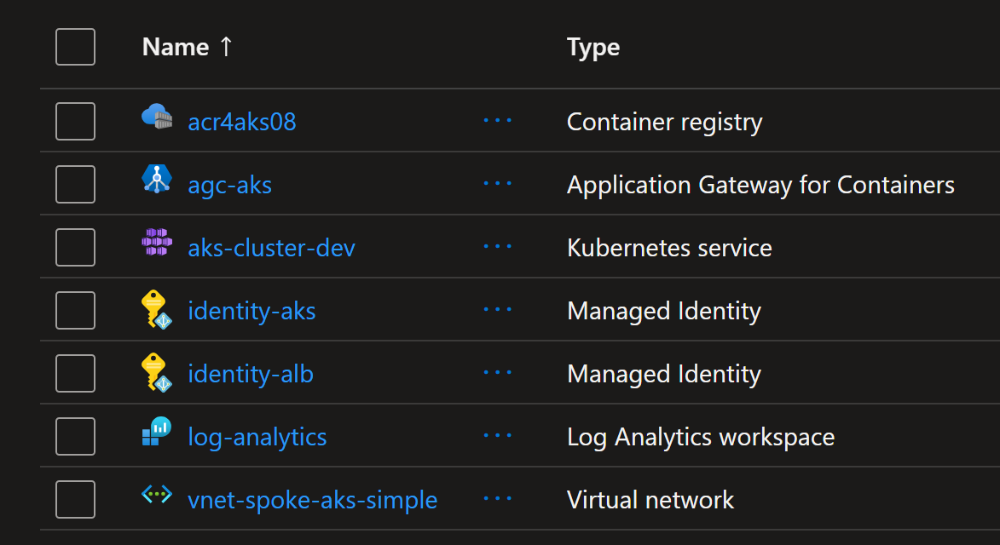
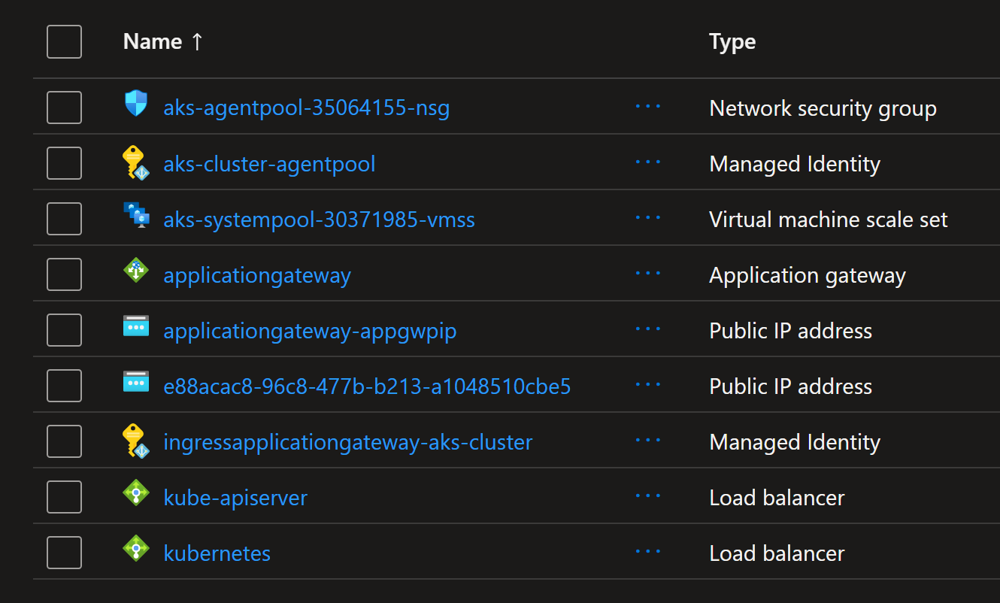

# Testing websockets with Azure Application Gateway and AKS

This repository contains a sample application and configuration for testing WebSocket support with Azure Application Gateway and Azure Kubernetes Service (AKS). The sample application is a simple WebSocket echo server that can be deployed to AKS, and the Application Gateway is configured to route WebSocket traffic to the AKS cluster.

## Instructions

1. Deploy the AKS cluster and Application Gateway (AGIC) using the provided Terraform configuration in the `infra` directory.

```sh
terraform init
terraform plan -out=tfplan
terraform apply tfplan
```

This will create an AKS cluster and enable AGIC addon on the cluster, which will automatically configure the Application Gateway to route traffic to the AKS cluster based on Kubernetes Ingress resources.




2. Build and push the WebSocket echo server Docker image to ACR

```sh
# Build the Docker image
az acr build --registry acr4aks08 --image websocket-echo-server:1.0.0 ./server
```

3. Build and push the WebSocket echo client Docker image to ACR

```sh
# Build the Docker image
az acr build --registry acr4aks08 --image websocket-echo-client:1.0.0 ./client
```

4. Deploy the WebSocket echo server and client application to the AKS cluster.

```sh
kubectl apply -f ./kubernetes/
# deployment.apps/websocket-echo-client created
# deployment.apps/websocket-echo-server created
# service/websocket-echo-server created
# ingress.networking.k8s.io/websocket-echo-server created
# deployment.apps/inspectorgadget created
# service/inspectorgadget created
# ingress.networking.k8s.io/inspectorgadget created
```

5. Test the WebSocket connection

When all pods are running, this means the WebSocket echo server is up and running and also the client is running and connecting to the server. You can check the logs of the client pod to see the WebSocket connection status and messages.

```sh
kubectl logs -f deployment/websocket-echo-client
# 2026-04-07 17:07:18,144  Connected to ws://websocket-echo-server:80/websocket-echo-server
# 2026-04-07 17:07:18,144  Sent: Hello #1
# 2026-04-07 17:07:28,147  Received: echo from server ('10.244.0.86', 8765) : Hello #1
# 2026-04-07 17:07:29,149  Sent: Hello #2
# 2026-04-07 17:07:39,153  Received: echo from server ('10.244.0.86', 8765) : Hello #2
# ...
```

You can also check the logs from the server pod to see the incoming WebSocket connections and messages.

```sh
kubectl logs -f deployment/websocket-echo-server
```

## Testing Application Gateway behaviour during backend Pod termination

To test the behavior of the Application Gateway during backend Pod termination, you can follow these steps:

1. Identify one of the Pod names of the WebSocket echo server.

```sh
kubectl get pods
# NAME                                          READY   STATUS    RESTARTS   AGE
# inspectorgadget-865775496-dbql9               1/1     Running   0          70m
# inspectorgadget-865775496-f5v4m               1/1     Running   0          70m
# websocket-echo-client-agc-75699fb9cf-7jcwc    1/1     Running   0          3m31s
# websocket-echo-client-agc-75699fb9cf-bmkkg    1/1     Running   0          3m31s
# websocket-echo-client-agc-75699fb9cf-fq68f    1/1     Running   0          3m31s
# websocket-echo-client-agic-69ff55db45-fpkkx   1/1     Running   0          27m
# websocket-echo-client-agic-69ff55db45-ll2gm   1/1     Running   0          27m
# websocket-echo-client-agic-69ff55db45-r6zcq   1/1     Running   0          27m
# websocket-echo-server-54899f754c-6qqwp        1/1     Running   0          70m
# websocket-echo-server-54899f754c-sdz8g        1/1     Running   0          70m
# websocket-echo-server-54899f754c-v78ct        1/1     Running   0          70m
```

We checked that here each client pod for AGIC is connected to a different server pod. The same is true for AGC.

2. Delete the identified Pod to simulate a termination scenario.

```sh
kubectl delete pod websocket-echo-server-54899f754c-v78ct
# pod "websocket-echo-server-54899f754c-v78ct" deleted from default namespace
```

At this point of time, the Application Gateway should detect that the Pod is terminating and stop routing new traffic to it. However, any existing WebSocket connections to that Pod will remain active until they are closed by the client or server, or until the Pod is forcefully terminated after the grace period expires.

AGIC will detect that the Pod is terminating and update the Application Gateway configuration accordingly.

ALB will also detect this change and update AGC configuration accordingly.

The important thing here is that the update of the App Gateway config will be done by re-applying all the configurations for the App Gateway.
This means that any connection that is currently active and being routed through the App Gateway will be dropped when the config is re-applied, even if the connection is still healthy and the backend Pod is still running. This is applicable to the web socket connections as well.

Let's prove this behaviour. Run the following command immediately after the previous one.

```sh
kubectl get pods -w
# NAME                                          READY   STATUS    RESTARTS        AGE
# inspectorgadget-865775496-dbql9               1/1     Running   0               75m
# inspectorgadget-865775496-f5v4m               1/1     Running   0               75m
# websocket-echo-client-agc-75699fb9cf-7jcwc    1/1     Running   1 (2m48s ago)   8m7s
# websocket-echo-client-agc-75699fb9cf-bmkkg    1/1     Running   0               8m7s
# websocket-echo-client-agc-75699fb9cf-fq68f    1/1     Running   0               8m7s
# websocket-echo-client-agic-69ff55db45-fpkkx   1/1     Running   1 (3m36s ago)   32m
# websocket-echo-client-agic-69ff55db45-ll2gm   1/1     Running   1 (3m36s ago)   32m
# websocket-echo-client-agic-69ff55db45-r6zcq   1/1     Running   1 (3m36s ago)   32m
# websocket-echo-server-54899f754c-6qqwp        1/1     Running   0               75m
# websocket-echo-server-54899f754c-8jmsf        1/1     Running   0               4m31s
# websocket-echo-server-54899f754c-sdz8g        1/1     Running   0               75m
```

Note that here we can see that ALL the client pods that were running and connected to the server pods, even the ones not being terminated, are now in Error state because their WebSocket connections to the server pods have been dropped due to the Application Gateway configuration update. After a few seconds, the client pods will be restarted and will establish new WebSocket connections to the new server pods that have been created to replace the terminated ones.

>An update to the App Gateway config will cause all the existing connections to be dropped, even if they are healthy and the backend pods are still running. This is an important consideration when using App Gateway with WebSocket applications, as it can lead to connection disruptions during scaling or updates.

Note how the AGC behaves differently in this scenario. Only the client pod connected to the terminated server pod is restarted, while the other client pods remain unaffected and their WebSocket connections remain active.

>An update to the App Gateway for Containers (AGC) config will not cause all the existing connections to be dropped, and the healthy connections will remain active. This is because AGC uses a different mechanism for updating its configuration that allows it to maintain existing connections while applying changes.

## Testing an update to another app

Let's make a change to another app served by both AGIC and AGC, for example the Inspector Gadget app, and see how the App Gateway and AGC behaves in this case.

```sh
kubectl scale deploy inspectorgadget --replicas=3
# deployment.apps/inspectorgadget scaled
```

```sh
kubectl get pods -w
# NAME                                          READY   STATUS    RESTARTS       AGE
# inspectorgadget-865775496-dbql9               1/1     Running   0              83m
# inspectorgadget-865775496-f5v4m               1/1     Running   0              83m
# inspectorgadget-865775496-lwm57               1/1     Running   0              2m42s
# websocket-echo-client-agc-75699fb9cf-7jcwc    1/1     Running   1 (11m ago)    16m
# websocket-echo-client-agc-75699fb9cf-bmkkg    1/1     Running   0              16m
# websocket-echo-client-agc-75699fb9cf-fq68f    1/1     Running   0              16m
# websocket-echo-client-agic-69ff55db45-fpkkx   1/1     Running   2 (117s ago)   40m
# websocket-echo-client-agic-69ff55db45-ll2gm   1/1     Running   2 (117s ago)   40m
# websocket-echo-client-agic-69ff55db45-r6zcq   1/1     Running   2 (117s ago)   40m
# websocket-echo-server-54899f754c-6qqwp        1/1     Running   0              83m
# websocket-echo-server-54899f754c-8jmsf        1/1     Running   0              12m
# websocket-echo-server-54899f754c-sdz8g        1/1     Running   0              83m
```

Note that here we can see that the client pods for AGIC are restarted because the App Gateway configuration is updated, so drops all connections, to reflect the new replicas of the Inspector Gadget app, while the client pods for AGC remain unaffected and their WebSocket connections remain active because AGC can update its configuration without dropping existing connections.

>Any update to the App Gateway configuration, even if it is not related to the served application, will cause all the existing connections to be dropped, while an update to the AGC configuration will not cause all the existing connections to be dropped, and the healthy connections will remain active. This is an important consideration when using App Gateway with WebSocket applications, as it can lead to connection disruptions during scaling or updates of any app served by the App Gateway.

## Testing adding another replicas

```sh
kubectl scale deploy websocket-echo-server --replicas=4
# deployment.apps/websocket-echo-server scaled
```

The result is the following.

```sh
kubectl get pods -w
# NAME                                          READY   STATUS    RESTARTS        AGE
# inspectorgadget-865775496-dbql9               1/1     Running   0               89m
# inspectorgadget-865775496-f5v4m               1/1     Running   0               89m
# inspectorgadget-865775496-lwm57               1/1     Running   0               9m5s
# websocket-echo-client-agc-75699fb9cf-7jcwc    1/1     Running   1 (17m ago)     22m
# websocket-echo-client-agc-75699fb9cf-bmkkg    1/1     Running   0               22m
# websocket-echo-client-agc-75699fb9cf-fq68f    1/1     Running   0               22m
# websocket-echo-client-agic-69ff55db45-fpkkx   1/1     Running   3 (4m41s ago)   46m
# websocket-echo-client-agic-69ff55db45-ll2gm   1/1     Running   3 (4m41s ago)   46m
# websocket-echo-client-agic-69ff55db45-r6zcq   1/1     Running   3 (4m41s ago)   46m
# websocket-echo-server-54899f754c-6qqwp        1/1     Running   0               89m
# websocket-echo-server-54899f754c-8jmsf        1/1     Running   0               19m
# websocket-echo-server-54899f754c-s5z2l        1/1     Running   0               5m19s
# websocket-echo-server-54899f754c-sdz8g        1/1     Running   0               89m
```

Note that here we can see that the client pods for AGIC are restarted because the App Gateway configuration is updated, so drops all connections, to reflect the new replica of the WebSocket echo server app, while the client pods for AGC remain unaffected and their WebSocket connections remain active because AGC can update its configuration without dropping existing connections.

>Even adding a new replica to the backend application will cause an update to the App Gateway configuration, which will cause all the existing connections to be dropped, while an update to the AGC configuration will not cause all the existing connections to be dropped, and the healthy connections will remain active.

## Important notes:

- If one of the Pod's containers has defined a preStop hook and the terminationGracePeriodSeconds in the Pod spec is not set to 0, the kubelet runs that hook inside of the container. The default terminationGracePeriodSeconds setting is 30 seconds.

- If the preStop hook is still running after the grace period expires, the kubelet requests a small, one-off grace period extension of 2 seconds.

- If the preStop hook needs longer to complete than the default grace period allows, you must modify terminationGracePeriodSeconds to suit this.

Src: https://kubernetes.io/docs/concepts/workloads/pods/pod-lifecycle/#pod-termination-flow

- AGIC annonations: https://azure.github.io/application-gateway-kubernetes-ingress/annotations/

- WebSocket connection is bound to the specific server instance that accepted it, unless you explicitly design around that.

Why WebSocket connections are “bound” to a server
A WebSocket connection is:

A long‑lived, stateful TCP connection
Upgraded from HTTP via a handshake
Maintained between one client socket and one server socket

Once the handshake is complete:

* The TCP connection stays open
* All messages flow over that same socket
* Only the server process that owns that socket can read/write to it

If the server Restarts, Crashes, Is scaled down or Loses network connectivity then the WebSocket connection drops.

- It is important to configure correctly the health probes for the WebSocket server, to ensure that the Application Gateway can detect when the server is healthy and route traffic to it. If the health probes are not configured correctly, the Application Gateway may consider the server unhealthy and stop routing traffic to it, which can cause WebSocket connections to drop. AGIC configures the health probes based on the Kubernetes Ingress resource through annotation `appgw.ingress.kubernetes.io/health-probe-path: "/health"` and the Application Gateway will use that path to check the health of the WebSocket server. And the `server.py` app exposes the health endpoint at `/health` that returns a 200 OK status code when the server is healthy.

- The backend server must respond to the application gateway probes, which are described in the health probe overview section. Application gateway health probes are HTTP/HTTPS only. Each backend server must respond to HTTP probes for application gateway to route WebSocket traffic to the server.

- WebSockets are only supported when using Gateway API for Application Gateway for Containers, "but they work also for Gateway API": https://learn.microsoft.com/en-us/azure/application-gateway/for-containers/websockets#health-probes